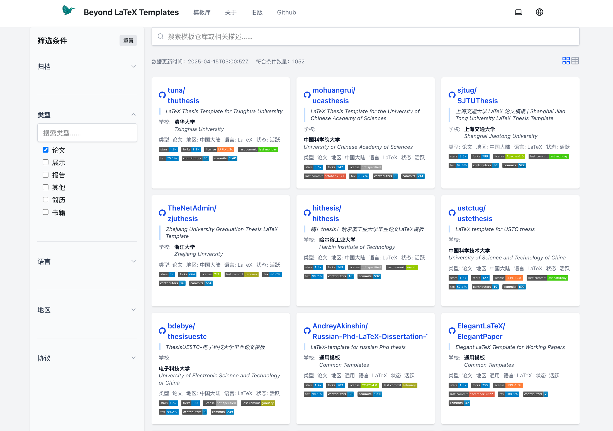

# Beyond LaTeX Templates

[English README](README-en.md) | [简体中文 README](README.md)

## Introduction

Update at: <!-- START-DATE -->*2025-10-15*<!-- END-DATE -->

An awesome list to collect all kinds of Latex thesis/dissertation, representation(beamer/slides), resume etc.,
as well as other format, include  Microsoft Word, Typst, Markdown ...

> [!IMPORTANT]  
> All templates click this site: 
>
> - site link: 
>   - [:link: templates][link-site-new] **Recommend: New**
>   - [:link: latex-templates][link-site] **Old**
> - file(JSON format): [:card_index_dividers: templates.json][link-data]

[link-site]: https://hantang.github.io/latex-templates/
[link-site-new]: https://hantang.github.io/templates/
[link-data]: ./data/templates.json

---

(New site snaphot)

<!-- **[:top: Back to Top](#beyond-latex-templates)** -->

---

<!-- START-TABLE -->

**Table of Contents**

<!-- END-TABLE -->

## Contributing

Your contributions are always welcome!

Copyright &copy; 2018-2025 Hantang

**[:top: Back to Top](#beyond-latex-templates)**
