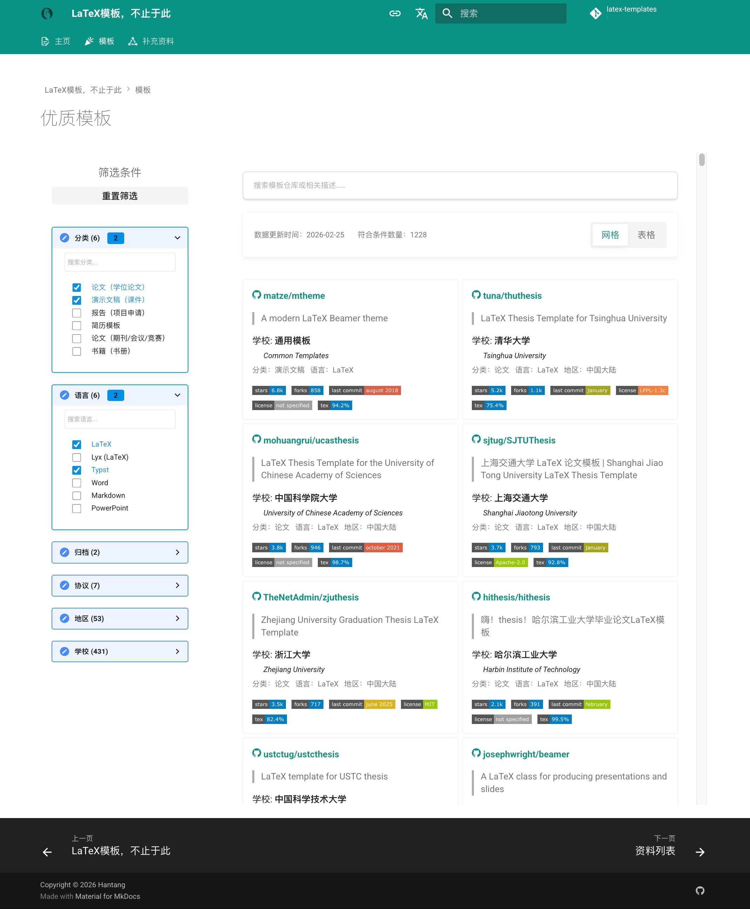

# Beyond LaTeX Templates

[English README](README-en.md) | [简体中文 README](README.md)

## Introduction

Update at: <!-- START-DATE -->*2026-02-15*<!-- END-DATE -->

An awesome list to collect all kinds of Latex thesis/dissertation, representation(beamer/slides), resume etc.,
as well as other format, include  Microsoft Word, Typst, Markdown ...

> [!IMPORTANT]
>
> **Templates data**
>
> - site link: [:link: latex-templates][link-site]
> - file(JSON format): 
>   [:card_index_dividers: templates.json][link-data]
>   [:card_index_dividers: templates-resume.json][link-resume]

[link-site]: https://hantang.github.io/latex-templates/awesome
[link-data]: ./templates.json
[link-resume]: ./templates-resume.json

---

## Popular Templates

<!-- START-TABLE -->

- [Thesis/Dissertation (LaTeX)](#thesisdissertation-latex)
- [Thesis/Dissertation (Typst etc.)](#thesisdissertation-typst-etc)
- [Presentation/Slide (LaTeX)](#presentationslide-latex)
- [Résumé/CV Templates](#résumécv-templates)
- [Report/Paper/Book Templates (LaTex)](#reportpaperbook-templates-latex)

### Thesis/Dissertation (LaTeX)

| University (College) | GitHub Repo | Statistics | Comment |
| --- | --- | --- | --- |
| **Tsinghua University** *清华大学* | [tuna/thuthesis] | ![5154][tuna/thuthesis/stars] ![1139][tuna/thuthesis/forks] ![2026-01-04][tuna/thuthesis/last-commit] | LaTeX Thesis Template for Tsinghua University |
| **University of Chinese Academy of Sciences** *中国科学院大学* | [mohuangrui/ucasthesis] | ![3781][mohuangrui/ucasthesis/stars] ![946][mohuangrui/ucasthesis/forks] ![2024-02-29][mohuangrui/ucasthesis/last-commit] | LaTeX Thesis Template for the University of Chinese Academy of Sciences |
| **Shanghai Jiaotong University** *上海交通大学* | [sjtug/SJTUThesis] | ![3698][sjtug/SJTUThesis/stars] ![794][sjtug/SJTUThesis/forks] ![2026-01-06][sjtug/SJTUThesis/last-commit] | 上海交通大学 LaTeX 论文模板 Shanghai Jiao Tong University LaTeX Thesis Template |
| **Zhejiang University** *浙江大学* | [TheNetAdmin/zjuthesis] | ![3484][TheNetAdmin/zjuthesis/stars] ![717][TheNetAdmin/zjuthesis/forks] ![2025-12-08][TheNetAdmin/zjuthesis/last-commit] | Zhejiang University Graduation Thesis LaTeX Template |
| **Harbin Institute of Technology** *哈尔滨工业大学* | [hithesis/hithesis] | ![2103][hithesis/hithesis/stars] ![391][hithesis/hithesis/forks] ![2026-02-01][hithesis/hithesis/last-commit] | 嗨！thesis！哈尔滨工业大学毕业论文LaTeX模板 |
| **University of Science and Technology of China** *中国科学技术大学* | [ustctug/ustcthesis] | ![2004][ustctug/ustcthesis/stars] ![441][ustctug/ustcthesis/forks] ![2026-01-13][ustctug/ustcthesis/last-commit] | LaTeX template for USTC thesis |
| **University of Electronic Science and Technology of China** *电子科技大学* | [bdebye/thesisuestc] | ![1592][bdebye/thesisuestc/stars] ![348][bdebye/thesisuestc/forks] ![2025-04-29][bdebye/thesisuestc/last-commit] | ThesisUESTC-电子科技大学毕业论文模板 |
| **Common Templates** *通用模板* | [AndreyAkinshin/Russian-Phd-LaTeX-Dissertation-Template] | ![1481][AndreyAkinshin/Russian-Phd-LaTeX-Dissertation-Template/stars] ![754][AndreyAkinshin/Russian-Phd-LaTeX-Dissertation-Template/forks] ![2026-01-04][AndreyAkinshin/Russian-Phd-LaTeX-Dissertation-Template/last-commit] | LaTeX-template for russian Phd thesis |
| **Common Templates** *通用模板* | [Pseudomanifold/latex-mimosis] | ![1215][Pseudomanifold/latex-mimosis/stars] ![134][Pseudomanifold/latex-mimosis/forks] ![2026-02-14][Pseudomanifold/latex-mimosis/last-commit] | A minimal & modern LaTeX template for your (bachelor's master's doctoral) thesis |
| **Wuhan University** *武汉大学* | [whutug/whu-thesis] | ![1212][whutug/whu-thesis/stars] ![213][whutug/whu-thesis/forks] ![2025-05-27][whutug/whu-thesis/last-commit] | 武汉大学毕业论文 LaTeX 模版 2025 |
| **Beihang University (Beijing University of Aeronautics and Astronautics, BUAA)** *北京航空航天大学* | [BHOSC/BUAAthesis] | ![1184][BHOSC/BUAAthesis/stars] ![302][BHOSC/BUAAthesis/forks] ![2025-01-12][BHOSC/BUAAthesis/last-commit] | 北航毕设论文LaTeX模板 |
| **Beijing Institute of Technology** *北京理工大学* | [BITNP/BIThesis] | ![1026][BITNP/BIThesis/stars] ![118][BITNP/BIThesis/forks] ![2026-01-15][BITNP/BIThesis/last-commit] | 📖 北京理工大学非官方 LaTeX 模板集合，包含本科、研究生毕业设计模板及更多。🎉 （更多文档请访问 wiki 和 release 中的手册） |
| **Xidian University** *西安电子科技大学* | [note286/xduts] | ![1026][note286/xduts/stars] ![96][note286/xduts/forks] ![2025-05-04][note286/xduts/last-commit] | Xidian University TeX Suite 西安电子科技大学LaTeX套装 |
| **Fudan University** *复旦大学* | [stone-zeng/fduthesis] | ![1012][stone-zeng/fduthesis/stars] ![230][stone-zeng/fduthesis/forks] ![2024-12-08][stone-zeng/fduthesis/last-commit] | LaTeX thesis template for Fudan University |
| **Common Templates** *通用模板* | [joaomlourenco/novathesis] | ![954][joaomlourenco/novathesis/stars] ![178][joaomlourenco/novathesis/forks] ![2026-02-12][joaomlourenco/novathesis/last-commit] | A LaTeX template for academic monographs (e.g., dissertations and thesis). This template serves both beginners and proficient LaTeX users. |
| **Common Templates** *通用模板* | [derric/cleanthesis] | ![918][derric/cleanthesis/stars] ![112][derric/cleanthesis/forks] ![2024-02-15][derric/cleanthesis/last-commit] | Clean Thesis is a clean, simple, and elegant LaTeX style (or template) for thesis documents. |
| **University of Cambridge** | [kks32/phd-thesis-template] | ![878][kks32/phd-thesis-template/stars] ![429][kks32/phd-thesis-template/forks] ![2023-07-30][kks32/phd-thesis-template/last-commit] | A LaTeX / XeLaTeX / LuaLaTeX PhD thesis template for Cambridge University Engineering Department (CUED) |
| **Sun Yat-sen University** *中山大学* | [SYSU-SCC/sysu-thesis] | ![835][SYSU-SCC/sysu-thesis/stars] ![84][SYSU-SCC/sysu-thesis/forks] ![2026-02-02][SYSU-SCC/sysu-thesis/last-commit] | 中山大学 LaTeX 本科生毕业论文项目模板 |
| **Common Templates** *通用模板* | [suchow/Dissertate] | ![745][suchow/Dissertate/stars] ![170][suchow/Dissertate/forks] ![2023-02-18][suchow/Dissertate/last-commit] | Beautiful LaTeX dissertation templates. |
| **University of Electronic Science and Technology of China** *电子科技大学* | [shifujun/UESTCthesis] | ![636][shifujun/UESTCthesis/stars] ![166][shifujun/UESTCthesis/forks] ![2023-04-24][shifujun/UESTCthesis/last-commit] | ![archived] 电子科技大学毕设设计论文LaTeX模板 |
| **Nanjing University** *南京大学* | [nju-lug/NJUThesis] | ![610][nju-lug/NJUThesis/stars] ![96][nju-lug/NJUThesis/forks] ![2025-12-19][nju-lug/NJUThesis/last-commit] | 南京大学学位论文模板 |
| **Peking University** *北京大学* | [CasperVector/pkuthss] | ![601][CasperVector/pkuthss/stars] ![197][CasperVector/pkuthss/forks] ![2024-04-25][CasperVector/pkuthss/last-commit] | LaTeX template for dissertations in Peking University |
| **Beihang University (Beijing University of Aeronautics and Astronautics, BUAA)** *北京航空航天大学* | [CheckBoxStudio/BUAAThesis] | ![597][CheckBoxStudio/BUAAThesis/stars] ![108][CheckBoxStudio/BUAAThesis/forks] ![2024-02-01][CheckBoxStudio/BUAAThesis/last-commit] | 北航研究生学位论文模板（Word+LaTeX）. |
| **Northwestern Polytechnical University** *西北工业大学* | [NWPUMetaphysicsOffice/Yet-Another-LaTeX-Template-for-NPU-Thesis] | ![567][NWPUMetaphysicsOffice/Yet-Another-LaTeX-Template-for-NPU-Thesis/stars] ![144][NWPUMetaphysicsOffice/Yet-Another-LaTeX-Template-for-NPU-Thesis/forks] ![2026-02-12][NWPUMetaphysicsOffice/Yet-Another-LaTeX-Template-for-NPU-Thesis/last-commit] | 西北工业大学硕博学位论文模版 Yet Another Thesis Template for Northwestern Polytechnical University |
| **Beijing University of Posts and Telecommunications** *北京邮电大学* | [sheng-qiang/BUPTBachelorThesis] | ![540][sheng-qiang/BUPTBachelorThesis/stars] ![121][sheng-qiang/BUPTBachelorThesis/forks] ![2022-06-02][sheng-qiang/BUPTBachelorThesis/last-commit] | A LaTeX Template for BUPT Bachelor Thesis (updated in 2018) 北京邮电大学学士学位论文LaTeX模板 |
| **National Defense University of Science and Technology** *国防科技大学* | [liubenyuan/nudtpaper] | ![518][liubenyuan/nudtpaper/stars] ![166][liubenyuan/nudtpaper/forks] ![2025-10-31][liubenyuan/nudtpaper/last-commit] | A LaTeX template for Master/PhD Thesis of NUDT |
| **South China University of Technology** *华南理工大学* | [mengchaoheng/SCUT_thesis] | ![502][mengchaoheng/SCUT_thesis/stars] ![84][mengchaoheng/SCUT_thesis/forks] ![2026-01-27][mengchaoheng/SCUT_thesis/last-commit] | 华南理工大学硕博士学位论文模板(LaTeX)。Latex templates for the thesis of South China University of Technology |
| **Technical University of Munich** *Technische Universität München* | [fwalch/tum-thesis-latex] | ![462][fwalch/tum-thesis-latex/stars] ![278][fwalch/tum-thesis-latex/forks] ![2022-12-20][fwalch/tum-thesis-latex/last-commit] | ![archived] :notebook_with_decorative_cover: A LaTeX template for TUM Bachelor/Master theses. |
| **Nanjing University** *南京大学* | [Haixing-Hu/nju-thesis] | ![439][Haixing-Hu/nju-thesis/stars] ![149][Haixing-Hu/nju-thesis/forks] ![2021-03-23][Haixing-Hu/nju-thesis/last-commit] | 南京大学学位论文XeLaTeX模板 |
| **University of Electronic Science and Technology of China** *电子科技大学* | [tinoryj/UESTC-Thesis-Latex-Template] | ![426][tinoryj/UESTC-Thesis-Latex-Template/stars] ![81][tinoryj/UESTC-Thesis-Latex-Template/forks] ![2025-02-08][tinoryj/UESTC-Thesis-Latex-Template/last-commit] | UESTC Thesis Latex Template 2023. It fully supports the latest format specification in 2023, supports independent symbol table, abbreviation table, and complete and fully customizable Academic/Professional-Master/PhD covers. |
| **Beijing University of Posts and Telecommunications** *北京邮电大学* | [rioxwang/BUPTGraduateThesis] | ![425][rioxwang/BUPTGraduateThesis/stars] ![116][rioxwang/BUPTGraduateThesis/forks] ![2024-03-05][rioxwang/BUPTGraduateThesis/last-commit] |  |
| **Tianjin University** *天津大学* | [a171232886/TJUThesis_master_2021] | ![421][a171232886/TJUThesis_master_2021/stars] ![68][a171232886/TJUThesis_master_2021/forks] ![2022-08-26][a171232886/TJUThesis_master_2021/last-commit] | 天大博士/硕士学位论文Latex模板，根据2021年版要求修改，可直接在Overleaf上运行。:star:所写的论文成功提交天津大学图书馆存档！（2021.12.24） |
| **Beijing Institute of Technology** *北京理工大学* | [BIT-thesis/LaTeX-template] | ![396][BIT-thesis/LaTeX-template/stars] ![94][BIT-thesis/LaTeX-template/forks] ![2024-03-21][BIT-thesis/LaTeX-template/last-commit] | LaTeX template for BIT thesis |
| **Common Templates** *通用模板* | [latextemplates/scientific-thesis-template] | ![382][latextemplates/scientific-thesis-template/stars] ![134][latextemplates/scientific-thesis-template/forks] ![2025-12-15][latextemplates/scientific-thesis-template/last-commit] | LaTeX template for Master, Bachelor, Diploma, and Student Theses |
| **Xi'an Jiaotong University** *西安交通大学* | [obster-y/XJTU-thesis] | ![377][obster-y/XJTU-thesis/stars] ![62][obster-y/XJTU-thesis/forks] ![2026-02-03][obster-y/XJTU-thesis/last-commit] | 西安交通大学学位论文模板（LaTeX）（适用硕士、博士学位）An official LaTeX template for Xi'an Jiaotong University degree thesis (Chinese and English) |
| **Nanjing University** *南京大学* | [njuhan/njuthesis-nju-thesis-template] | ![370][njuhan/njuthesis-nju-thesis-template/stars] ![115][njuhan/njuthesis-nju-thesis-template/forks] ![2026-01-14][njuhan/njuthesis-nju-thesis-template/last-commit] | 南京大学学位论文(本科/硕士/博士)，毕业论文LaTeX模板 |
| **Nanjing University of Aeronautics and Astronautics** *南京航空航天大学* | [nuaatug/nuaathesis] | ![363][nuaatug/nuaathesis/stars] ![76][nuaatug/nuaathesis/forks] ![2022-09-22][nuaatug/nuaathesis/last-commit] | LaTeX document class for NUAA, supporting bachelor/master/PH.D thesis in Chinese/English/Japanese. 南航本科、硕士、博士学位论文 LaTeX 模板 |
| **Xidian University** *西安电子科技大学* | [note286/xdupgthesis] | ![345][note286/xdupgthesis/stars] ![56][note286/xdupgthesis/forks] ![2024-04-18][note286/xdupgthesis/last-commit] | [停止维护 请使用note286/xduts]西安电子科技大学研究生学位论文XeLaTeX模板 |
| **Harbin Institute of Technology** *哈尔滨工业大学* | [YangLaTeX/hitszthesis] | ![326][YangLaTeX/hitszthesis/stars] ![49][YangLaTeX/hitszthesis/forks] ![2025-03-10][YangLaTeX/hitszthesis/last-commit] | A dissertation template for Harbin Institute of Technology, ShenZhen (HITSZ), including bachelor, master and doctor dissertations. |
| **Huazhong University of Science** *华中科技大学* | [skinaze/HUSTPaperTemp] | ![323][skinaze/HUSTPaperTemp/stars] ![50][skinaze/HUSTPaperTemp/forks] ![2022-04-12][skinaze/HUSTPaperTemp/last-commit] | 华中科技大学本科毕业论文LaTeX模板 2017 |
| **Chongqing University** *重庆大学* | [nanmu42/CQUThesis] | ![316][nanmu42/CQUThesis/stars] ![69][nanmu42/CQUThesis/forks] ![2022-05-12][nanmu42/CQUThesis/last-commit] | :pencil: 重庆大学毕业论文LaTeX模板---LaTeX Thesis Template for Chongqing University |
| **Southern University of Science and Technology** *南方科技大学* | [SUSTech-CRA/sustech-master-thesis] | ![302][SUSTech-CRA/sustech-master-thesis/stars] ![59][SUSTech-CRA/sustech-master-thesis/forks] ![2026-02-07][SUSTech-CRA/sustech-master-thesis/last-commit] | 南方科技大学研究生学位论文LaTeX模板 |
| **Southern University of Science and Technology** *南方科技大学* | [iydon/sustechthesis] | ![298][iydon/sustechthesis/stars] ![74][iydon/sustechthesis/forks] ![2026-02-07][iydon/sustechthesis/last-commit] | 南方科技大学本科生毕业论文 LaTeX 模板 |
| **Tongji University** *同济大学* | [TJ-CSCCG/tongji-undergrad-thesis] | ![297][TJ-CSCCG/tongji-undergrad-thesis/stars] ![29][TJ-CSCCG/tongji-undergrad-thesis/forks] ![2025-12-04][TJ-CSCCG/tongji-undergrad-thesis/last-commit] | :page_facing_up: 同济大学本科生毕业设计论文模板 Tongji University Undergraduate Thesis Template Overleaf / Mac / Linux / Windows / Workshop / Docker |
| **Guangdong University of Technology** *广东工业大学* | [sikouhjw/gdutthesis] | ![291][sikouhjw/gdutthesis/stars] ![46][sikouhjw/gdutthesis/forks] ![2024-03-26][sikouhjw/gdutthesis/last-commit] | 广东工业大学 LaTeX 论文模板 |
| **Northwestern Polytechnical University** *西北工业大学* | [polossk/LaTeX-Template-For-NPU-Thesis] | ![279][polossk/LaTeX-Template-For-NPU-Thesis/stars] ![46][polossk/LaTeX-Template-For-NPU-Thesis/forks] ![2023-05-17][polossk/LaTeX-Template-For-NPU-Thesis/last-commit] | 西北工业大学本科毕业设计论文模版 Thesis Template for Northwestern Polytechnical University |
| **Central South University** *中南大学* | [CSUcse/CSUthesis] | ![266][CSUcse/CSUthesis/stars] ![55][CSUcse/CSUthesis/forks] ![2025-04-02][CSUcse/CSUthesis/last-commit] | 中南大学研究生学位论文LaTex模版（博士和硕士） |
| **Xi'an Jiaotong University** *西安交通大学* | [Aetf/xjtuthesis] | ![256][Aetf/xjtuthesis/stars] ![50][Aetf/xjtuthesis/forks] ![2024-07-09][Aetf/xjtuthesis/last-commit] | 使用 LaTeX 排版学位论文！适用于西安交通大学学生 |
| **Southeast University** *东南大学* | [Reanon/SEUThesisLatexTemplate] | ![255][Reanon/SEUThesisLatexTemplate/stars] ![37][Reanon/SEUThesisLatexTemplate/forks] ![2024-04-18][Reanon/SEUThesisLatexTemplate/last-commit] | 东南大学 硕士毕业论文 Latex 模版 网络空间安全学院 |
| **South China Normal University** *华南师范大学* | [scnu/scnuthesis] | ![253][scnu/scnuthesis/stars] ![70][scnu/scnuthesis/forks] ![2024-12-30][scnu/scnuthesis/last-commit] | 符合华南师范大学硕士/博士学位论文格式要求的LaTeX模板。 |
| **National Taiwan University (NTU)** *國立臺灣大學* | [tzhuan/ntu-thesis] | ![249][tzhuan/ntu-thesis/stars] ![133][tzhuan/ntu-thesis/forks] ![2022-04-06][tzhuan/ntu-thesis/last-commit] | NTU thesis template for XeLaTeX |
| **Huazhong University of Science** *华中科技大学* | [XinzeZhang/HUST-PhD-Thesis-Latex] | ![248][XinzeZhang/HUST-PhD-Thesis-Latex/stars] ![50][XinzeZhang/HUST-PhD-Thesis-Latex/forks] ![2025-07-24][XinzeZhang/HUST-PhD-Thesis-Latex/last-commit] | 华中科技大学博士毕业论文Latex模板 |
| **Sichuan University** *四川大学* | [kevinleeex/scu_thesis_2020] | ![236][kevinleeex/scu_thesis_2020/stars] ![42][kevinleeex/scu_thesis_2020/forks] ![2022-06-08][kevinleeex/scu_thesis_2020/last-commit] | 四川大学研究生学位论文模板LaTex(复刻官方word模板)Here you go! |
| **South China University of Technology** *华南理工大学* | [alwintsui/scutthesis] | ![235][alwintsui/scutthesis/stars] ![55][alwintsui/scutthesis/forks] ![2025-03-12][alwintsui/scutthesis/last-commit] | Latex/Lyx templates for the thesis specifications of South China University of Technology (SCUT,华南理工大学) |
| **Central South University** *中南大学* | [disc0ver-csu/csu-thesis] | ![235][disc0ver-csu/csu-thesis/stars] ![41][disc0ver-csu/csu-thesis/forks] ![2023-10-04][disc0ver-csu/csu-thesis/last-commit] | 中南大学学术论文LaTex模板。Central South University Thesis LaTeX Template. |
| **Nanjing University** *南京大学* | [nju-lug/modern-nju-thesis] | ![234][nju-lug/modern-nju-thesis/stars] ![34][nju-lug/modern-nju-thesis/forks] ![2026-01-05][nju-lug/modern-nju-thesis/last-commit] | 南京大学学位论文 Typst 模板 modern-nju-thesis |
| **Warsaw University of Technology** *Politechnika Warszawska* | [ArturB/WUT-Thesis] | ![231][ArturB/WUT-Thesis/stars] ![22][ArturB/WUT-Thesis/forks] ![2023-01-27][ArturB/WUT-Thesis/last-commit] | LaTeX template for engineer and master thesis for Warsaw University of Technology. |
| **University of Cambridge** | [cambridge/thesis] | ![225][cambridge/thesis/stars] ![98][cambridge/thesis/forks] ![2024-04-06][cambridge/thesis/last-commit] | A LaTeX document class that conforms to the Computer Laboratory's PhD thesis formatting guidelines. |
| **Southeast University** *东南大学* | [TouchFishPioneer/SEU-master-thesis] | ![224][TouchFishPioneer/SEU-master-thesis/stars] ![50][TouchFishPioneer/SEU-master-thesis/forks] ![2024-04-22][TouchFishPioneer/SEU-master-thesis/last-commit] | 东南大学硕士研究生学位论文LaTeX模板 |
| **Technical University of Munich** *Technische Universität München* | [TUM-Dev/tum-thesis-latex] | ![223][TUM-Dev/tum-thesis-latex/stars] ![83][TUM-Dev/tum-thesis-latex/forks] ![2025-03-22][TUM-Dev/tum-thesis-latex/last-commit] | ![fork] :notebook_with_decorative_cover: A LaTeX template for TUM Bachelor/Master theses. |
| **FOM University of Applied Sciences for Economics and Management** *FOM Hochschule für Oekonomie & Management gemeinnützige Gesellschaft mbH* | [andygrunwald/FOM-LaTeX-Template] | ![221][andygrunwald/FOM-LaTeX-Template/stars] ![236][andygrunwald/FOM-LaTeX-Template/forks] ![2026-01-12][andygrunwald/FOM-LaTeX-Template/last-commit] | A LaTeX template for term paper, bachelor or master thesis for "FOM University of Applied Sciences" |
| **Common Templates** *通用模板* | [Digital-Media/HagenbergThesis] | ![221][Digital-Media/HagenbergThesis/stars] ![50][Digital-Media/HagenbergThesis/forks] ![2025-11-11][Digital-Media/HagenbergThesis/last-commit] | Hagenberg LaTeX Thesis Template |
| **Xiamen University** *厦门大学* | [zoam/xmu-thesis-grd] | ![219][zoam/xmu-thesis-grd/stars] ![43][zoam/xmu-thesis-grd/forks] ![2025-06-28][zoam/xmu-thesis-grd/last-commit] | 厦门大学研究生学位论文 LaTeX 模板 |
| **National Defense University of Science and Technology** *国防科技大学* | [TomHeaven/nudt_thesis] | ![210][TomHeaven/nudt_thesis/stars] ![54][TomHeaven/nudt_thesis/forks] ![2023-02-02][TomHeaven/nudt_thesis/last-commit] | NUDT硕士博士毕业论文latex模板 |
| **University of Oxford** | [mcmanigle/OxThesis] | ![207][mcmanigle/OxThesis/stars] ![128][mcmanigle/OxThesis/forks] ![2023-12-13][mcmanigle/OxThesis/last-commit] | LaTeX template for an Oxford University thesis |
| **Shanghai University** *上海大学* | [shuosc/SHU-Bachelor-Thesis-OSC] | ![203][shuosc/SHU-Bachelor-Thesis-OSC/stars] ![33][shuosc/SHU-Bachelor-Thesis-OSC/forks] ![2026-01-19][shuosc/SHU-Bachelor-Thesis-OSC/last-commit] | 上海大学本科生毕业论文 LaTeX 模板-开源社区版本。 |
| **Aalborg University** *Aalborg Universitet (AAU)* | [jkjaer/aauLatexTemplates] | ![195][jkjaer/aauLatexTemplates/stars] ![152][jkjaer/aauLatexTemplates/forks] ![2025-05-10][jkjaer/aauLatexTemplates/last-commit] | A collection of Aalborg University LaTeX-templates |
| **Nankai University** *南开大学* | [NewFuture/NKThesis] | ![195][NewFuture/NKThesis/stars] ![50][NewFuture/NKThesis/forks] ![2025-05-08][NewFuture/NKThesis/last-commit] | 南开大学硕士毕业论文/博士论文模板 (Latex Template for Nankai University) |
| **University College London (UCL)** | [UCL/ucl-latex-thesis-templates] | ![186][UCL/ucl-latex-thesis-templates/stars] ![131][UCL/ucl-latex-thesis-templates/forks] ![2022-07-06][UCL/ucl-latex-thesis-templates/last-commit] | UCL LaTeX thesis templates. |
| **Nanyang Technological University (NTU)** | [wang-chen/thesis_template_ntu] | ![172][wang-chen/thesis_template_ntu/stars] ![57][wang-chen/thesis_template_ntu/forks] ![2021-10-14][wang-chen/thesis_template_ntu/last-commit] | Thesis Latex Template for Nanyang Technological University (NTU) |
| **Xidian University** *西安电子科技大学* | [StickCui/XDUthesis-personal] | ![166][StickCui/XDUthesis-personal/stars] ![69][StickCui/XDUthesis-personal/forks] ![2022-05-23][StickCui/XDUthesis-personal/last-commit] | XDUthesis 西安电子科技大学学位论文模板 Xidian University thesis template |
| **Renmin University of China** *中国人民大学* | [ZebinWang/ructhesis] | ![125][ZebinWang/ructhesis/stars] ![64][ZebinWang/ructhesis/forks] ![2022-12-07][ZebinWang/ructhesis/last-commit] | 中国人民大学LaTeX论文模板 |
| **National Cheng Kung University (NCKU)** *國立成功大學* | [wengan-li/ncku-thesis-template-latex] | ![125][wengan-li/ncku-thesis-template-latex/stars] ![51][wengan-li/ncku-thesis-template-latex/forks] ![2025-11-14][wengan-li/ncku-thesis-template-latex/last-commit] | NCKU Thesis/Dissertation Template in Latex 台灣國立成功大學碩博士用畢業論文LaTex模板 |
| **Technical University of Munich** *Technische Universität München* | [TUM-LIS/tum-dissertation-latex] | ![120][TUM-LIS/tum-dissertation-latex/stars] ![56][TUM-LIS/tum-dissertation-latex/forks] ![2023-07-22][TUM-LIS/tum-dissertation-latex/last-commit] | Latex template for a TUM dissertation/PhD thesis |
| **University of British Columbia** | [briandealwis/ubcdiss] | ![116][briandealwis/ubcdiss/stars] ![105][briandealwis/ubcdiss/forks] ![2022-12-15][briandealwis/ubcdiss/last-commit] | A LaTeX template for dissertations at the University of British Columbia |
| **Delft University of Technology** *Technische Universiteit Delft (TU Delft)* | [Inventitech/phd-thesis-template] | ![116][Inventitech/phd-thesis-template/stars] ![60][Inventitech/phd-thesis-template/forks] ![2026-01-30][Inventitech/phd-thesis-template/last-commit] | A LaTeX template for creating beautiful PhD theses, originally created by TU Delft. |
| **Norwegian University of Science and Technology** *Norges teknisk-naturvitenskapelige universitet (NTNU)* | [COPCSE-NTNU/thesis-NTNU] | ![103][COPCSE-NTNU/thesis-NTNU/stars] ![426][COPCSE-NTNU/thesis-NTNU/forks] ![2025-06-11][COPCSE-NTNU/thesis-NTNU/last-commit] | An NTNU thesis LaTeX document class for bachelor, master, and PhD theses |
| **Southeast University** *东南大学* | [zhimengfan1990/seuthesix] | ![96][zhimengfan1990/seuthesix/stars] ![52][zhimengfan1990/seuthesix/forks] ![2023-03-19][zhimengfan1990/seuthesix/last-commit] | seuthesix: A LaTeX document class for typesetting thesis/dissertation of Southeast University. |
| **University of Washington (UW)** | [UWIT-IAM/UWThesis] | ![80][UWIT-IAM/UWThesis/stars] ![64][UWIT-IAM/UWThesis/forks] ![2021-11-09][UWIT-IAM/UWThesis/last-commit] | ![archived] Class file for University of Washington thesis formatting with LaTeX. |
| **University of California, Irvine (UCI)** | [lotten/uci-thesis-latex] | ![79][lotten/uci-thesis-latex/stars] ![56][lotten/uci-thesis-latex/forks] ![2025-09-06][lotten/uci-thesis-latex/last-commit] | LaTeX template for thesis and dissertation documents at UC Irvine |
| **University of California, San Diego (UCSD)** | [ucsd-thesis/ucsd-thesis] | ![75][ucsd-thesis/ucsd-thesis/stars] ![61][ucsd-thesis/ucsd-thesis/forks] ![2022-06-27][ucsd-thesis/ucsd-thesis/last-commit] |  |
| **University of Massachusetts (UMass)** | [umasscs/umassthesis] | ![66][umasscs/umassthesis/stars] ![52][umasscs/umassthesis/forks] ![2023-10-18][umasscs/umassthesis/last-commit] | Unofficial UMass thesis style files for use with LaTeX |
| **Common Templates** *通用模板* | [being24/latex-template-ja] | ![62][being24/latex-template-ja/stars] ![66][being24/latex-template-ja/forks] ![2026-02-23][being24/latex-template-ja/last-commit] | できるだけ簡単にLaTeX環境を構築できるようにするテンプレート |
| **UiT The Arctic University of Norway** *Universitetet i Tromsø – Norges arktiske universitet* | [egraff/uit-thesis] | ![54][egraff/uit-thesis/stars] ![51][egraff/uit-thesis/forks] ![2026-02-21][egraff/uit-thesis/last-commit] | LaTeX document class for writing theses |
| **Zurich University of Applied Sciences (ZHAW)** *ZHAW Zürcher Hochschule für Angewandte Wissenschaften* | [matteodelucchi/ZHAW_thesis-template] | ![42][matteodelucchi/ZHAW_thesis-template/stars] ![84][matteodelucchi/ZHAW_thesis-template/forks] ![2024-10-28][matteodelucchi/ZHAW_thesis-template/last-commit] | LaTeX thesis template for ZHAW, Zurich University of Applied Sciences. |
| **University of Padua** *Università degli Studi di Padova (UNIPD)* | [FIUP/Thesis-template] | ![22][FIUP/Thesis-template/stars] ![56][FIUP/Thesis-template/forks] ![2024-02-11][FIUP/Thesis-template/last-commit] | A simple Thesis template for the Bachelor's Degree in Computer Science @Unipadova |

[archived]: https://img.shields.io/badge/archived-TRUE-orange?style=plastic
[fork]: https://img.shields.io/badge/fork-TRUE-green?style=plastic
[tuna/thuthesis]: https://github.com/tuna/thuthesis
[tuna/thuthesis/stars]: https://img.shields.io/github/stars/tuna/thuthesis?style=flat-square
[tuna/thuthesis/forks]: https://img.shields.io/github/forks/tuna/thuthesis?style=flat-square
[tuna/thuthesis/last-commit]: https://img.shields.io/github/last-commit/tuna/thuthesis?style=flat-square
[mohuangrui/ucasthesis]: https://github.com/mohuangrui/ucasthesis
[mohuangrui/ucasthesis/stars]: https://img.shields.io/github/stars/mohuangrui/ucasthesis?style=flat-square
[mohuangrui/ucasthesis/forks]: https://img.shields.io/github/forks/mohuangrui/ucasthesis?style=flat-square
[mohuangrui/ucasthesis/last-commit]: https://img.shields.io/github/last-commit/mohuangrui/ucasthesis?style=flat-square
[sjtug/SJTUThesis]: https://github.com/sjtug/SJTUThesis
[sjtug/SJTUThesis/stars]: https://img.shields.io/github/stars/sjtug/SJTUThesis?style=flat-square
[sjtug/SJTUThesis/forks]: https://img.shields.io/github/forks/sjtug/SJTUThesis?style=flat-square
[sjtug/SJTUThesis/last-commit]: https://img.shields.io/github/last-commit/sjtug/SJTUThesis?style=flat-square
[TheNetAdmin/zjuthesis]: https://github.com/TheNetAdmin/zjuthesis
[TheNetAdmin/zjuthesis/stars]: https://img.shields.io/github/stars/TheNetAdmin/zjuthesis?style=flat-square
[TheNetAdmin/zjuthesis/forks]: https://img.shields.io/github/forks/TheNetAdmin/zjuthesis?style=flat-square
[TheNetAdmin/zjuthesis/last-commit]: https://img.shields.io/github/last-commit/TheNetAdmin/zjuthesis?style=flat-square
[hithesis/hithesis]: https://github.com/hithesis/hithesis
[hithesis/hithesis/stars]: https://img.shields.io/github/stars/hithesis/hithesis?style=flat-square
[hithesis/hithesis/forks]: https://img.shields.io/github/forks/hithesis/hithesis?style=flat-square
[hithesis/hithesis/last-commit]: https://img.shields.io/github/last-commit/hithesis/hithesis?style=flat-square
[ustctug/ustcthesis]: https://github.com/ustctug/ustcthesis
[ustctug/ustcthesis/stars]: https://img.shields.io/github/stars/ustctug/ustcthesis?style=flat-square
[ustctug/ustcthesis/forks]: https://img.shields.io/github/forks/ustctug/ustcthesis?style=flat-square
[ustctug/ustcthesis/last-commit]: https://img.shields.io/github/last-commit/ustctug/ustcthesis?style=flat-square
[bdebye/thesisuestc]: https://github.com/bdebye/thesisuestc
[bdebye/thesisuestc/stars]: https://img.shields.io/github/stars/bdebye/thesisuestc?style=flat-square
[bdebye/thesisuestc/forks]: https://img.shields.io/github/forks/bdebye/thesisuestc?style=flat-square
[bdebye/thesisuestc/last-commit]: https://img.shields.io/github/last-commit/bdebye/thesisuestc?style=flat-square
[AndreyAkinshin/Russian-Phd-LaTeX-Dissertation-Template]: https://github.com/AndreyAkinshin/Russian-Phd-LaTeX-Dissertation-Template
[AndreyAkinshin/Russian-Phd-LaTeX-Dissertation-Template/stars]: https://img.shields.io/github/stars/AndreyAkinshin/Russian-Phd-LaTeX-Dissertation-Template?style=flat-square
[AndreyAkinshin/Russian-Phd-LaTeX-Dissertation-Template/forks]: https://img.shields.io/github/forks/AndreyAkinshin/Russian-Phd-LaTeX-Dissertation-Template?style=flat-square
[AndreyAkinshin/Russian-Phd-LaTeX-Dissertation-Template/last-commit]: https://img.shields.io/github/last-commit/AndreyAkinshin/Russian-Phd-LaTeX-Dissertation-Template?style=flat-square
[Pseudomanifold/latex-mimosis]: https://github.com/Pseudomanifold/latex-mimosis
[Pseudomanifold/latex-mimosis/stars]: https://img.shields.io/github/stars/Pseudomanifold/latex-mimosis?style=flat-square
[Pseudomanifold/latex-mimosis/forks]: https://img.shields.io/github/forks/Pseudomanifold/latex-mimosis?style=flat-square
[Pseudomanifold/latex-mimosis/last-commit]: https://img.shields.io/github/last-commit/Pseudomanifold/latex-mimosis?style=flat-square
[whutug/whu-thesis]: https://github.com/whutug/whu-thesis
[whutug/whu-thesis/stars]: https://img.shields.io/github/stars/whutug/whu-thesis?style=flat-square
[whutug/whu-thesis/forks]: https://img.shields.io/github/forks/whutug/whu-thesis?style=flat-square
[whutug/whu-thesis/last-commit]: https://img.shields.io/github/last-commit/whutug/whu-thesis?style=flat-square
[BHOSC/BUAAthesis]: https://github.com/BHOSC/BUAAthesis
[BHOSC/BUAAthesis/stars]: https://img.shields.io/github/stars/BHOSC/BUAAthesis?style=flat-square
[BHOSC/BUAAthesis/forks]: https://img.shields.io/github/forks/BHOSC/BUAAthesis?style=flat-square
[BHOSC/BUAAthesis/last-commit]: https://img.shields.io/github/last-commit/BHOSC/BUAAthesis?style=flat-square
[BITNP/BIThesis]: https://github.com/BITNP/BIThesis
[BITNP/BIThesis/stars]: https://img.shields.io/github/stars/BITNP/BIThesis?style=flat-square
[BITNP/BIThesis/forks]: https://img.shields.io/github/forks/BITNP/BIThesis?style=flat-square
[BITNP/BIThesis/last-commit]: https://img.shields.io/github/last-commit/BITNP/BIThesis?style=flat-square
[note286/xduts]: https://github.com/note286/xduts
[note286/xduts/stars]: https://img.shields.io/github/stars/note286/xduts?style=flat-square
[note286/xduts/forks]: https://img.shields.io/github/forks/note286/xduts?style=flat-square
[note286/xduts/last-commit]: https://img.shields.io/github/last-commit/note286/xduts?style=flat-square
[stone-zeng/fduthesis]: https://github.com/stone-zeng/fduthesis
[stone-zeng/fduthesis/stars]: https://img.shields.io/github/stars/stone-zeng/fduthesis?style=flat-square
[stone-zeng/fduthesis/forks]: https://img.shields.io/github/forks/stone-zeng/fduthesis?style=flat-square
[stone-zeng/fduthesis/last-commit]: https://img.shields.io/github/last-commit/stone-zeng/fduthesis?style=flat-square
[joaomlourenco/novathesis]: https://github.com/joaomlourenco/novathesis
[joaomlourenco/novathesis/stars]: https://img.shields.io/github/stars/joaomlourenco/novathesis?style=flat-square
[joaomlourenco/novathesis/forks]: https://img.shields.io/github/forks/joaomlourenco/novathesis?style=flat-square
[joaomlourenco/novathesis/last-commit]: https://img.shields.io/github/last-commit/joaomlourenco/novathesis?style=flat-square
[derric/cleanthesis]: https://github.com/derric/cleanthesis
[derric/cleanthesis/stars]: https://img.shields.io/github/stars/derric/cleanthesis?style=flat-square
[derric/cleanthesis/forks]: https://img.shields.io/github/forks/derric/cleanthesis?style=flat-square
[derric/cleanthesis/last-commit]: https://img.shields.io/github/last-commit/derric/cleanthesis?style=flat-square
[kks32/phd-thesis-template]: https://github.com/kks32/phd-thesis-template
[kks32/phd-thesis-template/stars]: https://img.shields.io/github/stars/kks32/phd-thesis-template?style=flat-square
[kks32/phd-thesis-template/forks]: https://img.shields.io/github/forks/kks32/phd-thesis-template?style=flat-square
[kks32/phd-thesis-template/last-commit]: https://img.shields.io/github/last-commit/kks32/phd-thesis-template?style=flat-square
[SYSU-SCC/sysu-thesis]: https://github.com/SYSU-SCC/sysu-thesis
[SYSU-SCC/sysu-thesis/stars]: https://img.shields.io/github/stars/SYSU-SCC/sysu-thesis?style=flat-square
[SYSU-SCC/sysu-thesis/forks]: https://img.shields.io/github/forks/SYSU-SCC/sysu-thesis?style=flat-square
[SYSU-SCC/sysu-thesis/last-commit]: https://img.shields.io/github/last-commit/SYSU-SCC/sysu-thesis?style=flat-square
[suchow/Dissertate]: https://github.com/suchow/Dissertate
[suchow/Dissertate/stars]: https://img.shields.io/github/stars/suchow/Dissertate?style=flat-square
[suchow/Dissertate/forks]: https://img.shields.io/github/forks/suchow/Dissertate?style=flat-square
[suchow/Dissertate/last-commit]: https://img.shields.io/github/last-commit/suchow/Dissertate?style=flat-square
[shifujun/UESTCthesis]: https://github.com/shifujun/UESTCthesis
[shifujun/UESTCthesis/stars]: https://img.shields.io/github/stars/shifujun/UESTCthesis?style=flat-square
[shifujun/UESTCthesis/forks]: https://img.shields.io/github/forks/shifujun/UESTCthesis?style=flat-square
[shifujun/UESTCthesis/last-commit]: https://img.shields.io/github/last-commit/shifujun/UESTCthesis?style=flat-square
[nju-lug/NJUThesis]: https://github.com/nju-lug/NJUThesis
[nju-lug/NJUThesis/stars]: https://img.shields.io/github/stars/nju-lug/NJUThesis?style=flat-square
[nju-lug/NJUThesis/forks]: https://img.shields.io/github/forks/nju-lug/NJUThesis?style=flat-square
[nju-lug/NJUThesis/last-commit]: https://img.shields.io/github/last-commit/nju-lug/NJUThesis?style=flat-square
[CasperVector/pkuthss]: https://github.com/CasperVector/pkuthss
[CasperVector/pkuthss/stars]: https://img.shields.io/github/stars/CasperVector/pkuthss?style=flat-square
[CasperVector/pkuthss/forks]: https://img.shields.io/github/forks/CasperVector/pkuthss?style=flat-square
[CasperVector/pkuthss/last-commit]: https://img.shields.io/github/last-commit/CasperVector/pkuthss?style=flat-square
[CheckBoxStudio/BUAAThesis]: https://github.com/CheckBoxStudio/BUAAThesis
[CheckBoxStudio/BUAAThesis/stars]: https://img.shields.io/github/stars/CheckBoxStudio/BUAAThesis?style=flat-square
[CheckBoxStudio/BUAAThesis/forks]: https://img.shields.io/github/forks/CheckBoxStudio/BUAAThesis?style=flat-square
[CheckBoxStudio/BUAAThesis/last-commit]: https://img.shields.io/github/last-commit/CheckBoxStudio/BUAAThesis?style=flat-square
[NWPUMetaphysicsOffice/Yet-Another-LaTeX-Template-for-NPU-Thesis]: https://github.com/NWPUMetaphysicsOffice/Yet-Another-LaTeX-Template-for-NPU-Thesis
[NWPUMetaphysicsOffice/Yet-Another-LaTeX-Template-for-NPU-Thesis/stars]: https://img.shields.io/github/stars/NWPUMetaphysicsOffice/Yet-Another-LaTeX-Template-for-NPU-Thesis?style=flat-square
[NWPUMetaphysicsOffice/Yet-Another-LaTeX-Template-for-NPU-Thesis/forks]: https://img.shields.io/github/forks/NWPUMetaphysicsOffice/Yet-Another-LaTeX-Template-for-NPU-Thesis?style=flat-square
[NWPUMetaphysicsOffice/Yet-Another-LaTeX-Template-for-NPU-Thesis/last-commit]: https://img.shields.io/github/last-commit/NWPUMetaphysicsOffice/Yet-Another-LaTeX-Template-for-NPU-Thesis?style=flat-square
[sheng-qiang/BUPTBachelorThesis]: https://github.com/sheng-qiang/BUPTBachelorThesis
[sheng-qiang/BUPTBachelorThesis/stars]: https://img.shields.io/github/stars/sheng-qiang/BUPTBachelorThesis?style=flat-square
[sheng-qiang/BUPTBachelorThesis/forks]: https://img.shields.io/github/forks/sheng-qiang/BUPTBachelorThesis?style=flat-square
[sheng-qiang/BUPTBachelorThesis/last-commit]: https://img.shields.io/github/last-commit/sheng-qiang/BUPTBachelorThesis?style=flat-square
[liubenyuan/nudtpaper]: https://github.com/liubenyuan/nudtpaper
[liubenyuan/nudtpaper/stars]: https://img.shields.io/github/stars/liubenyuan/nudtpaper?style=flat-square
[liubenyuan/nudtpaper/forks]: https://img.shields.io/github/forks/liubenyuan/nudtpaper?style=flat-square
[liubenyuan/nudtpaper/last-commit]: https://img.shields.io/github/last-commit/liubenyuan/nudtpaper?style=flat-square
[mengchaoheng/SCUT_thesis]: https://github.com/mengchaoheng/SCUT_thesis
[mengchaoheng/SCUT_thesis/stars]: https://img.shields.io/github/stars/mengchaoheng/SCUT_thesis?style=flat-square
[mengchaoheng/SCUT_thesis/forks]: https://img.shields.io/github/forks/mengchaoheng/SCUT_thesis?style=flat-square
[mengchaoheng/SCUT_thesis/last-commit]: https://img.shields.io/github/last-commit/mengchaoheng/SCUT_thesis?style=flat-square
[fwalch/tum-thesis-latex]: https://github.com/fwalch/tum-thesis-latex
[fwalch/tum-thesis-latex/stars]: https://img.shields.io/github/stars/fwalch/tum-thesis-latex?style=flat-square
[fwalch/tum-thesis-latex/forks]: https://img.shields.io/github/forks/fwalch/tum-thesis-latex?style=flat-square
[fwalch/tum-thesis-latex/last-commit]: https://img.shields.io/github/last-commit/fwalch/tum-thesis-latex?style=flat-square
[Haixing-Hu/nju-thesis]: https://github.com/Haixing-Hu/nju-thesis
[Haixing-Hu/nju-thesis/stars]: https://img.shields.io/github/stars/Haixing-Hu/nju-thesis?style=flat-square
[Haixing-Hu/nju-thesis/forks]: https://img.shields.io/github/forks/Haixing-Hu/nju-thesis?style=flat-square
[Haixing-Hu/nju-thesis/last-commit]: https://img.shields.io/github/last-commit/Haixing-Hu/nju-thesis?style=flat-square
[tinoryj/UESTC-Thesis-Latex-Template]: https://github.com/tinoryj/UESTC-Thesis-Latex-Template
[tinoryj/UESTC-Thesis-Latex-Template/stars]: https://img.shields.io/github/stars/tinoryj/UESTC-Thesis-Latex-Template?style=flat-square
[tinoryj/UESTC-Thesis-Latex-Template/forks]: https://img.shields.io/github/forks/tinoryj/UESTC-Thesis-Latex-Template?style=flat-square
[tinoryj/UESTC-Thesis-Latex-Template/last-commit]: https://img.shields.io/github/last-commit/tinoryj/UESTC-Thesis-Latex-Template?style=flat-square
[rioxwang/BUPTGraduateThesis]: https://github.com/rioxwang/BUPTGraduateThesis
[rioxwang/BUPTGraduateThesis/stars]: https://img.shields.io/github/stars/rioxwang/BUPTGraduateThesis?style=flat-square
[rioxwang/BUPTGraduateThesis/forks]: https://img.shields.io/github/forks/rioxwang/BUPTGraduateThesis?style=flat-square
[rioxwang/BUPTGraduateThesis/last-commit]: https://img.shields.io/github/last-commit/rioxwang/BUPTGraduateThesis?style=flat-square
[a171232886/TJUThesis_master_2021]: https://github.com/a171232886/TJUThesis_master_2021
[a171232886/TJUThesis_master_2021/stars]: https://img.shields.io/github/stars/a171232886/TJUThesis_master_2021?style=flat-square
[a171232886/TJUThesis_master_2021/forks]: https://img.shields.io/github/forks/a171232886/TJUThesis_master_2021?style=flat-square
[a171232886/TJUThesis_master_2021/last-commit]: https://img.shields.io/github/last-commit/a171232886/TJUThesis_master_2021?style=flat-square
[BIT-thesis/LaTeX-template]: https://github.com/BIT-thesis/LaTeX-template
[BIT-thesis/LaTeX-template/stars]: https://img.shields.io/github/stars/BIT-thesis/LaTeX-template?style=flat-square
[BIT-thesis/LaTeX-template/forks]: https://img.shields.io/github/forks/BIT-thesis/LaTeX-template?style=flat-square
[BIT-thesis/LaTeX-template/last-commit]: https://img.shields.io/github/last-commit/BIT-thesis/LaTeX-template?style=flat-square
[latextemplates/scientific-thesis-template]: https://github.com/latextemplates/scientific-thesis-template
[latextemplates/scientific-thesis-template/stars]: https://img.shields.io/github/stars/latextemplates/scientific-thesis-template?style=flat-square
[latextemplates/scientific-thesis-template/forks]: https://img.shields.io/github/forks/latextemplates/scientific-thesis-template?style=flat-square
[latextemplates/scientific-thesis-template/last-commit]: https://img.shields.io/github/last-commit/latextemplates/scientific-thesis-template?style=flat-square
[obster-y/XJTU-thesis]: https://github.com/obster-y/XJTU-thesis
[obster-y/XJTU-thesis/stars]: https://img.shields.io/github/stars/obster-y/XJTU-thesis?style=flat-square
[obster-y/XJTU-thesis/forks]: https://img.shields.io/github/forks/obster-y/XJTU-thesis?style=flat-square
[obster-y/XJTU-thesis/last-commit]: https://img.shields.io/github/last-commit/obster-y/XJTU-thesis?style=flat-square
[njuhan/njuthesis-nju-thesis-template]: https://github.com/njuhan/njuthesis-nju-thesis-template
[njuhan/njuthesis-nju-thesis-template/stars]: https://img.shields.io/github/stars/njuhan/njuthesis-nju-thesis-template?style=flat-square
[njuhan/njuthesis-nju-thesis-template/forks]: https://img.shields.io/github/forks/njuhan/njuthesis-nju-thesis-template?style=flat-square
[njuhan/njuthesis-nju-thesis-template/last-commit]: https://img.shields.io/github/last-commit/njuhan/njuthesis-nju-thesis-template?style=flat-square
[nuaatug/nuaathesis]: https://github.com/nuaatug/nuaathesis
[nuaatug/nuaathesis/stars]: https://img.shields.io/github/stars/nuaatug/nuaathesis?style=flat-square
[nuaatug/nuaathesis/forks]: https://img.shields.io/github/forks/nuaatug/nuaathesis?style=flat-square
[nuaatug/nuaathesis/last-commit]: https://img.shields.io/github/last-commit/nuaatug/nuaathesis?style=flat-square
[note286/xdupgthesis]: https://github.com/note286/xdupgthesis
[note286/xdupgthesis/stars]: https://img.shields.io/github/stars/note286/xdupgthesis?style=flat-square
[note286/xdupgthesis/forks]: https://img.shields.io/github/forks/note286/xdupgthesis?style=flat-square
[note286/xdupgthesis/last-commit]: https://img.shields.io/github/last-commit/note286/xdupgthesis?style=flat-square
[YangLaTeX/hitszthesis]: https://github.com/YangLaTeX/hitszthesis
[YangLaTeX/hitszthesis/stars]: https://img.shields.io/github/stars/YangLaTeX/hitszthesis?style=flat-square
[YangLaTeX/hitszthesis/forks]: https://img.shields.io/github/forks/YangLaTeX/hitszthesis?style=flat-square
[YangLaTeX/hitszthesis/last-commit]: https://img.shields.io/github/last-commit/YangLaTeX/hitszthesis?style=flat-square
[skinaze/HUSTPaperTemp]: https://github.com/skinaze/HUSTPaperTemp
[skinaze/HUSTPaperTemp/stars]: https://img.shields.io/github/stars/skinaze/HUSTPaperTemp?style=flat-square
[skinaze/HUSTPaperTemp/forks]: https://img.shields.io/github/forks/skinaze/HUSTPaperTemp?style=flat-square
[skinaze/HUSTPaperTemp/last-commit]: https://img.shields.io/github/last-commit/skinaze/HUSTPaperTemp?style=flat-square
[nanmu42/CQUThesis]: https://github.com/nanmu42/CQUThesis
[nanmu42/CQUThesis/stars]: https://img.shields.io/github/stars/nanmu42/CQUThesis?style=flat-square
[nanmu42/CQUThesis/forks]: https://img.shields.io/github/forks/nanmu42/CQUThesis?style=flat-square
[nanmu42/CQUThesis/last-commit]: https://img.shields.io/github/last-commit/nanmu42/CQUThesis?style=flat-square
[SUSTech-CRA/sustech-master-thesis]: https://github.com/SUSTech-CRA/sustech-master-thesis
[SUSTech-CRA/sustech-master-thesis/stars]: https://img.shields.io/github/stars/SUSTech-CRA/sustech-master-thesis?style=flat-square
[SUSTech-CRA/sustech-master-thesis/forks]: https://img.shields.io/github/forks/SUSTech-CRA/sustech-master-thesis?style=flat-square
[SUSTech-CRA/sustech-master-thesis/last-commit]: https://img.shields.io/github/last-commit/SUSTech-CRA/sustech-master-thesis?style=flat-square
[iydon/sustechthesis]: https://github.com/iydon/sustechthesis
[iydon/sustechthesis/stars]: https://img.shields.io/github/stars/iydon/sustechthesis?style=flat-square
[iydon/sustechthesis/forks]: https://img.shields.io/github/forks/iydon/sustechthesis?style=flat-square
[iydon/sustechthesis/last-commit]: https://img.shields.io/github/last-commit/iydon/sustechthesis?style=flat-square
[TJ-CSCCG/tongji-undergrad-thesis]: https://github.com/TJ-CSCCG/tongji-undergrad-thesis
[TJ-CSCCG/tongji-undergrad-thesis/stars]: https://img.shields.io/github/stars/TJ-CSCCG/tongji-undergrad-thesis?style=flat-square
[TJ-CSCCG/tongji-undergrad-thesis/forks]: https://img.shields.io/github/forks/TJ-CSCCG/tongji-undergrad-thesis?style=flat-square
[TJ-CSCCG/tongji-undergrad-thesis/last-commit]: https://img.shields.io/github/last-commit/TJ-CSCCG/tongji-undergrad-thesis?style=flat-square
[sikouhjw/gdutthesis]: https://github.com/sikouhjw/gdutthesis
[sikouhjw/gdutthesis/stars]: https://img.shields.io/github/stars/sikouhjw/gdutthesis?style=flat-square
[sikouhjw/gdutthesis/forks]: https://img.shields.io/github/forks/sikouhjw/gdutthesis?style=flat-square
[sikouhjw/gdutthesis/last-commit]: https://img.shields.io/github/last-commit/sikouhjw/gdutthesis?style=flat-square
[polossk/LaTeX-Template-For-NPU-Thesis]: https://github.com/polossk/LaTeX-Template-For-NPU-Thesis
[polossk/LaTeX-Template-For-NPU-Thesis/stars]: https://img.shields.io/github/stars/polossk/LaTeX-Template-For-NPU-Thesis?style=flat-square
[polossk/LaTeX-Template-For-NPU-Thesis/forks]: https://img.shields.io/github/forks/polossk/LaTeX-Template-For-NPU-Thesis?style=flat-square
[polossk/LaTeX-Template-For-NPU-Thesis/last-commit]: https://img.shields.io/github/last-commit/polossk/LaTeX-Template-For-NPU-Thesis?style=flat-square
[CSUcse/CSUthesis]: https://github.com/CSUcse/CSUthesis
[CSUcse/CSUthesis/stars]: https://img.shields.io/github/stars/CSUcse/CSUthesis?style=flat-square
[CSUcse/CSUthesis/forks]: https://img.shields.io/github/forks/CSUcse/CSUthesis?style=flat-square
[CSUcse/CSUthesis/last-commit]: https://img.shields.io/github/last-commit/CSUcse/CSUthesis?style=flat-square
[Aetf/xjtuthesis]: https://github.com/Aetf/xjtuthesis
[Aetf/xjtuthesis/stars]: https://img.shields.io/github/stars/Aetf/xjtuthesis?style=flat-square
[Aetf/xjtuthesis/forks]: https://img.shields.io/github/forks/Aetf/xjtuthesis?style=flat-square
[Aetf/xjtuthesis/last-commit]: https://img.shields.io/github/last-commit/Aetf/xjtuthesis?style=flat-square
[Reanon/SEUThesisLatexTemplate]: https://github.com/Reanon/SEUThesisLatexTemplate
[Reanon/SEUThesisLatexTemplate/stars]: https://img.shields.io/github/stars/Reanon/SEUThesisLatexTemplate?style=flat-square
[Reanon/SEUThesisLatexTemplate/forks]: https://img.shields.io/github/forks/Reanon/SEUThesisLatexTemplate?style=flat-square
[Reanon/SEUThesisLatexTemplate/last-commit]: https://img.shields.io/github/last-commit/Reanon/SEUThesisLatexTemplate?style=flat-square
[scnu/scnuthesis]: https://github.com/scnu/scnuthesis
[scnu/scnuthesis/stars]: https://img.shields.io/github/stars/scnu/scnuthesis?style=flat-square
[scnu/scnuthesis/forks]: https://img.shields.io/github/forks/scnu/scnuthesis?style=flat-square
[scnu/scnuthesis/last-commit]: https://img.shields.io/github/last-commit/scnu/scnuthesis?style=flat-square
[tzhuan/ntu-thesis]: https://github.com/tzhuan/ntu-thesis
[tzhuan/ntu-thesis/stars]: https://img.shields.io/github/stars/tzhuan/ntu-thesis?style=flat-square
[tzhuan/ntu-thesis/forks]: https://img.shields.io/github/forks/tzhuan/ntu-thesis?style=flat-square
[tzhuan/ntu-thesis/last-commit]: https://img.shields.io/github/last-commit/tzhuan/ntu-thesis?style=flat-square
[XinzeZhang/HUST-PhD-Thesis-Latex]: https://github.com/XinzeZhang/HUST-PhD-Thesis-Latex
[XinzeZhang/HUST-PhD-Thesis-Latex/stars]: https://img.shields.io/github/stars/XinzeZhang/HUST-PhD-Thesis-Latex?style=flat-square
[XinzeZhang/HUST-PhD-Thesis-Latex/forks]: https://img.shields.io/github/forks/XinzeZhang/HUST-PhD-Thesis-Latex?style=flat-square
[XinzeZhang/HUST-PhD-Thesis-Latex/last-commit]: https://img.shields.io/github/last-commit/XinzeZhang/HUST-PhD-Thesis-Latex?style=flat-square
[kevinleeex/scu_thesis_2020]: https://github.com/kevinleeex/scu_thesis_2020
[kevinleeex/scu_thesis_2020/stars]: https://img.shields.io/github/stars/kevinleeex/scu_thesis_2020?style=flat-square
[kevinleeex/scu_thesis_2020/forks]: https://img.shields.io/github/forks/kevinleeex/scu_thesis_2020?style=flat-square
[kevinleeex/scu_thesis_2020/last-commit]: https://img.shields.io/github/last-commit/kevinleeex/scu_thesis_2020?style=flat-square
[alwintsui/scutthesis]: https://github.com/alwintsui/scutthesis
[alwintsui/scutthesis/stars]: https://img.shields.io/github/stars/alwintsui/scutthesis?style=flat-square
[alwintsui/scutthesis/forks]: https://img.shields.io/github/forks/alwintsui/scutthesis?style=flat-square
[alwintsui/scutthesis/last-commit]: https://img.shields.io/github/last-commit/alwintsui/scutthesis?style=flat-square
[disc0ver-csu/csu-thesis]: https://github.com/disc0ver-csu/csu-thesis
[disc0ver-csu/csu-thesis/stars]: https://img.shields.io/github/stars/disc0ver-csu/csu-thesis?style=flat-square
[disc0ver-csu/csu-thesis/forks]: https://img.shields.io/github/forks/disc0ver-csu/csu-thesis?style=flat-square
[disc0ver-csu/csu-thesis/last-commit]: https://img.shields.io/github/last-commit/disc0ver-csu/csu-thesis?style=flat-square
[nju-lug/modern-nju-thesis]: https://github.com/nju-lug/modern-nju-thesis
[nju-lug/modern-nju-thesis/stars]: https://img.shields.io/github/stars/nju-lug/modern-nju-thesis?style=flat-square
[nju-lug/modern-nju-thesis/forks]: https://img.shields.io/github/forks/nju-lug/modern-nju-thesis?style=flat-square
[nju-lug/modern-nju-thesis/last-commit]: https://img.shields.io/github/last-commit/nju-lug/modern-nju-thesis?style=flat-square
[ArturB/WUT-Thesis]: https://github.com/ArturB/WUT-Thesis
[ArturB/WUT-Thesis/stars]: https://img.shields.io/github/stars/ArturB/WUT-Thesis?style=flat-square
[ArturB/WUT-Thesis/forks]: https://img.shields.io/github/forks/ArturB/WUT-Thesis?style=flat-square
[ArturB/WUT-Thesis/last-commit]: https://img.shields.io/github/last-commit/ArturB/WUT-Thesis?style=flat-square
[cambridge/thesis]: https://github.com/cambridge/thesis
[cambridge/thesis/stars]: https://img.shields.io/github/stars/cambridge/thesis?style=flat-square
[cambridge/thesis/forks]: https://img.shields.io/github/forks/cambridge/thesis?style=flat-square
[cambridge/thesis/last-commit]: https://img.shields.io/github/last-commit/cambridge/thesis?style=flat-square
[TouchFishPioneer/SEU-master-thesis]: https://github.com/TouchFishPioneer/SEU-master-thesis
[TouchFishPioneer/SEU-master-thesis/stars]: https://img.shields.io/github/stars/TouchFishPioneer/SEU-master-thesis?style=flat-square
[TouchFishPioneer/SEU-master-thesis/forks]: https://img.shields.io/github/forks/TouchFishPioneer/SEU-master-thesis?style=flat-square
[TouchFishPioneer/SEU-master-thesis/last-commit]: https://img.shields.io/github/last-commit/TouchFishPioneer/SEU-master-thesis?style=flat-square
[TUM-Dev/tum-thesis-latex]: https://github.com/TUM-Dev/tum-thesis-latex
[TUM-Dev/tum-thesis-latex/stars]: https://img.shields.io/github/stars/TUM-Dev/tum-thesis-latex?style=flat-square
[TUM-Dev/tum-thesis-latex/forks]: https://img.shields.io/github/forks/TUM-Dev/tum-thesis-latex?style=flat-square
[TUM-Dev/tum-thesis-latex/last-commit]: https://img.shields.io/github/last-commit/TUM-Dev/tum-thesis-latex?style=flat-square
[andygrunwald/FOM-LaTeX-Template]: https://github.com/andygrunwald/FOM-LaTeX-Template
[andygrunwald/FOM-LaTeX-Template/stars]: https://img.shields.io/github/stars/andygrunwald/FOM-LaTeX-Template?style=flat-square
[andygrunwald/FOM-LaTeX-Template/forks]: https://img.shields.io/github/forks/andygrunwald/FOM-LaTeX-Template?style=flat-square
[andygrunwald/FOM-LaTeX-Template/last-commit]: https://img.shields.io/github/last-commit/andygrunwald/FOM-LaTeX-Template?style=flat-square
[Digital-Media/HagenbergThesis]: https://github.com/Digital-Media/HagenbergThesis
[Digital-Media/HagenbergThesis/stars]: https://img.shields.io/github/stars/Digital-Media/HagenbergThesis?style=flat-square
[Digital-Media/HagenbergThesis/forks]: https://img.shields.io/github/forks/Digital-Media/HagenbergThesis?style=flat-square
[Digital-Media/HagenbergThesis/last-commit]: https://img.shields.io/github/last-commit/Digital-Media/HagenbergThesis?style=flat-square
[zoam/xmu-thesis-grd]: https://github.com/zoam/xmu-thesis-grd
[zoam/xmu-thesis-grd/stars]: https://img.shields.io/github/stars/zoam/xmu-thesis-grd?style=flat-square
[zoam/xmu-thesis-grd/forks]: https://img.shields.io/github/forks/zoam/xmu-thesis-grd?style=flat-square
[zoam/xmu-thesis-grd/last-commit]: https://img.shields.io/github/last-commit/zoam/xmu-thesis-grd?style=flat-square
[TomHeaven/nudt_thesis]: https://github.com/TomHeaven/nudt_thesis
[TomHeaven/nudt_thesis/stars]: https://img.shields.io/github/stars/TomHeaven/nudt_thesis?style=flat-square
[TomHeaven/nudt_thesis/forks]: https://img.shields.io/github/forks/TomHeaven/nudt_thesis?style=flat-square
[TomHeaven/nudt_thesis/last-commit]: https://img.shields.io/github/last-commit/TomHeaven/nudt_thesis?style=flat-square
[mcmanigle/OxThesis]: https://github.com/mcmanigle/OxThesis
[mcmanigle/OxThesis/stars]: https://img.shields.io/github/stars/mcmanigle/OxThesis?style=flat-square
[mcmanigle/OxThesis/forks]: https://img.shields.io/github/forks/mcmanigle/OxThesis?style=flat-square
[mcmanigle/OxThesis/last-commit]: https://img.shields.io/github/last-commit/mcmanigle/OxThesis?style=flat-square
[shuosc/SHU-Bachelor-Thesis-OSC]: https://github.com/shuosc/SHU-Bachelor-Thesis-OSC
[shuosc/SHU-Bachelor-Thesis-OSC/stars]: https://img.shields.io/github/stars/shuosc/SHU-Bachelor-Thesis-OSC?style=flat-square
[shuosc/SHU-Bachelor-Thesis-OSC/forks]: https://img.shields.io/github/forks/shuosc/SHU-Bachelor-Thesis-OSC?style=flat-square
[shuosc/SHU-Bachelor-Thesis-OSC/last-commit]: https://img.shields.io/github/last-commit/shuosc/SHU-Bachelor-Thesis-OSC?style=flat-square
[jkjaer/aauLatexTemplates]: https://github.com/jkjaer/aauLatexTemplates
[jkjaer/aauLatexTemplates/stars]: https://img.shields.io/github/stars/jkjaer/aauLatexTemplates?style=flat-square
[jkjaer/aauLatexTemplates/forks]: https://img.shields.io/github/forks/jkjaer/aauLatexTemplates?style=flat-square
[jkjaer/aauLatexTemplates/last-commit]: https://img.shields.io/github/last-commit/jkjaer/aauLatexTemplates?style=flat-square
[NewFuture/NKThesis]: https://github.com/NewFuture/NKThesis
[NewFuture/NKThesis/stars]: https://img.shields.io/github/stars/NewFuture/NKThesis?style=flat-square
[NewFuture/NKThesis/forks]: https://img.shields.io/github/forks/NewFuture/NKThesis?style=flat-square
[NewFuture/NKThesis/last-commit]: https://img.shields.io/github/last-commit/NewFuture/NKThesis?style=flat-square
[UCL/ucl-latex-thesis-templates]: https://github.com/UCL/ucl-latex-thesis-templates
[UCL/ucl-latex-thesis-templates/stars]: https://img.shields.io/github/stars/UCL/ucl-latex-thesis-templates?style=flat-square
[UCL/ucl-latex-thesis-templates/forks]: https://img.shields.io/github/forks/UCL/ucl-latex-thesis-templates?style=flat-square
[UCL/ucl-latex-thesis-templates/last-commit]: https://img.shields.io/github/last-commit/UCL/ucl-latex-thesis-templates?style=flat-square
[wang-chen/thesis_template_ntu]: https://github.com/wang-chen/thesis_template_ntu
[wang-chen/thesis_template_ntu/stars]: https://img.shields.io/github/stars/wang-chen/thesis_template_ntu?style=flat-square
[wang-chen/thesis_template_ntu/forks]: https://img.shields.io/github/forks/wang-chen/thesis_template_ntu?style=flat-square
[wang-chen/thesis_template_ntu/last-commit]: https://img.shields.io/github/last-commit/wang-chen/thesis_template_ntu?style=flat-square
[StickCui/XDUthesis-personal]: https://github.com/StickCui/XDUthesis-personal
[StickCui/XDUthesis-personal/stars]: https://img.shields.io/github/stars/StickCui/XDUthesis-personal?style=flat-square
[StickCui/XDUthesis-personal/forks]: https://img.shields.io/github/forks/StickCui/XDUthesis-personal?style=flat-square
[StickCui/XDUthesis-personal/last-commit]: https://img.shields.io/github/last-commit/StickCui/XDUthesis-personal?style=flat-square
[ZebinWang/ructhesis]: https://github.com/ZebinWang/ructhesis
[ZebinWang/ructhesis/stars]: https://img.shields.io/github/stars/ZebinWang/ructhesis?style=flat-square
[ZebinWang/ructhesis/forks]: https://img.shields.io/github/forks/ZebinWang/ructhesis?style=flat-square
[ZebinWang/ructhesis/last-commit]: https://img.shields.io/github/last-commit/ZebinWang/ructhesis?style=flat-square
[wengan-li/ncku-thesis-template-latex]: https://github.com/wengan-li/ncku-thesis-template-latex
[wengan-li/ncku-thesis-template-latex/stars]: https://img.shields.io/github/stars/wengan-li/ncku-thesis-template-latex?style=flat-square
[wengan-li/ncku-thesis-template-latex/forks]: https://img.shields.io/github/forks/wengan-li/ncku-thesis-template-latex?style=flat-square
[wengan-li/ncku-thesis-template-latex/last-commit]: https://img.shields.io/github/last-commit/wengan-li/ncku-thesis-template-latex?style=flat-square
[TUM-LIS/tum-dissertation-latex]: https://github.com/TUM-LIS/tum-dissertation-latex
[TUM-LIS/tum-dissertation-latex/stars]: https://img.shields.io/github/stars/TUM-LIS/tum-dissertation-latex?style=flat-square
[TUM-LIS/tum-dissertation-latex/forks]: https://img.shields.io/github/forks/TUM-LIS/tum-dissertation-latex?style=flat-square
[TUM-LIS/tum-dissertation-latex/last-commit]: https://img.shields.io/github/last-commit/TUM-LIS/tum-dissertation-latex?style=flat-square
[briandealwis/ubcdiss]: https://github.com/briandealwis/ubcdiss
[briandealwis/ubcdiss/stars]: https://img.shields.io/github/stars/briandealwis/ubcdiss?style=flat-square
[briandealwis/ubcdiss/forks]: https://img.shields.io/github/forks/briandealwis/ubcdiss?style=flat-square
[briandealwis/ubcdiss/last-commit]: https://img.shields.io/github/last-commit/briandealwis/ubcdiss?style=flat-square
[Inventitech/phd-thesis-template]: https://github.com/Inventitech/phd-thesis-template
[Inventitech/phd-thesis-template/stars]: https://img.shields.io/github/stars/Inventitech/phd-thesis-template?style=flat-square
[Inventitech/phd-thesis-template/forks]: https://img.shields.io/github/forks/Inventitech/phd-thesis-template?style=flat-square
[Inventitech/phd-thesis-template/last-commit]: https://img.shields.io/github/last-commit/Inventitech/phd-thesis-template?style=flat-square
[COPCSE-NTNU/thesis-NTNU]: https://github.com/COPCSE-NTNU/thesis-NTNU
[COPCSE-NTNU/thesis-NTNU/stars]: https://img.shields.io/github/stars/COPCSE-NTNU/thesis-NTNU?style=flat-square
[COPCSE-NTNU/thesis-NTNU/forks]: https://img.shields.io/github/forks/COPCSE-NTNU/thesis-NTNU?style=flat-square
[COPCSE-NTNU/thesis-NTNU/last-commit]: https://img.shields.io/github/last-commit/COPCSE-NTNU/thesis-NTNU?style=flat-square
[zhimengfan1990/seuthesix]: https://github.com/zhimengfan1990/seuthesix
[zhimengfan1990/seuthesix/stars]: https://img.shields.io/github/stars/zhimengfan1990/seuthesix?style=flat-square
[zhimengfan1990/seuthesix/forks]: https://img.shields.io/github/forks/zhimengfan1990/seuthesix?style=flat-square
[zhimengfan1990/seuthesix/last-commit]: https://img.shields.io/github/last-commit/zhimengfan1990/seuthesix?style=flat-square
[UWIT-IAM/UWThesis]: https://github.com/UWIT-IAM/UWThesis
[UWIT-IAM/UWThesis/stars]: https://img.shields.io/github/stars/UWIT-IAM/UWThesis?style=flat-square
[UWIT-IAM/UWThesis/forks]: https://img.shields.io/github/forks/UWIT-IAM/UWThesis?style=flat-square
[UWIT-IAM/UWThesis/last-commit]: https://img.shields.io/github/last-commit/UWIT-IAM/UWThesis?style=flat-square
[lotten/uci-thesis-latex]: https://github.com/lotten/uci-thesis-latex
[lotten/uci-thesis-latex/stars]: https://img.shields.io/github/stars/lotten/uci-thesis-latex?style=flat-square
[lotten/uci-thesis-latex/forks]: https://img.shields.io/github/forks/lotten/uci-thesis-latex?style=flat-square
[lotten/uci-thesis-latex/last-commit]: https://img.shields.io/github/last-commit/lotten/uci-thesis-latex?style=flat-square
[ucsd-thesis/ucsd-thesis]: https://github.com/ucsd-thesis/ucsd-thesis
[ucsd-thesis/ucsd-thesis/stars]: https://img.shields.io/github/stars/ucsd-thesis/ucsd-thesis?style=flat-square
[ucsd-thesis/ucsd-thesis/forks]: https://img.shields.io/github/forks/ucsd-thesis/ucsd-thesis?style=flat-square
[ucsd-thesis/ucsd-thesis/last-commit]: https://img.shields.io/github/last-commit/ucsd-thesis/ucsd-thesis?style=flat-square
[umasscs/umassthesis]: https://github.com/umasscs/umassthesis
[umasscs/umassthesis/stars]: https://img.shields.io/github/stars/umasscs/umassthesis?style=flat-square
[umasscs/umassthesis/forks]: https://img.shields.io/github/forks/umasscs/umassthesis?style=flat-square
[umasscs/umassthesis/last-commit]: https://img.shields.io/github/last-commit/umasscs/umassthesis?style=flat-square
[being24/latex-template-ja]: https://github.com/being24/latex-template-ja
[being24/latex-template-ja/stars]: https://img.shields.io/github/stars/being24/latex-template-ja?style=flat-square
[being24/latex-template-ja/forks]: https://img.shields.io/github/forks/being24/latex-template-ja?style=flat-square
[being24/latex-template-ja/last-commit]: https://img.shields.io/github/last-commit/being24/latex-template-ja?style=flat-square
[egraff/uit-thesis]: https://github.com/egraff/uit-thesis
[egraff/uit-thesis/stars]: https://img.shields.io/github/stars/egraff/uit-thesis?style=flat-square
[egraff/uit-thesis/forks]: https://img.shields.io/github/forks/egraff/uit-thesis?style=flat-square
[egraff/uit-thesis/last-commit]: https://img.shields.io/github/last-commit/egraff/uit-thesis?style=flat-square
[matteodelucchi/ZHAW_thesis-template]: https://github.com/matteodelucchi/ZHAW_thesis-template
[matteodelucchi/ZHAW_thesis-template/stars]: https://img.shields.io/github/stars/matteodelucchi/ZHAW_thesis-template?style=flat-square
[matteodelucchi/ZHAW_thesis-template/forks]: https://img.shields.io/github/forks/matteodelucchi/ZHAW_thesis-template?style=flat-square
[matteodelucchi/ZHAW_thesis-template/last-commit]: https://img.shields.io/github/last-commit/matteodelucchi/ZHAW_thesis-template?style=flat-square
[FIUP/Thesis-template]: https://github.com/FIUP/Thesis-template
[FIUP/Thesis-template/stars]: https://img.shields.io/github/stars/FIUP/Thesis-template?style=flat-square
[FIUP/Thesis-template/forks]: https://img.shields.io/github/forks/FIUP/Thesis-template?style=flat-square
[FIUP/Thesis-template/last-commit]: https://img.shields.io/github/last-commit/FIUP/Thesis-template?style=flat-square

### Thesis/Dissertation (Typst etc.)

| University (College) | GitHub Repo | Statistics | Comment |
| --- | --- | --- | --- |
| **University College London (UCL)** | [tompollard/phd_thesis_markdown] | ![1253][tompollard/phd_thesis_markdown/stars] ![555][tompollard/phd_thesis_markdown/forks] ![2023-05-23][tompollard/phd_thesis_markdown/last-commit] | Template for writing a PhD thesis in Markdown |
| **Common Templates** *通用模板* | [ismayc/thesisdown] | ![820][ismayc/thesisdown/stars] ![358][ismayc/thesisdown/forks] ![2024-10-31][ismayc/thesisdown/last-commit] | An updated R Markdown thesis template using the bookdown package |
| **Beijing University of Posts and Telecommunications** *北京邮电大学* | [sigmarising/BUPTMasterThesisWord] | ![228][sigmarising/BUPTMasterThesisWord/stars] ![28][sigmarising/BUPTMasterThesisWord/forks] ![2024-01-24][sigmarising/BUPTMasterThesisWord/last-commit] | ![archived] The Microsoft Office Word template of BUPT Thesis for Master Degree. |
| **University of Oxford** | [ulyngs/oxforddown] | ![225][ulyngs/oxforddown/stars] ![79][ulyngs/oxforddown/forks] ![2026-02-15][ulyngs/oxforddown/last-commit] | Template for writing an Oxford University thesis in R Markdown; uses the OxThesis LaTeX template and was inspired by thesisdown. |
| **Tsinghua University** *清华大学* | [fatalerror-i/ThuWordThesis] | ![220][fatalerror-i/ThuWordThesis/stars] ![15][fatalerror-i/ThuWordThesis/forks] ![2023-03-22][fatalerror-i/ThuWordThesis/last-commit] | 清华大学学位论文Word模板。A Word thesis template for Tsinghua University. |
| **Common Templates** *通用模板* | [jinhao-huang/SimplePaper] | ![173][jinhao-huang/SimplePaper/stars] ![16][jinhao-huang/SimplePaper/forks] ![2025-04-16][jinhao-huang/SimplePaper/last-commit] | 一个简单的 Typst 中文模板 |
| **Peking University** *北京大学* | [pku-typst/pkuthss-typst] | ![139][pku-typst/pkuthss-typst/stars] ![34][pku-typst/pkuthss-typst/forks] ![2026-02-15][pku-typst/pkuthss-typst/last-commit] | Typst template for dissertations in Peking University (PKU). |
| **University of Washington (UW)** | [benmarwick/huskydown] | ![121][benmarwick/huskydown/stars] ![28][benmarwick/huskydown/forks] ![2021-03-20][benmarwick/huskydown/last-commit] | ![fork] An R Markdown template using the bookdown package for preparing a PhD thesis at the University of Washington |
| **Technical University of Munich** *Technische Universität München* | [ls1intum/thesis-template-typst] | ![120][ls1intum/thesis-template-typst/stars] ![36][ls1intum/thesis-template-typst/forks] ![2026-01-26][ls1intum/thesis-template-typst/last-commit] | TUM AET thesis typst template |
| **Peking University** *北京大学* | [xelmirage/pku_thesis_docx] | ![107][xelmirage/pku_thesis_docx/stars] ![20][xelmirage/pku_thesis_docx/forks] ![2025-01-09][xelmirage/pku_thesis_docx/last-commit] | docx版本的北京大学毕业论文模板 |
| **Common Templates** *通用模板* | [cagix/pandoc-thesis] | ![98][cagix/pandoc-thesis/stars] ![27][cagix/pandoc-thesis/forks] ![2026-02-20][cagix/pandoc-thesis/last-commit] | Pandoc Thesis Template: A Template for Thesis Documents written in Markdown |
| **Beijing University of Posts and Telecommunications** *北京邮电大学* | [QQKdeGit/bupt-typst] | ![94][QQKdeGit/bupt-typst/stars] ![6][QQKdeGit/bupt-typst/forks] ![2024-01-13][QQKdeGit/bupt-typst/last-commit] | 北京邮电大学本科生毕设论文 Typst 模板。Typst template for dissertations in Beijing University of Posts and Telecommunications (BUPT). |
| **Shanghai University** *上海大学* | [shuosc/SHU-Bachelor-Thesis-Typst] | ![86][shuosc/SHU-Bachelor-Thesis-Typst/stars] ![17][shuosc/SHU-Bachelor-Thesis-Typst/forks] ![2025-12-05][shuosc/SHU-Bachelor-Thesis-Typst/last-commit] | 上海大学本科生毕业论文Typst模板 |
| **Xidian University** *西安电子科技大学* | [Hubert9982/typst_xdutemplate] | ![75][Hubert9982/typst_xdutemplate/stars] ![9][Hubert9982/typst_xdutemplate/forks] ![2025-05-30][Hubert9982/typst_xdutemplate/last-commit] | 西安电子科技大学本科毕业设计Typst非官方模板 |
| **Shanghai Jiaotong University** *上海交通大学* | [sjtug/modern-sjtu-thesis] | ![73][sjtug/modern-sjtu-thesis/stars] ![9][sjtug/modern-sjtu-thesis/forks] ![2026-02-05][sjtug/modern-sjtu-thesis/last-commit] | 上海交通大学学位论文 Typst 模板 (SJTU Thesis Typst Template) |
| **Monash University** | [robjhyndman/MonashThesis] | ![70][robjhyndman/MonashThesis/stars] ![52][robjhyndman/MonashThesis/forks] ![2021-12-30][robjhyndman/MonashThesis/last-commit] | Monash PhD thesis template |
| **Beihang University (Beijing University of Aeronautics and Astronautics, BUAA)** *北京航空航天大学* | [ixzhao/BUAA_Dissertation_Template] | ![70][ixzhao/BUAA_Dissertation_Template/stars] ![12][ixzhao/BUAA_Dissertation_Template/forks] ![2025-02-15][ixzhao/BUAA_Dissertation_Template/last-commit] | ![archived] 北航硕博研究生毕业设计论文模板（Word） |
| **Southeast University** *东南大学* | [seuthesis-word/seuthesis-word.github.io] | ![68][seuthesis-word/seuthesis-word.github.io/stars] ![6][seuthesis-word/seuthesis-word.github.io/forks] ![2026-01-11][seuthesis-word/seuthesis-word.github.io/last-commit] | 东南大学硕士学位论文Word模板 Southeast University Master's Thesis Word Template |
| **Sichuan University** *四川大学* | [SunnyHaze/scu-thesis-template] | ![63][SunnyHaze/scu-thesis-template/stars] ![3][SunnyHaze/scu-thesis-template/forks] ![2023-04-27][SunnyHaze/scu-thesis-template/last-commit] | 四川大学本科毕业论文word模板及常见要求 |
| **Common Templates** *通用模板* | [zagoli/simple-typst-thesis] | ![62][zagoli/simple-typst-thesis/stars] ![4][zagoli/simple-typst-thesis/forks] ![2025-04-11][zagoli/simple-typst-thesis/last-commit] | A template to use for a simple thesis written in Typst. |
| **Sun Yat-sen University** *中山大学* | [howardlau1999/sysu-thesis-typst] | ![56][howardlau1999/sysu-thesis-typst/stars] ![4][howardlau1999/sysu-thesis-typst/forks] ![2024-09-27][howardlau1999/sysu-thesis-typst/last-commit] | ![archived] 中山大学学位论文 Typst 模板 |
| **Common Templates** *通用模板* | [ut-khanlab/master_thesis_template_for_typst] | ![53][ut-khanlab/master_thesis_template_for_typst/stars] ![6][ut-khanlab/master_thesis_template_for_typst/forks] ![2024-12-30][ut-khanlab/master_thesis_template_for_typst/last-commit] | Writing in typst, thesis template |
| **University of Minnesota** | [agude/UMN-PhD-Thesis-Template] | ![50][agude/UMN-PhD-Thesis-Template/stars] ![43][agude/UMN-PhD-Thesis-Template/forks] ![2025-08-06][agude/UMN-PhD-Thesis-Template/last-commit] | The LaTeX thesis template provided by the University of Minnesota, with various improvements. |
| **Harbin Institute of Technology** *哈尔滨工业大学* | [hitszosa/universal-hit-thesis] | ![50][hitszosa/universal-hit-thesis/stars] ![9][hitszosa/universal-hit-thesis/forks] ![2026-01-17][hitszosa/universal-hit-thesis/last-commit] | 哈尔滨工业大学 Typst 论文模板 |

[archived]: https://img.shields.io/badge/archived-TRUE-orange?style=plastic
[fork]: https://img.shields.io/badge/fork-TRUE-green?style=plastic
[tompollard/phd_thesis_markdown]: https://github.com/tompollard/phd_thesis_markdown
[tompollard/phd_thesis_markdown/stars]: https://img.shields.io/github/stars/tompollard/phd_thesis_markdown?style=flat-square
[tompollard/phd_thesis_markdown/forks]: https://img.shields.io/github/forks/tompollard/phd_thesis_markdown?style=flat-square
[tompollard/phd_thesis_markdown/last-commit]: https://img.shields.io/github/last-commit/tompollard/phd_thesis_markdown?style=flat-square
[ismayc/thesisdown]: https://github.com/ismayc/thesisdown
[ismayc/thesisdown/stars]: https://img.shields.io/github/stars/ismayc/thesisdown?style=flat-square
[ismayc/thesisdown/forks]: https://img.shields.io/github/forks/ismayc/thesisdown?style=flat-square
[ismayc/thesisdown/last-commit]: https://img.shields.io/github/last-commit/ismayc/thesisdown?style=flat-square
[sigmarising/BUPTMasterThesisWord]: https://github.com/sigmarising/BUPTMasterThesisWord
[sigmarising/BUPTMasterThesisWord/stars]: https://img.shields.io/github/stars/sigmarising/BUPTMasterThesisWord?style=flat-square
[sigmarising/BUPTMasterThesisWord/forks]: https://img.shields.io/github/forks/sigmarising/BUPTMasterThesisWord?style=flat-square
[sigmarising/BUPTMasterThesisWord/last-commit]: https://img.shields.io/github/last-commit/sigmarising/BUPTMasterThesisWord?style=flat-square
[ulyngs/oxforddown]: https://github.com/ulyngs/oxforddown
[ulyngs/oxforddown/stars]: https://img.shields.io/github/stars/ulyngs/oxforddown?style=flat-square
[ulyngs/oxforddown/forks]: https://img.shields.io/github/forks/ulyngs/oxforddown?style=flat-square
[ulyngs/oxforddown/last-commit]: https://img.shields.io/github/last-commit/ulyngs/oxforddown?style=flat-square
[fatalerror-i/ThuWordThesis]: https://github.com/fatalerror-i/ThuWordThesis
[fatalerror-i/ThuWordThesis/stars]: https://img.shields.io/github/stars/fatalerror-i/ThuWordThesis?style=flat-square
[fatalerror-i/ThuWordThesis/forks]: https://img.shields.io/github/forks/fatalerror-i/ThuWordThesis?style=flat-square
[fatalerror-i/ThuWordThesis/last-commit]: https://img.shields.io/github/last-commit/fatalerror-i/ThuWordThesis?style=flat-square
[jinhao-huang/SimplePaper]: https://github.com/jinhao-huang/SimplePaper
[jinhao-huang/SimplePaper/stars]: https://img.shields.io/github/stars/jinhao-huang/SimplePaper?style=flat-square
[jinhao-huang/SimplePaper/forks]: https://img.shields.io/github/forks/jinhao-huang/SimplePaper?style=flat-square
[jinhao-huang/SimplePaper/last-commit]: https://img.shields.io/github/last-commit/jinhao-huang/SimplePaper?style=flat-square
[pku-typst/pkuthss-typst]: https://github.com/pku-typst/pkuthss-typst
[pku-typst/pkuthss-typst/stars]: https://img.shields.io/github/stars/pku-typst/pkuthss-typst?style=flat-square
[pku-typst/pkuthss-typst/forks]: https://img.shields.io/github/forks/pku-typst/pkuthss-typst?style=flat-square
[pku-typst/pkuthss-typst/last-commit]: https://img.shields.io/github/last-commit/pku-typst/pkuthss-typst?style=flat-square
[benmarwick/huskydown]: https://github.com/benmarwick/huskydown
[benmarwick/huskydown/stars]: https://img.shields.io/github/stars/benmarwick/huskydown?style=flat-square
[benmarwick/huskydown/forks]: https://img.shields.io/github/forks/benmarwick/huskydown?style=flat-square
[benmarwick/huskydown/last-commit]: https://img.shields.io/github/last-commit/benmarwick/huskydown?style=flat-square
[ls1intum/thesis-template-typst]: https://github.com/ls1intum/thesis-template-typst
[ls1intum/thesis-template-typst/stars]: https://img.shields.io/github/stars/ls1intum/thesis-template-typst?style=flat-square
[ls1intum/thesis-template-typst/forks]: https://img.shields.io/github/forks/ls1intum/thesis-template-typst?style=flat-square
[ls1intum/thesis-template-typst/last-commit]: https://img.shields.io/github/last-commit/ls1intum/thesis-template-typst?style=flat-square
[xelmirage/pku_thesis_docx]: https://github.com/xelmirage/pku_thesis_docx
[xelmirage/pku_thesis_docx/stars]: https://img.shields.io/github/stars/xelmirage/pku_thesis_docx?style=flat-square
[xelmirage/pku_thesis_docx/forks]: https://img.shields.io/github/forks/xelmirage/pku_thesis_docx?style=flat-square
[xelmirage/pku_thesis_docx/last-commit]: https://img.shields.io/github/last-commit/xelmirage/pku_thesis_docx?style=flat-square
[cagix/pandoc-thesis]: https://github.com/cagix/pandoc-thesis
[cagix/pandoc-thesis/stars]: https://img.shields.io/github/stars/cagix/pandoc-thesis?style=flat-square
[cagix/pandoc-thesis/forks]: https://img.shields.io/github/forks/cagix/pandoc-thesis?style=flat-square
[cagix/pandoc-thesis/last-commit]: https://img.shields.io/github/last-commit/cagix/pandoc-thesis?style=flat-square
[QQKdeGit/bupt-typst]: https://github.com/QQKdeGit/bupt-typst
[QQKdeGit/bupt-typst/stars]: https://img.shields.io/github/stars/QQKdeGit/bupt-typst?style=flat-square
[QQKdeGit/bupt-typst/forks]: https://img.shields.io/github/forks/QQKdeGit/bupt-typst?style=flat-square
[QQKdeGit/bupt-typst/last-commit]: https://img.shields.io/github/last-commit/QQKdeGit/bupt-typst?style=flat-square
[shuosc/SHU-Bachelor-Thesis-Typst]: https://github.com/shuosc/SHU-Bachelor-Thesis-Typst
[shuosc/SHU-Bachelor-Thesis-Typst/stars]: https://img.shields.io/github/stars/shuosc/SHU-Bachelor-Thesis-Typst?style=flat-square
[shuosc/SHU-Bachelor-Thesis-Typst/forks]: https://img.shields.io/github/forks/shuosc/SHU-Bachelor-Thesis-Typst?style=flat-square
[shuosc/SHU-Bachelor-Thesis-Typst/last-commit]: https://img.shields.io/github/last-commit/shuosc/SHU-Bachelor-Thesis-Typst?style=flat-square
[Hubert9982/typst_xdutemplate]: https://github.com/Hubert9982/typst_xdutemplate
[Hubert9982/typst_xdutemplate/stars]: https://img.shields.io/github/stars/Hubert9982/typst_xdutemplate?style=flat-square
[Hubert9982/typst_xdutemplate/forks]: https://img.shields.io/github/forks/Hubert9982/typst_xdutemplate?style=flat-square
[Hubert9982/typst_xdutemplate/last-commit]: https://img.shields.io/github/last-commit/Hubert9982/typst_xdutemplate?style=flat-square
[sjtug/modern-sjtu-thesis]: https://github.com/sjtug/modern-sjtu-thesis
[sjtug/modern-sjtu-thesis/stars]: https://img.shields.io/github/stars/sjtug/modern-sjtu-thesis?style=flat-square
[sjtug/modern-sjtu-thesis/forks]: https://img.shields.io/github/forks/sjtug/modern-sjtu-thesis?style=flat-square
[sjtug/modern-sjtu-thesis/last-commit]: https://img.shields.io/github/last-commit/sjtug/modern-sjtu-thesis?style=flat-square
[robjhyndman/MonashThesis]: https://github.com/robjhyndman/MonashThesis
[robjhyndman/MonashThesis/stars]: https://img.shields.io/github/stars/robjhyndman/MonashThesis?style=flat-square
[robjhyndman/MonashThesis/forks]: https://img.shields.io/github/forks/robjhyndman/MonashThesis?style=flat-square
[robjhyndman/MonashThesis/last-commit]: https://img.shields.io/github/last-commit/robjhyndman/MonashThesis?style=flat-square
[ixzhao/BUAA_Dissertation_Template]: https://github.com/ixzhao/BUAA_Dissertation_Template
[ixzhao/BUAA_Dissertation_Template/stars]: https://img.shields.io/github/stars/ixzhao/BUAA_Dissertation_Template?style=flat-square
[ixzhao/BUAA_Dissertation_Template/forks]: https://img.shields.io/github/forks/ixzhao/BUAA_Dissertation_Template?style=flat-square
[ixzhao/BUAA_Dissertation_Template/last-commit]: https://img.shields.io/github/last-commit/ixzhao/BUAA_Dissertation_Template?style=flat-square
[seuthesis-word/seuthesis-word.github.io]: https://github.com/seuthesis-word/seuthesis-word.github.io
[seuthesis-word/seuthesis-word.github.io/stars]: https://img.shields.io/github/stars/seuthesis-word/seuthesis-word.github.io?style=flat-square
[seuthesis-word/seuthesis-word.github.io/forks]: https://img.shields.io/github/forks/seuthesis-word/seuthesis-word.github.io?style=flat-square
[seuthesis-word/seuthesis-word.github.io/last-commit]: https://img.shields.io/github/last-commit/seuthesis-word/seuthesis-word.github.io?style=flat-square
[SunnyHaze/scu-thesis-template]: https://github.com/SunnyHaze/scu-thesis-template
[SunnyHaze/scu-thesis-template/stars]: https://img.shields.io/github/stars/SunnyHaze/scu-thesis-template?style=flat-square
[SunnyHaze/scu-thesis-template/forks]: https://img.shields.io/github/forks/SunnyHaze/scu-thesis-template?style=flat-square
[SunnyHaze/scu-thesis-template/last-commit]: https://img.shields.io/github/last-commit/SunnyHaze/scu-thesis-template?style=flat-square
[zagoli/simple-typst-thesis]: https://github.com/zagoli/simple-typst-thesis
[zagoli/simple-typst-thesis/stars]: https://img.shields.io/github/stars/zagoli/simple-typst-thesis?style=flat-square
[zagoli/simple-typst-thesis/forks]: https://img.shields.io/github/forks/zagoli/simple-typst-thesis?style=flat-square
[zagoli/simple-typst-thesis/last-commit]: https://img.shields.io/github/last-commit/zagoli/simple-typst-thesis?style=flat-square
[howardlau1999/sysu-thesis-typst]: https://github.com/howardlau1999/sysu-thesis-typst
[howardlau1999/sysu-thesis-typst/stars]: https://img.shields.io/github/stars/howardlau1999/sysu-thesis-typst?style=flat-square
[howardlau1999/sysu-thesis-typst/forks]: https://img.shields.io/github/forks/howardlau1999/sysu-thesis-typst?style=flat-square
[howardlau1999/sysu-thesis-typst/last-commit]: https://img.shields.io/github/last-commit/howardlau1999/sysu-thesis-typst?style=flat-square
[ut-khanlab/master_thesis_template_for_typst]: https://github.com/ut-khanlab/master_thesis_template_for_typst
[ut-khanlab/master_thesis_template_for_typst/stars]: https://img.shields.io/github/stars/ut-khanlab/master_thesis_template_for_typst?style=flat-square
[ut-khanlab/master_thesis_template_for_typst/forks]: https://img.shields.io/github/forks/ut-khanlab/master_thesis_template_for_typst?style=flat-square
[ut-khanlab/master_thesis_template_for_typst/last-commit]: https://img.shields.io/github/last-commit/ut-khanlab/master_thesis_template_for_typst?style=flat-square
[agude/UMN-PhD-Thesis-Template]: https://github.com/agude/UMN-PhD-Thesis-Template
[agude/UMN-PhD-Thesis-Template/stars]: https://img.shields.io/github/stars/agude/UMN-PhD-Thesis-Template?style=flat-square
[agude/UMN-PhD-Thesis-Template/forks]: https://img.shields.io/github/forks/agude/UMN-PhD-Thesis-Template?style=flat-square
[agude/UMN-PhD-Thesis-Template/last-commit]: https://img.shields.io/github/last-commit/agude/UMN-PhD-Thesis-Template?style=flat-square
[hitszosa/universal-hit-thesis]: https://github.com/hitszosa/universal-hit-thesis
[hitszosa/universal-hit-thesis/stars]: https://img.shields.io/github/stars/hitszosa/universal-hit-thesis?style=flat-square
[hitszosa/universal-hit-thesis/forks]: https://img.shields.io/github/forks/hitszosa/universal-hit-thesis?style=flat-square
[hitszosa/universal-hit-thesis/last-commit]: https://img.shields.io/github/last-commit/hitszosa/universal-hit-thesis?style=flat-square

### Presentation/Slide (LaTeX)

| University (College) | GitHub Repo | Statistics | Comment |
| --- | --- | --- | --- |
| **Common Templates** *通用模板* | [matze/mtheme] | ![6776][matze/mtheme/stars] ![858][matze/mtheme/forks] ![2022-11-23][matze/mtheme/last-commit] | A modern LaTeX Beamer theme |
| **Common Templates** *通用模板* | [josephwright/beamer] | ![1619][josephwright/beamer/stars] ![154][josephwright/beamer/forks] ![2026-01-22][josephwright/beamer/last-commit] | A LaTeX class for producing presentations and slides |
| **Common Templates** *通用模板* | [anishathalye/gemini] | ![1198][anishathalye/gemini/stars] ![290][anishathalye/gemini/forks] ![2025-12-13][anishathalye/gemini/last-commit] | Gemini is a modern LaTex beamerposter theme 🖼 |
| **Common Templates** *通用模板* | [pcafrica/focus-beamertheme] | ![540][pcafrica/focus-beamertheme/stars] ![44][pcafrica/focus-beamertheme/forks] ![2024-02-07][pcafrica/focus-beamertheme/last-commit] | Focus: a minimalist presentation theme for LaTeX Beamer. |
| **Common Templates** *通用模板* | [anishathalye/auriga] | ![396][anishathalye/auriga/stars] ![36][anishathalye/auriga/forks] ![2025-02-01][anishathalye/auriga/last-commit] | Auriga is a minimalist LaTeX beamer presentation theme 📽 |
| **Southeast University** *东南大学* | [TouchFishPioneer/SEU-Beamer-Slide] | ![386][TouchFishPioneer/SEU-Beamer-Slide/stars] ![92][TouchFishPioneer/SEU-Beamer-Slide/forks] ![2021-10-15][TouchFishPioneer/SEU-Beamer-Slide/last-commit] | 东南大学幻灯片模板（豪华版）:clipboard: |
| **University of Science and Technology of China** *中国科学技术大学* | [ustctug/ustcbeamer] | ![331][ustctug/ustcbeamer/stars] ![63][ustctug/ustcbeamer/forks] ![2022-07-26][ustctug/ustcbeamer/last-commit] | USTC Beamer 模板（基于学校公用 PPT 模板） |
| **Common Templates** *通用模板* | [SunYanCN/Latex-Beamer-Template] | ![286][SunYanCN/Latex-Beamer-Template/stars] ![58][SunYanCN/Latex-Beamer-Template/forks] ![2022-11-29][SunYanCN/Latex-Beamer-Template/last-commit] | 中文学术LaTeX Beamer模板 |
| **Common Templates** *通用模板* | [XiangyunHuang/awesome-beamers] | ![267][XiangyunHuang/awesome-beamers/stars] ![81][XiangyunHuang/awesome-beamers/forks] ![2023-09-01][XiangyunHuang/awesome-beamers/last-commit] | beamer template collection |
| **Common Templates** *通用模板* | [piazzai/arguelles] | ![267][piazzai/arguelles/stars] ![24][piazzai/arguelles/forks] ![2026-01-17][piazzai/arguelles/last-commit] | Simple, typographic beamer theme |
| **Common Templates** *通用模板* | [pmichaillat/latex-presentation] | ![254][pmichaillat/latex-presentation/stars] ![72][pmichaillat/latex-presentation/forks] ![2025-12-13][pmichaillat/latex-presentation/last-commit] | Minimalist LaTeX template for academic presentations |
| **Common Templates** *通用模板* | [pm25/SimplePlus-BeamerTheme] | ![244][pm25/SimplePlus-BeamerTheme/stars] ![26][pm25/SimplePlus-BeamerTheme/forks] ![2025-01-12][pm25/SimplePlus-BeamerTheme/last-commit] | 🍃 SimplePlus - A minimalist and clean LaTeX Beamer theme |
| **RheinMain University of Applied Sciences** *Hochschule RheinMain* | [benjamin-weiss/hsrmbeamertheme] | ![228][benjamin-weiss/hsrmbeamertheme/stars] ![63][benjamin-weiss/hsrmbeamertheme/forks] ![2024-03-09][benjamin-weiss/hsrmbeamertheme/last-commit] | Beamer theme that complies with the corporate design of the RheinMain University of Applied Sciences. |
| **Stanford University** | [RylanSchaeffer/Stanford-LaTeX-Poster-Template] | ![212][RylanSchaeffer/Stanford-LaTeX-Poster-Template/stars] ![79][RylanSchaeffer/Stanford-LaTeX-Poster-Template/forks] ![2025-06-29][RylanSchaeffer/Stanford-LaTeX-Poster-Template/last-commit] | Stanford LaTeX poster template |
| **Common Templates** *通用模板* | [jolars/moloch] | ![206][jolars/moloch/stars] ![9][jolars/moloch/forks] ![2026-02-23][jolars/moloch/last-commit] | ![fork] Moloch is a minimalist, feature-rich Beamer theme for LaTeX presentations with a clean design and extensive customization options. |
| **Common Templates** *通用模板* | [liu-qilong/college-beamer] | ![202][liu-qilong/college-beamer/stars] ![63][liu-qilong/college-beamer/forks] ![2026-01-08][liu-qilong/college-beamer/last-commit] | Customized beamer templates for colleges/institutes |
| **Sichuan University** *四川大学* | [FvNCCR228/SCU-Beamer-Theme] | ![173][FvNCCR228/SCU-Beamer-Theme/stars] ![24][FvNCCR228/SCU-Beamer-Theme/forks] ![2025-10-16][FvNCCR228/SCU-Beamer-Theme/last-commit] | 四川大学非官方Beamer模板 Unofficial Beamer Template for Sichuan University |
| **Common Templates** *通用模板* | [LukasPietzschmann/awesome-beamer] | ![167][LukasPietzschmann/awesome-beamer/stars] ![21][LukasPietzschmann/awesome-beamer/forks] ![2025-06-16][LukasPietzschmann/awesome-beamer/last-commit] | Kinda awesome beamer theme |
| **Common Templates** *通用模板* | [mholson/sthlmNordBeamerTheme] | ![166][mholson/sthlmNordBeamerTheme/stars] ![20][mholson/sthlmNordBeamerTheme/forks] ![2022-11-05][mholson/sthlmNordBeamerTheme/last-commit] | ![archived] sthlmNord is a LaTeX Beamer slide deck theme inspired by the arctic north blueish colour palette of Nord. The code base is HEAVILY influenced by hsrmbeamer and mtheme. WIP |
| **Common Templates** *通用模板* | [kai-tub/latex-beamer-pure-minimalistic] | ![157][kai-tub/latex-beamer-pure-minimalistic/stars] ![14][kai-tub/latex-beamer-pure-minimalistic/forks] ![2024-07-02][kai-tub/latex-beamer-pure-minimalistic/last-commit] | A true minimalistic LaTeX beamer template |
| **Common Templates** *通用模板* | [kmaed/kmbeamer] | ![153][kmaed/kmbeamer/stars] ![24][kmaed/kmbeamer/forks] ![2023-03-10][kmaed/kmbeamer/last-commit] | My themes for Beamer. |
| **Tsinghua University** *清华大学* | [YangLaTeX/thubeamer] | ![99][YangLaTeX/thubeamer/stars] ![20][YangLaTeX/thubeamer/forks] ![2023-11-27][YangLaTeX/thubeamer/last-commit] | A Beamer Theme for Tsinghua University (THU). |
| **Zhejiang University** *浙江大学* | [qychen2001/ZJU-Beamer-Template] | ![94][qychen2001/ZJU-Beamer-Template/stars] ![8][qychen2001/ZJU-Beamer-Template/forks] ![2025-12-11][qychen2001/ZJU-Beamer-Template/last-commit] | 一个更好看的浙江大学beamer模板 |
| **Common Templates** *通用模板* | [pm25/SimpleDarkBlue-BeamerTheme] | ![91][pm25/SimpleDarkBlue-BeamerTheme/stars] ![15][pm25/SimpleDarkBlue-BeamerTheme/forks] ![2025-01-14][pm25/SimpleDarkBlue-BeamerTheme/last-commit] | 🫐 SimpleDarkBlue - A simple and clear LaTeX Beamer theme |
| **Wuhan University** *武汉大学* | [hrtan99/WHU-Beamer] | ![84][hrtan99/WHU-Beamer/stars] ![4][hrtan99/WHU-Beamer/forks] ![2023-11-01][hrtan99/WHU-Beamer/last-commit] | 武汉大学 Beamer 幻灯片模板。武大师生可用于各种报告、展示、答辩等场景。 |
| **University of Oxford** | [gbaydin/oxford-poster] | ![75][gbaydin/oxford-poster/stars] ![44][gbaydin/oxford-poster/forks] ![2023-03-31][gbaydin/oxford-poster/last-commit] | LaTeX beamer poster template themed for the University of Oxford |
| **Northwestern Polytechnical University** *西北工业大学* | [ruiguoz/NWPU-BEAMER] | ![69][ruiguoz/NWPU-BEAMER/stars] ![12][ruiguoz/NWPU-BEAMER/forks] ![2025-10-29][ruiguoz/NWPU-BEAMER/last-commit] | Latex-Beamer-ppt-NWPU-西北工业大学ppt模板-LaTex-Beamer |
| **Common Templates** *通用模板* | [gshstexsociety/gshs-format] | ![63][gshstexsociety/gshs-format/stars] ![14][gshstexsociety/gshs-format/forks] ![2025-03-11][gshstexsociety/gshs-format/last-commit] | LaTeX 양식 : R&E, 졸업논문, beamer 등등 - 컴파일된 결과 pdf파일 미포함 |
| **Sun Yat-sen University** *中山大学* | [yxnchen/sysu-beamer-template] | ![54][yxnchen/sysu-beamer-template/stars] ![10][yxnchen/sysu-beamer-template/forks] ![2023-10-10][yxnchen/sysu-beamer-template/last-commit] | A LaTeX beamer template for SYSU. 中山大学LaTeX演示模板 |
| **Wuhan University** *武汉大学* | [hamsterwk/whucs-beamer] | ![51][hamsterwk/whucs-beamer/stars] ![11][hamsterwk/whucs-beamer/forks] ![2022-05-11][hamsterwk/whucs-beamer/last-commit] | Beamer Template for Computer Science Academy of Wuhan University (WHU-CS) 武汉大学计算机学院beamer模板（答辩，汇报） |
| **Dalian University of Technology** *大连理工大学* | [fuujiro/DLUT-Beamer-Slide-V1] | ![50][fuujiro/DLUT-Beamer-Slide-V1/stars] ![19][fuujiro/DLUT-Beamer-Slide-V1/forks] ![2021-03-18][fuujiro/DLUT-Beamer-Slide-V1/last-commit] | 一份简约现代的beamer模板/PPT杀手/学术范入门/大连理工大学beamer（已出新版，请移步https://github.com/fuujiro/DLUT-Beamer-Slide-V2） |
| **Hong Kong Polytechnic University (PolyU)** *香港理工大學* | [fletcherjiang/Polyulatex] | ![25][fletcherjiang/Polyulatex/stars] ![109][fletcherjiang/Polyulatex/forks] ![2024-06-20][fletcherjiang/Polyulatex/last-commit] | Polyu Pre LaTex Template |

[archived]: https://img.shields.io/badge/archived-TRUE-orange?style=plastic
[fork]: https://img.shields.io/badge/fork-TRUE-green?style=plastic
[matze/mtheme]: https://github.com/matze/mtheme
[matze/mtheme/stars]: https://img.shields.io/github/stars/matze/mtheme?style=flat-square
[matze/mtheme/forks]: https://img.shields.io/github/forks/matze/mtheme?style=flat-square
[matze/mtheme/last-commit]: https://img.shields.io/github/last-commit/matze/mtheme?style=flat-square
[josephwright/beamer]: https://github.com/josephwright/beamer
[josephwright/beamer/stars]: https://img.shields.io/github/stars/josephwright/beamer?style=flat-square
[josephwright/beamer/forks]: https://img.shields.io/github/forks/josephwright/beamer?style=flat-square
[josephwright/beamer/last-commit]: https://img.shields.io/github/last-commit/josephwright/beamer?style=flat-square
[anishathalye/gemini]: https://github.com/anishathalye/gemini
[anishathalye/gemini/stars]: https://img.shields.io/github/stars/anishathalye/gemini?style=flat-square
[anishathalye/gemini/forks]: https://img.shields.io/github/forks/anishathalye/gemini?style=flat-square
[anishathalye/gemini/last-commit]: https://img.shields.io/github/last-commit/anishathalye/gemini?style=flat-square
[pcafrica/focus-beamertheme]: https://github.com/pcafrica/focus-beamertheme
[pcafrica/focus-beamertheme/stars]: https://img.shields.io/github/stars/pcafrica/focus-beamertheme?style=flat-square
[pcafrica/focus-beamertheme/forks]: https://img.shields.io/github/forks/pcafrica/focus-beamertheme?style=flat-square
[pcafrica/focus-beamertheme/last-commit]: https://img.shields.io/github/last-commit/pcafrica/focus-beamertheme?style=flat-square
[anishathalye/auriga]: https://github.com/anishathalye/auriga
[anishathalye/auriga/stars]: https://img.shields.io/github/stars/anishathalye/auriga?style=flat-square
[anishathalye/auriga/forks]: https://img.shields.io/github/forks/anishathalye/auriga?style=flat-square
[anishathalye/auriga/last-commit]: https://img.shields.io/github/last-commit/anishathalye/auriga?style=flat-square
[TouchFishPioneer/SEU-Beamer-Slide]: https://github.com/TouchFishPioneer/SEU-Beamer-Slide
[TouchFishPioneer/SEU-Beamer-Slide/stars]: https://img.shields.io/github/stars/TouchFishPioneer/SEU-Beamer-Slide?style=flat-square
[TouchFishPioneer/SEU-Beamer-Slide/forks]: https://img.shields.io/github/forks/TouchFishPioneer/SEU-Beamer-Slide?style=flat-square
[TouchFishPioneer/SEU-Beamer-Slide/last-commit]: https://img.shields.io/github/last-commit/TouchFishPioneer/SEU-Beamer-Slide?style=flat-square
[ustctug/ustcbeamer]: https://github.com/ustctug/ustcbeamer
[ustctug/ustcbeamer/stars]: https://img.shields.io/github/stars/ustctug/ustcbeamer?style=flat-square
[ustctug/ustcbeamer/forks]: https://img.shields.io/github/forks/ustctug/ustcbeamer?style=flat-square
[ustctug/ustcbeamer/last-commit]: https://img.shields.io/github/last-commit/ustctug/ustcbeamer?style=flat-square
[SunYanCN/Latex-Beamer-Template]: https://github.com/SunYanCN/Latex-Beamer-Template
[SunYanCN/Latex-Beamer-Template/stars]: https://img.shields.io/github/stars/SunYanCN/Latex-Beamer-Template?style=flat-square
[SunYanCN/Latex-Beamer-Template/forks]: https://img.shields.io/github/forks/SunYanCN/Latex-Beamer-Template?style=flat-square
[SunYanCN/Latex-Beamer-Template/last-commit]: https://img.shields.io/github/last-commit/SunYanCN/Latex-Beamer-Template?style=flat-square
[XiangyunHuang/awesome-beamers]: https://github.com/XiangyunHuang/awesome-beamers
[XiangyunHuang/awesome-beamers/stars]: https://img.shields.io/github/stars/XiangyunHuang/awesome-beamers?style=flat-square
[XiangyunHuang/awesome-beamers/forks]: https://img.shields.io/github/forks/XiangyunHuang/awesome-beamers?style=flat-square
[XiangyunHuang/awesome-beamers/last-commit]: https://img.shields.io/github/last-commit/XiangyunHuang/awesome-beamers?style=flat-square
[piazzai/arguelles]: https://github.com/piazzai/arguelles
[piazzai/arguelles/stars]: https://img.shields.io/github/stars/piazzai/arguelles?style=flat-square
[piazzai/arguelles/forks]: https://img.shields.io/github/forks/piazzai/arguelles?style=flat-square
[piazzai/arguelles/last-commit]: https://img.shields.io/github/last-commit/piazzai/arguelles?style=flat-square
[pmichaillat/latex-presentation]: https://github.com/pmichaillat/latex-presentation
[pmichaillat/latex-presentation/stars]: https://img.shields.io/github/stars/pmichaillat/latex-presentation?style=flat-square
[pmichaillat/latex-presentation/forks]: https://img.shields.io/github/forks/pmichaillat/latex-presentation?style=flat-square
[pmichaillat/latex-presentation/last-commit]: https://img.shields.io/github/last-commit/pmichaillat/latex-presentation?style=flat-square
[pm25/SimplePlus-BeamerTheme]: https://github.com/pm25/SimplePlus-BeamerTheme
[pm25/SimplePlus-BeamerTheme/stars]: https://img.shields.io/github/stars/pm25/SimplePlus-BeamerTheme?style=flat-square
[pm25/SimplePlus-BeamerTheme/forks]: https://img.shields.io/github/forks/pm25/SimplePlus-BeamerTheme?style=flat-square
[pm25/SimplePlus-BeamerTheme/last-commit]: https://img.shields.io/github/last-commit/pm25/SimplePlus-BeamerTheme?style=flat-square
[benjamin-weiss/hsrmbeamertheme]: https://github.com/benjamin-weiss/hsrmbeamertheme
[benjamin-weiss/hsrmbeamertheme/stars]: https://img.shields.io/github/stars/benjamin-weiss/hsrmbeamertheme?style=flat-square
[benjamin-weiss/hsrmbeamertheme/forks]: https://img.shields.io/github/forks/benjamin-weiss/hsrmbeamertheme?style=flat-square
[benjamin-weiss/hsrmbeamertheme/last-commit]: https://img.shields.io/github/last-commit/benjamin-weiss/hsrmbeamertheme?style=flat-square
[RylanSchaeffer/Stanford-LaTeX-Poster-Template]: https://github.com/RylanSchaeffer/Stanford-LaTeX-Poster-Template
[RylanSchaeffer/Stanford-LaTeX-Poster-Template/stars]: https://img.shields.io/github/stars/RylanSchaeffer/Stanford-LaTeX-Poster-Template?style=flat-square
[RylanSchaeffer/Stanford-LaTeX-Poster-Template/forks]: https://img.shields.io/github/forks/RylanSchaeffer/Stanford-LaTeX-Poster-Template?style=flat-square
[RylanSchaeffer/Stanford-LaTeX-Poster-Template/last-commit]: https://img.shields.io/github/last-commit/RylanSchaeffer/Stanford-LaTeX-Poster-Template?style=flat-square
[jolars/moloch]: https://github.com/jolars/moloch
[jolars/moloch/stars]: https://img.shields.io/github/stars/jolars/moloch?style=flat-square
[jolars/moloch/forks]: https://img.shields.io/github/forks/jolars/moloch?style=flat-square
[jolars/moloch/last-commit]: https://img.shields.io/github/last-commit/jolars/moloch?style=flat-square
[liu-qilong/college-beamer]: https://github.com/liu-qilong/college-beamer
[liu-qilong/college-beamer/stars]: https://img.shields.io/github/stars/liu-qilong/college-beamer?style=flat-square
[liu-qilong/college-beamer/forks]: https://img.shields.io/github/forks/liu-qilong/college-beamer?style=flat-square
[liu-qilong/college-beamer/last-commit]: https://img.shields.io/github/last-commit/liu-qilong/college-beamer?style=flat-square
[FvNCCR228/SCU-Beamer-Theme]: https://github.com/FvNCCR228/SCU-Beamer-Theme
[FvNCCR228/SCU-Beamer-Theme/stars]: https://img.shields.io/github/stars/FvNCCR228/SCU-Beamer-Theme?style=flat-square
[FvNCCR228/SCU-Beamer-Theme/forks]: https://img.shields.io/github/forks/FvNCCR228/SCU-Beamer-Theme?style=flat-square
[FvNCCR228/SCU-Beamer-Theme/last-commit]: https://img.shields.io/github/last-commit/FvNCCR228/SCU-Beamer-Theme?style=flat-square
[LukasPietzschmann/awesome-beamer]: https://github.com/LukasPietzschmann/awesome-beamer
[LukasPietzschmann/awesome-beamer/stars]: https://img.shields.io/github/stars/LukasPietzschmann/awesome-beamer?style=flat-square
[LukasPietzschmann/awesome-beamer/forks]: https://img.shields.io/github/forks/LukasPietzschmann/awesome-beamer?style=flat-square
[LukasPietzschmann/awesome-beamer/last-commit]: https://img.shields.io/github/last-commit/LukasPietzschmann/awesome-beamer?style=flat-square
[mholson/sthlmNordBeamerTheme]: https://github.com/mholson/sthlmNordBeamerTheme
[mholson/sthlmNordBeamerTheme/stars]: https://img.shields.io/github/stars/mholson/sthlmNordBeamerTheme?style=flat-square
[mholson/sthlmNordBeamerTheme/forks]: https://img.shields.io/github/forks/mholson/sthlmNordBeamerTheme?style=flat-square
[mholson/sthlmNordBeamerTheme/last-commit]: https://img.shields.io/github/last-commit/mholson/sthlmNordBeamerTheme?style=flat-square
[kai-tub/latex-beamer-pure-minimalistic]: https://github.com/kai-tub/latex-beamer-pure-minimalistic
[kai-tub/latex-beamer-pure-minimalistic/stars]: https://img.shields.io/github/stars/kai-tub/latex-beamer-pure-minimalistic?style=flat-square
[kai-tub/latex-beamer-pure-minimalistic/forks]: https://img.shields.io/github/forks/kai-tub/latex-beamer-pure-minimalistic?style=flat-square
[kai-tub/latex-beamer-pure-minimalistic/last-commit]: https://img.shields.io/github/last-commit/kai-tub/latex-beamer-pure-minimalistic?style=flat-square
[kmaed/kmbeamer]: https://github.com/kmaed/kmbeamer
[kmaed/kmbeamer/stars]: https://img.shields.io/github/stars/kmaed/kmbeamer?style=flat-square
[kmaed/kmbeamer/forks]: https://img.shields.io/github/forks/kmaed/kmbeamer?style=flat-square
[kmaed/kmbeamer/last-commit]: https://img.shields.io/github/last-commit/kmaed/kmbeamer?style=flat-square
[YangLaTeX/thubeamer]: https://github.com/YangLaTeX/thubeamer
[YangLaTeX/thubeamer/stars]: https://img.shields.io/github/stars/YangLaTeX/thubeamer?style=flat-square
[YangLaTeX/thubeamer/forks]: https://img.shields.io/github/forks/YangLaTeX/thubeamer?style=flat-square
[YangLaTeX/thubeamer/last-commit]: https://img.shields.io/github/last-commit/YangLaTeX/thubeamer?style=flat-square
[qychen2001/ZJU-Beamer-Template]: https://github.com/qychen2001/ZJU-Beamer-Template
[qychen2001/ZJU-Beamer-Template/stars]: https://img.shields.io/github/stars/qychen2001/ZJU-Beamer-Template?style=flat-square
[qychen2001/ZJU-Beamer-Template/forks]: https://img.shields.io/github/forks/qychen2001/ZJU-Beamer-Template?style=flat-square
[qychen2001/ZJU-Beamer-Template/last-commit]: https://img.shields.io/github/last-commit/qychen2001/ZJU-Beamer-Template?style=flat-square
[pm25/SimpleDarkBlue-BeamerTheme]: https://github.com/pm25/SimpleDarkBlue-BeamerTheme
[pm25/SimpleDarkBlue-BeamerTheme/stars]: https://img.shields.io/github/stars/pm25/SimpleDarkBlue-BeamerTheme?style=flat-square
[pm25/SimpleDarkBlue-BeamerTheme/forks]: https://img.shields.io/github/forks/pm25/SimpleDarkBlue-BeamerTheme?style=flat-square
[pm25/SimpleDarkBlue-BeamerTheme/last-commit]: https://img.shields.io/github/last-commit/pm25/SimpleDarkBlue-BeamerTheme?style=flat-square
[hrtan99/WHU-Beamer]: https://github.com/hrtan99/WHU-Beamer
[hrtan99/WHU-Beamer/stars]: https://img.shields.io/github/stars/hrtan99/WHU-Beamer?style=flat-square
[hrtan99/WHU-Beamer/forks]: https://img.shields.io/github/forks/hrtan99/WHU-Beamer?style=flat-square
[hrtan99/WHU-Beamer/last-commit]: https://img.shields.io/github/last-commit/hrtan99/WHU-Beamer?style=flat-square
[gbaydin/oxford-poster]: https://github.com/gbaydin/oxford-poster
[gbaydin/oxford-poster/stars]: https://img.shields.io/github/stars/gbaydin/oxford-poster?style=flat-square
[gbaydin/oxford-poster/forks]: https://img.shields.io/github/forks/gbaydin/oxford-poster?style=flat-square
[gbaydin/oxford-poster/last-commit]: https://img.shields.io/github/last-commit/gbaydin/oxford-poster?style=flat-square
[ruiguoz/NWPU-BEAMER]: https://github.com/ruiguoz/NWPU-BEAMER
[ruiguoz/NWPU-BEAMER/stars]: https://img.shields.io/github/stars/ruiguoz/NWPU-BEAMER?style=flat-square
[ruiguoz/NWPU-BEAMER/forks]: https://img.shields.io/github/forks/ruiguoz/NWPU-BEAMER?style=flat-square
[ruiguoz/NWPU-BEAMER/last-commit]: https://img.shields.io/github/last-commit/ruiguoz/NWPU-BEAMER?style=flat-square
[gshstexsociety/gshs-format]: https://github.com/gshstexsociety/gshs-format
[gshstexsociety/gshs-format/stars]: https://img.shields.io/github/stars/gshstexsociety/gshs-format?style=flat-square
[gshstexsociety/gshs-format/forks]: https://img.shields.io/github/forks/gshstexsociety/gshs-format?style=flat-square
[gshstexsociety/gshs-format/last-commit]: https://img.shields.io/github/last-commit/gshstexsociety/gshs-format?style=flat-square
[yxnchen/sysu-beamer-template]: https://github.com/yxnchen/sysu-beamer-template
[yxnchen/sysu-beamer-template/stars]: https://img.shields.io/github/stars/yxnchen/sysu-beamer-template?style=flat-square
[yxnchen/sysu-beamer-template/forks]: https://img.shields.io/github/forks/yxnchen/sysu-beamer-template?style=flat-square
[yxnchen/sysu-beamer-template/last-commit]: https://img.shields.io/github/last-commit/yxnchen/sysu-beamer-template?style=flat-square
[hamsterwk/whucs-beamer]: https://github.com/hamsterwk/whucs-beamer
[hamsterwk/whucs-beamer/stars]: https://img.shields.io/github/stars/hamsterwk/whucs-beamer?style=flat-square
[hamsterwk/whucs-beamer/forks]: https://img.shields.io/github/forks/hamsterwk/whucs-beamer?style=flat-square
[hamsterwk/whucs-beamer/last-commit]: https://img.shields.io/github/last-commit/hamsterwk/whucs-beamer?style=flat-square
[fuujiro/DLUT-Beamer-Slide-V1]: https://github.com/fuujiro/DLUT-Beamer-Slide-V1
[fuujiro/DLUT-Beamer-Slide-V1/stars]: https://img.shields.io/github/stars/fuujiro/DLUT-Beamer-Slide-V1?style=flat-square
[fuujiro/DLUT-Beamer-Slide-V1/forks]: https://img.shields.io/github/forks/fuujiro/DLUT-Beamer-Slide-V1?style=flat-square
[fuujiro/DLUT-Beamer-Slide-V1/last-commit]: https://img.shields.io/github/last-commit/fuujiro/DLUT-Beamer-Slide-V1?style=flat-square
[fletcherjiang/Polyulatex]: https://github.com/fletcherjiang/Polyulatex
[fletcherjiang/Polyulatex/stars]: https://img.shields.io/github/stars/fletcherjiang/Polyulatex?style=flat-square
[fletcherjiang/Polyulatex/forks]: https://img.shields.io/github/forks/fletcherjiang/Polyulatex?style=flat-square
[fletcherjiang/Polyulatex/last-commit]: https://img.shields.io/github/last-commit/fletcherjiang/Polyulatex?style=flat-square

### Résumé/CV Templates

| University (College) | GitHub Repo | Statistics | Comment |
| --- | --- | --- | --- |
| **Résumé/CV Templates** *简历模板* | [amruthpillai/reactive-resume] | ![35415][amruthpillai/reactive-resume/stars] ![3900][amruthpillai/reactive-resume/forks] ![2026-02-24][amruthpillai/reactive-resume/last-commit] | A one-of-a-kind resume builder that keeps your privacy in mind. Completely secure, customizable, portable, open-source and free forever. Try it out today! |
| **Résumé/CV Templates** *简历模板* | [posquit0/Awesome-CV] | ![26840][posquit0/Awesome-CV/stars] ![5180][posquit0/Awesome-CV/forks] ![2026-02-10][posquit0/Awesome-CV/last-commit] | :page_facing_up: Awesome CV is LaTeX template for your outstanding job application |
| **Résumé/CV Templates** *简历模板* | [salomonelli/best-resume-ever] | ![16462][salomonelli/best-resume-ever/stars] ![2290][salomonelli/best-resume-ever/forks] ![2024-06-11][salomonelli/best-resume-ever/last-commit] | :necktie: :briefcase: Build fast :rocket: and easy multiple beautiful resumes and create your best CV ever! Made with Vue and LESS. |
| **Résumé/CV Templates** *简历模板* | [rendercv/rendercv] | ![15753][rendercv/rendercv/stars] ![1093][rendercv/rendercv/forks] ![2026-02-23][rendercv/rendercv/last-commit] | CV/resume generator for academics and engineers, YAML to PDF |
| **Résumé/CV Templates** *简历模板* | [billryan/resume] | ![10753][billryan/resume/stars] ![2808][billryan/resume/forks] ![2024-03-15][billryan/resume/last-commit] | An elegant \LaTeX\ résumé template. 大陆镜像 https://gods.coding.net/p/resume/git |
| **Résumé/CV Templates** *简历模板* | [xitanggg/open-resume] | ![8473][xitanggg/open-resume/stars] ![961][xitanggg/open-resume/forks] ![2024-10-29][xitanggg/open-resume/last-commit] | OpenResume is a powerful open-source resume builder and resume parser. https://open-resume.com/ |
| **Résumé/CV Templates** *简历模板* | [sb2nov/resume] | ![6471][sb2nov/resume/stars] ![1795][sb2nov/resume/forks] ![2024-08-14][sb2nov/resume/last-commit] | Software developer resume in Latex |
| **Résumé/CV Templates** *简历模板* | [deedy/Deedy-Resume] | ![4964][deedy/Deedy-Resume/stars] ![1293][deedy/Deedy-Resume/forks] ![2022-09-18][deedy/Deedy-Resume/last-commit] | A one page , two asymmetric column resume template in XeTeX that caters to an undergraduate Computer Science student |
| **Résumé/CV Templates** *简历模板* | [HugoBlox/hugo-theme-academic-cv] | ![4840][HugoBlox/hugo-theme-academic-cv/stars] ![6479][HugoBlox/hugo-theme-academic-cv/forks] ![2026-02-22][HugoBlox/hugo-theme-academic-cv/last-commit] | 🎓 无需编写任何代码即可轻松创建漂亮的学术网站 Easily create a beautiful academic résumé or educational website using Hugo and GitHub. No code. |
| **Résumé/CV Templates** *简历模板* | [jsonresume/resume-cli] | ![4697][jsonresume/resume-cli/stars] ![394][jsonresume/resume-cli/forks] ![2024-04-03][jsonresume/resume-cli/last-commit] | CLI tool to easily setup a new resume 📑 |
| **Résumé/CV Templates** *简历模板* | [BingyanStudio/LapisCV] | ![4158][BingyanStudio/LapisCV/stars] ![264][BingyanStudio/LapisCV/forks] ![2026-02-03][BingyanStudio/LapisCV/last-commit] | 📄 Easily create your resume with Markdown on VSCode / Typora / Obsidian |
| **Résumé/CV Templates** *简历模板* | [saadq/resumake.io] | ![3544][saadq/resumake.io/stars] ![487][saadq/resumake.io/forks] ![2024-06-19][saadq/resumake.io/last-commit] | 📝 A website for automatically generating elegant LaTeX resumes. |
| **Résumé/CV Templates** *简历模板* | [jankapunkt/latexcv] | ![3235][jankapunkt/latexcv/stars] ![638][jankapunkt/latexcv/forks] ![2025-12-15][jankapunkt/latexcv/last-commit] | :necktie: A collection of cv and resume templates written in LaTeX. Leave an issue if your language is not supported! |
| **Résumé/CV Templates** *简历模板* | [visiky/resume] | ![3031][visiky/resume/stars] ![748][visiky/resume/forks] ![2023-08-30][visiky/resume/last-commit] | 🚀 在线简历生成器 |
| **Résumé/CV Templates** *简历模板* | [hijiangtao/resume] | ![2842][hijiangtao/resume/stars] ![665][hijiangtao/resume/forks] ![2024-09-04][hijiangtao/resume/last-commit] | 个人中文简历 Latex 源码 https://hijiangtao.github.io/ |
| **Résumé/CV Templates** *简历模板* | [dnl-blkv/mcdowell-cv] | ![2635][dnl-blkv/mcdowell-cv/stars] ![840][dnl-blkv/mcdowell-cv/forks] ![2024-05-10][dnl-blkv/mcdowell-cv/last-commit] | A Nice-looking CV template made into LaTeX |
| **Résumé/CV Templates** *简历模板* | [jakegut/resume] | ![2455][jakegut/resume/stars] ![573][jakegut/resume/forks] ![2024-08-10][jakegut/resume/last-commit] | ![archived] LaTeX template for my personal resume |
| **Résumé/CV Templates** *简历模板* | [sproogen/modern-resume-theme] | ![2274][sproogen/modern-resume-theme/stars] ![1538][sproogen/modern-resume-theme/forks] ![2024-06-15][sproogen/modern-resume-theme/last-commit] | A modern static resume template and theme. Powered by Jekyll and GitHub pages. |
| **Résumé/CV Templates** *简历模板* | [WebPraktikos/universal-resume] | ![1774][WebPraktikos/universal-resume/stars] ![205][WebPraktikos/universal-resume/forks] ![2024-07-25][WebPraktikos/universal-resume/last-commit] | Minimal and formal résumé (CV) website template for print, mobile, and desktop. |
| **Résumé/CV Templates** *简历模板* | [mszep/pandoc_resume] | ![1734][mszep/pandoc_resume/stars] ![768][mszep/pandoc_resume/forks] ![2024-02-28][mszep/pandoc_resume/last-commit] | The Markdown Resume |
| **Résumé/CV Templates** *简历模板* | [elipapa/markdown-cv] | ![1465][elipapa/markdown-cv/stars] ![3372][elipapa/markdown-cv/forks] ![2024-06-27][elipapa/markdown-cv/last-commit] | a simple template to write your CV in a readable markdown file and use CSS to publish/print it. |
| **Résumé/CV Templates** *简历模板* | [Arman19941113/dnd-resume] | ![1365][Arman19941113/dnd-resume/stars] ![124][Arman19941113/dnd-resume/forks] ![2025-09-08][Arman19941113/dnd-resume/last-commit] | 🚀 Resume Builder 在线简历生成工具 |
| **Résumé/CV Templates** *简历模板* | [mitchelloharawild/vitae] | ![1263][mitchelloharawild/vitae/stars] ![247][mitchelloharawild/vitae/forks] ![2026-01-29][mitchelloharawild/vitae/last-commit] | R Markdown Résumés and CVs |
| **Résumé/CV Templates** *简历模板* | [yamlresume/yamlresume] | ![1240][yamlresume/yamlresume/stars] ![55][yamlresume/yamlresume/forks] ![2026-02-20][yamlresume/yamlresume/last-commit] | Resumes as code in YAML, brought to you with ❤️ by PPResume. |
| **Résumé/CV Templates** *简历模板* | [darwiin/yaac-another-awesome-cv] | ![1000][darwiin/yaac-another-awesome-cv/stars] ![277][darwiin/yaac-another-awesome-cv/forks] ![2022-11-14][darwiin/yaac-another-awesome-cv/last-commit] | YAAC: Another Awesome CV is a template using Font Awesome and Adobe Source Font. |
| **Résumé/CV Templates** *简历模板* | [moderncv/moderncv] | ![927][moderncv/moderncv/stars] ![202][moderncv/moderncv/forks] ![2026-02-22][moderncv/moderncv/last-commit] | ![fork] A modern curriculum vitae class for LaTeX |
| **Résumé/CV Templates** *简历模板* | [arasgungore/arasgungore-CV] | ![894][arasgungore/arasgungore-CV/stars] ![271][arasgungore/arasgungore-CV/forks] ![2024-09-11][arasgungore/arasgungore-CV/last-commit] | My curriculum vitae (CV) written using LaTeX. |
| **Résumé/CV Templates** *简历模板* | [Renovamen/oh-my-cv] | ![851][Renovamen/oh-my-cv/stars] ![163][Renovamen/oh-my-cv/forks] ![2024-07-11][Renovamen/oh-my-cv/last-commit] | An in-browser, local-first Markdown resume builder. |
| **Résumé/CV Templates** *简历模板* | [liweitianux/resume] | ![764][liweitianux/resume/stars] ![145][liweitianux/resume/forks] ![2025-08-03][liweitianux/resume/last-commit] | My resume in LaTeX (template suited for new graduates; 应届生简历模板) |
| **Résumé/CV Templates** *简历模板* | [yunanwg/brilliant-CV] | ![736][yunanwg/brilliant-CV/stars] ![84][yunanwg/brilliant-CV/forks] ![2026-02-06][yunanwg/brilliant-CV/last-commit] | 💼 another CV template for your job application, yet powered by Typst and more |
| **Résumé/CV Templates** *简历模板* | [OrangeX4/Chinese-Resume-in-Typst] | ![723][OrangeX4/Chinese-Resume-in-Typst/stars] ![75][OrangeX4/Chinese-Resume-in-Typst/forks] ![2025-03-18][OrangeX4/Chinese-Resume-in-Typst/last-commit] | 使用 Typst 编写的中文简历, 语法简洁, 样式美观, 开箱即用, 可选是否显示照片 |
| **Résumé/CV Templates** *简历模板* | [skyzh/chicv] | ![702][skyzh/chicv/stars] ![51][skyzh/chicv/forks] ![2025-04-06][skyzh/chicv/last-commit] | A minimal and fully-customizable CV template for Typst. |
| **Résumé/CV Templates** *简历模板* | [nordicgiant2/react-nice-resume] | ![688][nordicgiant2/react-nice-resume/stars] ![459][nordicgiant2/react-nice-resume/forks] ![2024-06-16][nordicgiant2/react-nice-resume/last-commit] | A React.js Nice Resume Template |
| **Résumé/CV Templates** *简历模板* | [fky2015/resume-ng] | ![656][fky2015/resume-ng/stars] ![68][fky2015/resume-ng/forks] ![2024-06-26][fky2015/resume-ng/last-commit] | A LaTeX resume template designed for optimal information density and aesthetic appeal. |
| **Résumé/CV Templates** *简历模板* | [tbaltrushaitis/cv] | ![627][tbaltrushaitis/cv/stars] ![209][tbaltrushaitis/cv/forks] ![2023-03-31][tbaltrushaitis/cv/last-commit] | :mortar_board: Best in Class modern CV, Resume and Portfolio website template. All-in-One-Page site with simply customizable builder. |
| **Résumé/CV Templates** *简历模板* | [mmacneil/devfolio] | ![555][mmacneil/devfolio/stars] ![176][mmacneil/devfolio/forks] ![2024-07-23][mmacneil/devfolio/last-commit] | A simple, responsive, single-page portfolio and resume for developers built with Bulma, Sass, Font Awesome and Flickity. |
| **Résumé/CV Templates** *简历模板* | [zachscrivena/simple-resume-cv] | ![541][zachscrivena/simple-resume-cv/stars] ![155][zachscrivena/simple-resume-cv/forks] ![2024-02-11][zachscrivena/simple-resume-cv/last-commit] | Template for a simple resume or curriculum vitae (CV), in XeLaTeX. |
| **Résumé/CV Templates** *简历模板* | [ptsouchlos/modern-cv] | ![537][ptsouchlos/modern-cv/stars] ![113][ptsouchlos/modern-cv/forks] ![2026-02-24][ptsouchlos/modern-cv/last-commit] | A modern resume template written in Typst, inspired by Awesome-CV |
| **Résumé/CV Templates** *简历模板* | [subidit/rover-resume] | ![534][subidit/rover-resume/stars] ![92][subidit/rover-resume/forks] ![2025-01-30][subidit/rover-resume/last-commit] | ATS friendly LaTeX resume template. Create a unique looking CV from scratch. |
| **Résumé/CV Templates** *简历模板* | [huajh/awesome-latex-cv] | ![523][huajh/awesome-latex-cv/stars] ![147][huajh/awesome-latex-cv/forks] ![2021-07-20][huajh/awesome-latex-cv/last-commit] | Latex CV template built with Font Awesome. |
| **Résumé/CV Templates** *简历模板* | [byoungd/Resume-template-for-Coder] | ![522][byoungd/Resume-template-for-Coder/stars] ![90][byoungd/Resume-template-for-Coder/forks] ![2022-02-22][byoungd/Resume-template-for-Coder/last-commit] | Resume template for Coder 适合程序员的简历模板 🎉 |
| **Résumé/CV Templates** *简历模板* | [sauravhathi/atsresume] | ![493][sauravhathi/atsresume/stars] ![151][sauravhathi/atsresume/forks] ![2025-09-07][sauravhathi/atsresume/last-commit] | ATSResume Get hired with an ATS-optimized resume |
| **Résumé/CV Templates** *简历模板* | [sramezani/resume-builder] | ![489][sramezani/resume-builder/stars] ![100][sramezani/resume-builder/forks] ![2025-09-08][sramezani/resume-builder/last-commit] | Modern real-time design and 100% free resume builder. |
| **Résumé/CV Templates** *简历模板* | [geekplux/cv_resume] | ![463][geekplux/cv_resume/stars] ![145][geekplux/cv_resume/forks] ![2025-12-11][geekplux/cv_resume/last-commit] | A latex cv/resume template. |
| **Résumé/CV Templates** *简历模板* | [IvanIsCoding/ResuLLMe] | ![456][IvanIsCoding/ResuLLMe/stars] ![132][IvanIsCoding/ResuLLMe/forks] ![2026-02-16][IvanIsCoding/ResuLLMe/last-commit] | Enhance your résumé with Large Language Models |
| **Résumé/CV Templates** *简历模板* | [thehale/expressive-resume] | ![421][thehale/expressive-resume/stars] ![192][thehale/expressive-resume/forks] ![2024-12-04][thehale/expressive-resume/last-commit] | A beautiful resume/cover letter LaTeX template pair that are extraordinarily easy to use. |
| **Résumé/CV Templates** *简历模板* | [bamos/cv] | ![419][bamos/cv/stars] ![153][bamos/cv/forks] ![2026-02-21][bamos/cv/last-commit] |  |
| **Résumé/CV Templates** *简历模板* | [claudiabdm/cvfy] | ![407][claudiabdm/cvfy/stars] ![116][claudiabdm/cvfy/forks] ![2026-01-14][claudiabdm/cvfy/last-commit] | CV generator built with Nuxt.js, TailwindCSS, deployed on Cloudflare Pages. |
| **Résumé/CV Templates** *简历模板* | [gboeing/cv] | ![365][gboeing/cv/stars] ![122][gboeing/cv/forks] ![2026-02-10][gboeing/cv/last-commit] | Geoff Boeing's academic CV in LaTeX |
| **Résumé/CV Templates** *简历模板* | [uyu423/resume-nextjs] | ![347][uyu423/resume-nextjs/stars] ![216][uyu423/resume-nextjs/forks] ![2026-02-17][uyu423/resume-nextjs/last-commit] | Next.js 로 누구나 쉽게 만드는 Static HTML 이력서 |
| **Résumé/CV Templates** *简历模板* | [bedimcode/responsive-resume-cv-smith] | ![305][bedimcode/responsive-resume-cv-smith/stars] ![174][bedimcode/responsive-resume-cv-smith/forks] ![2024-03-31][bedimcode/responsive-resume-cv-smith/last-commit] | Responsive Resume Cv Website Using HTML CSS And JavaScript |
| **Résumé/CV Templates** *简历模板* | [afnizarnur/draco] | ![217][afnizarnur/draco/stars] ![127][afnizarnur/draco/forks] ![2023-11-16][afnizarnur/draco/last-commit] | Draco is a free PSD & HTML resume template |
| **Résumé/CV Templates** *简历模板* | [Stavrospanakakis/jekyll-cv] | ![212][Stavrospanakakis/jekyll-cv/stars] ![267][Stavrospanakakis/jekyll-cv/forks] ![2024-08-10][Stavrospanakakis/jekyll-cv/last-commit] | Lightweight jekyll theme for your CV with dark mode support |
| **Résumé/CV Templates** *简历模板* | [izzydoesizzy/resumetemplate] | ![208][izzydoesizzy/resumetemplate/stars] ![194][izzydoesizzy/resumetemplate/forks] ![2022-07-13][izzydoesizzy/resumetemplate/last-commit] | Creative: Personal website/landing page template. |
| **Résumé/CV Templates** *简历模板* | [Jayin/resume] | ![206][Jayin/resume/stars] ![296][Jayin/resume/forks] ![2024-02-10][Jayin/resume/last-commit] | 1分钟构建个人的在线简历 |

[archived]: https://img.shields.io/badge/archived-TRUE-orange?style=plastic
[fork]: https://img.shields.io/badge/fork-TRUE-green?style=plastic
[amruthpillai/reactive-resume]: https://github.com/amruthpillai/reactive-resume
[amruthpillai/reactive-resume/stars]: https://img.shields.io/github/stars/amruthpillai/reactive-resume?style=flat-square
[amruthpillai/reactive-resume/forks]: https://img.shields.io/github/forks/amruthpillai/reactive-resume?style=flat-square
[amruthpillai/reactive-resume/last-commit]: https://img.shields.io/github/last-commit/amruthpillai/reactive-resume?style=flat-square
[posquit0/Awesome-CV]: https://github.com/posquit0/Awesome-CV
[posquit0/Awesome-CV/stars]: https://img.shields.io/github/stars/posquit0/Awesome-CV?style=flat-square
[posquit0/Awesome-CV/forks]: https://img.shields.io/github/forks/posquit0/Awesome-CV?style=flat-square
[posquit0/Awesome-CV/last-commit]: https://img.shields.io/github/last-commit/posquit0/Awesome-CV?style=flat-square
[salomonelli/best-resume-ever]: https://github.com/salomonelli/best-resume-ever
[salomonelli/best-resume-ever/stars]: https://img.shields.io/github/stars/salomonelli/best-resume-ever?style=flat-square
[salomonelli/best-resume-ever/forks]: https://img.shields.io/github/forks/salomonelli/best-resume-ever?style=flat-square
[salomonelli/best-resume-ever/last-commit]: https://img.shields.io/github/last-commit/salomonelli/best-resume-ever?style=flat-square
[rendercv/rendercv]: https://github.com/rendercv/rendercv
[rendercv/rendercv/stars]: https://img.shields.io/github/stars/rendercv/rendercv?style=flat-square
[rendercv/rendercv/forks]: https://img.shields.io/github/forks/rendercv/rendercv?style=flat-square
[rendercv/rendercv/last-commit]: https://img.shields.io/github/last-commit/rendercv/rendercv?style=flat-square
[billryan/resume]: https://github.com/billryan/resume
[billryan/resume/stars]: https://img.shields.io/github/stars/billryan/resume?style=flat-square
[billryan/resume/forks]: https://img.shields.io/github/forks/billryan/resume?style=flat-square
[billryan/resume/last-commit]: https://img.shields.io/github/last-commit/billryan/resume?style=flat-square
[xitanggg/open-resume]: https://github.com/xitanggg/open-resume
[xitanggg/open-resume/stars]: https://img.shields.io/github/stars/xitanggg/open-resume?style=flat-square
[xitanggg/open-resume/forks]: https://img.shields.io/github/forks/xitanggg/open-resume?style=flat-square
[xitanggg/open-resume/last-commit]: https://img.shields.io/github/last-commit/xitanggg/open-resume?style=flat-square
[sb2nov/resume]: https://github.com/sb2nov/resume
[sb2nov/resume/stars]: https://img.shields.io/github/stars/sb2nov/resume?style=flat-square
[sb2nov/resume/forks]: https://img.shields.io/github/forks/sb2nov/resume?style=flat-square
[sb2nov/resume/last-commit]: https://img.shields.io/github/last-commit/sb2nov/resume?style=flat-square
[deedy/Deedy-Resume]: https://github.com/deedy/Deedy-Resume
[deedy/Deedy-Resume/stars]: https://img.shields.io/github/stars/deedy/Deedy-Resume?style=flat-square
[deedy/Deedy-Resume/forks]: https://img.shields.io/github/forks/deedy/Deedy-Resume?style=flat-square
[deedy/Deedy-Resume/last-commit]: https://img.shields.io/github/last-commit/deedy/Deedy-Resume?style=flat-square
[HugoBlox/hugo-theme-academic-cv]: https://github.com/HugoBlox/hugo-theme-academic-cv
[HugoBlox/hugo-theme-academic-cv/stars]: https://img.shields.io/github/stars/HugoBlox/hugo-theme-academic-cv?style=flat-square
[HugoBlox/hugo-theme-academic-cv/forks]: https://img.shields.io/github/forks/HugoBlox/hugo-theme-academic-cv?style=flat-square
[HugoBlox/hugo-theme-academic-cv/last-commit]: https://img.shields.io/github/last-commit/HugoBlox/hugo-theme-academic-cv?style=flat-square
[jsonresume/resume-cli]: https://github.com/jsonresume/resume-cli
[jsonresume/resume-cli/stars]: https://img.shields.io/github/stars/jsonresume/resume-cli?style=flat-square
[jsonresume/resume-cli/forks]: https://img.shields.io/github/forks/jsonresume/resume-cli?style=flat-square
[jsonresume/resume-cli/last-commit]: https://img.shields.io/github/last-commit/jsonresume/resume-cli?style=flat-square
[BingyanStudio/LapisCV]: https://github.com/BingyanStudio/LapisCV
[BingyanStudio/LapisCV/stars]: https://img.shields.io/github/stars/BingyanStudio/LapisCV?style=flat-square
[BingyanStudio/LapisCV/forks]: https://img.shields.io/github/forks/BingyanStudio/LapisCV?style=flat-square
[BingyanStudio/LapisCV/last-commit]: https://img.shields.io/github/last-commit/BingyanStudio/LapisCV?style=flat-square
[saadq/resumake.io]: https://github.com/saadq/resumake.io
[saadq/resumake.io/stars]: https://img.shields.io/github/stars/saadq/resumake.io?style=flat-square
[saadq/resumake.io/forks]: https://img.shields.io/github/forks/saadq/resumake.io?style=flat-square
[saadq/resumake.io/last-commit]: https://img.shields.io/github/last-commit/saadq/resumake.io?style=flat-square
[jankapunkt/latexcv]: https://github.com/jankapunkt/latexcv
[jankapunkt/latexcv/stars]: https://img.shields.io/github/stars/jankapunkt/latexcv?style=flat-square
[jankapunkt/latexcv/forks]: https://img.shields.io/github/forks/jankapunkt/latexcv?style=flat-square
[jankapunkt/latexcv/last-commit]: https://img.shields.io/github/last-commit/jankapunkt/latexcv?style=flat-square
[visiky/resume]: https://github.com/visiky/resume
[visiky/resume/stars]: https://img.shields.io/github/stars/visiky/resume?style=flat-square
[visiky/resume/forks]: https://img.shields.io/github/forks/visiky/resume?style=flat-square
[visiky/resume/last-commit]: https://img.shields.io/github/last-commit/visiky/resume?style=flat-square
[hijiangtao/resume]: https://github.com/hijiangtao/resume
[hijiangtao/resume/stars]: https://img.shields.io/github/stars/hijiangtao/resume?style=flat-square
[hijiangtao/resume/forks]: https://img.shields.io/github/forks/hijiangtao/resume?style=flat-square
[hijiangtao/resume/last-commit]: https://img.shields.io/github/last-commit/hijiangtao/resume?style=flat-square
[dnl-blkv/mcdowell-cv]: https://github.com/dnl-blkv/mcdowell-cv
[dnl-blkv/mcdowell-cv/stars]: https://img.shields.io/github/stars/dnl-blkv/mcdowell-cv?style=flat-square
[dnl-blkv/mcdowell-cv/forks]: https://img.shields.io/github/forks/dnl-blkv/mcdowell-cv?style=flat-square
[dnl-blkv/mcdowell-cv/last-commit]: https://img.shields.io/github/last-commit/dnl-blkv/mcdowell-cv?style=flat-square
[jakegut/resume]: https://github.com/jakegut/resume
[jakegut/resume/stars]: https://img.shields.io/github/stars/jakegut/resume?style=flat-square
[jakegut/resume/forks]: https://img.shields.io/github/forks/jakegut/resume?style=flat-square
[jakegut/resume/last-commit]: https://img.shields.io/github/last-commit/jakegut/resume?style=flat-square
[sproogen/modern-resume-theme]: https://github.com/sproogen/modern-resume-theme
[sproogen/modern-resume-theme/stars]: https://img.shields.io/github/stars/sproogen/modern-resume-theme?style=flat-square
[sproogen/modern-resume-theme/forks]: https://img.shields.io/github/forks/sproogen/modern-resume-theme?style=flat-square
[sproogen/modern-resume-theme/last-commit]: https://img.shields.io/github/last-commit/sproogen/modern-resume-theme?style=flat-square
[WebPraktikos/universal-resume]: https://github.com/WebPraktikos/universal-resume
[WebPraktikos/universal-resume/stars]: https://img.shields.io/github/stars/WebPraktikos/universal-resume?style=flat-square
[WebPraktikos/universal-resume/forks]: https://img.shields.io/github/forks/WebPraktikos/universal-resume?style=flat-square
[WebPraktikos/universal-resume/last-commit]: https://img.shields.io/github/last-commit/WebPraktikos/universal-resume?style=flat-square
[mszep/pandoc_resume]: https://github.com/mszep/pandoc_resume
[mszep/pandoc_resume/stars]: https://img.shields.io/github/stars/mszep/pandoc_resume?style=flat-square
[mszep/pandoc_resume/forks]: https://img.shields.io/github/forks/mszep/pandoc_resume?style=flat-square
[mszep/pandoc_resume/last-commit]: https://img.shields.io/github/last-commit/mszep/pandoc_resume?style=flat-square
[elipapa/markdown-cv]: https://github.com/elipapa/markdown-cv
[elipapa/markdown-cv/stars]: https://img.shields.io/github/stars/elipapa/markdown-cv?style=flat-square
[elipapa/markdown-cv/forks]: https://img.shields.io/github/forks/elipapa/markdown-cv?style=flat-square
[elipapa/markdown-cv/last-commit]: https://img.shields.io/github/last-commit/elipapa/markdown-cv?style=flat-square
[Arman19941113/dnd-resume]: https://github.com/Arman19941113/dnd-resume
[Arman19941113/dnd-resume/stars]: https://img.shields.io/github/stars/Arman19941113/dnd-resume?style=flat-square
[Arman19941113/dnd-resume/forks]: https://img.shields.io/github/forks/Arman19941113/dnd-resume?style=flat-square
[Arman19941113/dnd-resume/last-commit]: https://img.shields.io/github/last-commit/Arman19941113/dnd-resume?style=flat-square
[mitchelloharawild/vitae]: https://github.com/mitchelloharawild/vitae
[mitchelloharawild/vitae/stars]: https://img.shields.io/github/stars/mitchelloharawild/vitae?style=flat-square
[mitchelloharawild/vitae/forks]: https://img.shields.io/github/forks/mitchelloharawild/vitae?style=flat-square
[mitchelloharawild/vitae/last-commit]: https://img.shields.io/github/last-commit/mitchelloharawild/vitae?style=flat-square
[yamlresume/yamlresume]: https://github.com/yamlresume/yamlresume
[yamlresume/yamlresume/stars]: https://img.shields.io/github/stars/yamlresume/yamlresume?style=flat-square
[yamlresume/yamlresume/forks]: https://img.shields.io/github/forks/yamlresume/yamlresume?style=flat-square
[yamlresume/yamlresume/last-commit]: https://img.shields.io/github/last-commit/yamlresume/yamlresume?style=flat-square
[darwiin/yaac-another-awesome-cv]: https://github.com/darwiin/yaac-another-awesome-cv
[darwiin/yaac-another-awesome-cv/stars]: https://img.shields.io/github/stars/darwiin/yaac-another-awesome-cv?style=flat-square
[darwiin/yaac-another-awesome-cv/forks]: https://img.shields.io/github/forks/darwiin/yaac-another-awesome-cv?style=flat-square
[darwiin/yaac-another-awesome-cv/last-commit]: https://img.shields.io/github/last-commit/darwiin/yaac-another-awesome-cv?style=flat-square
[moderncv/moderncv]: https://github.com/moderncv/moderncv
[moderncv/moderncv/stars]: https://img.shields.io/github/stars/moderncv/moderncv?style=flat-square
[moderncv/moderncv/forks]: https://img.shields.io/github/forks/moderncv/moderncv?style=flat-square
[moderncv/moderncv/last-commit]: https://img.shields.io/github/last-commit/moderncv/moderncv?style=flat-square
[arasgungore/arasgungore-CV]: https://github.com/arasgungore/arasgungore-CV
[arasgungore/arasgungore-CV/stars]: https://img.shields.io/github/stars/arasgungore/arasgungore-CV?style=flat-square
[arasgungore/arasgungore-CV/forks]: https://img.shields.io/github/forks/arasgungore/arasgungore-CV?style=flat-square
[arasgungore/arasgungore-CV/last-commit]: https://img.shields.io/github/last-commit/arasgungore/arasgungore-CV?style=flat-square
[Renovamen/oh-my-cv]: https://github.com/Renovamen/oh-my-cv
[Renovamen/oh-my-cv/stars]: https://img.shields.io/github/stars/Renovamen/oh-my-cv?style=flat-square
[Renovamen/oh-my-cv/forks]: https://img.shields.io/github/forks/Renovamen/oh-my-cv?style=flat-square
[Renovamen/oh-my-cv/last-commit]: https://img.shields.io/github/last-commit/Renovamen/oh-my-cv?style=flat-square
[liweitianux/resume]: https://github.com/liweitianux/resume
[liweitianux/resume/stars]: https://img.shields.io/github/stars/liweitianux/resume?style=flat-square
[liweitianux/resume/forks]: https://img.shields.io/github/forks/liweitianux/resume?style=flat-square
[liweitianux/resume/last-commit]: https://img.shields.io/github/last-commit/liweitianux/resume?style=flat-square
[yunanwg/brilliant-CV]: https://github.com/yunanwg/brilliant-CV
[yunanwg/brilliant-CV/stars]: https://img.shields.io/github/stars/yunanwg/brilliant-CV?style=flat-square
[yunanwg/brilliant-CV/forks]: https://img.shields.io/github/forks/yunanwg/brilliant-CV?style=flat-square
[yunanwg/brilliant-CV/last-commit]: https://img.shields.io/github/last-commit/yunanwg/brilliant-CV?style=flat-square
[OrangeX4/Chinese-Resume-in-Typst]: https://github.com/OrangeX4/Chinese-Resume-in-Typst
[OrangeX4/Chinese-Resume-in-Typst/stars]: https://img.shields.io/github/stars/OrangeX4/Chinese-Resume-in-Typst?style=flat-square
[OrangeX4/Chinese-Resume-in-Typst/forks]: https://img.shields.io/github/forks/OrangeX4/Chinese-Resume-in-Typst?style=flat-square
[OrangeX4/Chinese-Resume-in-Typst/last-commit]: https://img.shields.io/github/last-commit/OrangeX4/Chinese-Resume-in-Typst?style=flat-square
[skyzh/chicv]: https://github.com/skyzh/chicv
[skyzh/chicv/stars]: https://img.shields.io/github/stars/skyzh/chicv?style=flat-square
[skyzh/chicv/forks]: https://img.shields.io/github/forks/skyzh/chicv?style=flat-square
[skyzh/chicv/last-commit]: https://img.shields.io/github/last-commit/skyzh/chicv?style=flat-square
[nordicgiant2/react-nice-resume]: https://github.com/nordicgiant2/react-nice-resume
[nordicgiant2/react-nice-resume/stars]: https://img.shields.io/github/stars/nordicgiant2/react-nice-resume?style=flat-square
[nordicgiant2/react-nice-resume/forks]: https://img.shields.io/github/forks/nordicgiant2/react-nice-resume?style=flat-square
[nordicgiant2/react-nice-resume/last-commit]: https://img.shields.io/github/last-commit/nordicgiant2/react-nice-resume?style=flat-square
[fky2015/resume-ng]: https://github.com/fky2015/resume-ng
[fky2015/resume-ng/stars]: https://img.shields.io/github/stars/fky2015/resume-ng?style=flat-square
[fky2015/resume-ng/forks]: https://img.shields.io/github/forks/fky2015/resume-ng?style=flat-square
[fky2015/resume-ng/last-commit]: https://img.shields.io/github/last-commit/fky2015/resume-ng?style=flat-square
[tbaltrushaitis/cv]: https://github.com/tbaltrushaitis/cv
[tbaltrushaitis/cv/stars]: https://img.shields.io/github/stars/tbaltrushaitis/cv?style=flat-square
[tbaltrushaitis/cv/forks]: https://img.shields.io/github/forks/tbaltrushaitis/cv?style=flat-square
[tbaltrushaitis/cv/last-commit]: https://img.shields.io/github/last-commit/tbaltrushaitis/cv?style=flat-square
[mmacneil/devfolio]: https://github.com/mmacneil/devfolio
[mmacneil/devfolio/stars]: https://img.shields.io/github/stars/mmacneil/devfolio?style=flat-square
[mmacneil/devfolio/forks]: https://img.shields.io/github/forks/mmacneil/devfolio?style=flat-square
[mmacneil/devfolio/last-commit]: https://img.shields.io/github/last-commit/mmacneil/devfolio?style=flat-square
[zachscrivena/simple-resume-cv]: https://github.com/zachscrivena/simple-resume-cv
[zachscrivena/simple-resume-cv/stars]: https://img.shields.io/github/stars/zachscrivena/simple-resume-cv?style=flat-square
[zachscrivena/simple-resume-cv/forks]: https://img.shields.io/github/forks/zachscrivena/simple-resume-cv?style=flat-square
[zachscrivena/simple-resume-cv/last-commit]: https://img.shields.io/github/last-commit/zachscrivena/simple-resume-cv?style=flat-square
[ptsouchlos/modern-cv]: https://github.com/ptsouchlos/modern-cv
[ptsouchlos/modern-cv/stars]: https://img.shields.io/github/stars/ptsouchlos/modern-cv?style=flat-square
[ptsouchlos/modern-cv/forks]: https://img.shields.io/github/forks/ptsouchlos/modern-cv?style=flat-square
[ptsouchlos/modern-cv/last-commit]: https://img.shields.io/github/last-commit/ptsouchlos/modern-cv?style=flat-square
[subidit/rover-resume]: https://github.com/subidit/rover-resume
[subidit/rover-resume/stars]: https://img.shields.io/github/stars/subidit/rover-resume?style=flat-square
[subidit/rover-resume/forks]: https://img.shields.io/github/forks/subidit/rover-resume?style=flat-square
[subidit/rover-resume/last-commit]: https://img.shields.io/github/last-commit/subidit/rover-resume?style=flat-square
[huajh/awesome-latex-cv]: https://github.com/huajh/awesome-latex-cv
[huajh/awesome-latex-cv/stars]: https://img.shields.io/github/stars/huajh/awesome-latex-cv?style=flat-square
[huajh/awesome-latex-cv/forks]: https://img.shields.io/github/forks/huajh/awesome-latex-cv?style=flat-square
[huajh/awesome-latex-cv/last-commit]: https://img.shields.io/github/last-commit/huajh/awesome-latex-cv?style=flat-square
[byoungd/Resume-template-for-Coder]: https://github.com/byoungd/Resume-template-for-Coder
[byoungd/Resume-template-for-Coder/stars]: https://img.shields.io/github/stars/byoungd/Resume-template-for-Coder?style=flat-square
[byoungd/Resume-template-for-Coder/forks]: https://img.shields.io/github/forks/byoungd/Resume-template-for-Coder?style=flat-square
[byoungd/Resume-template-for-Coder/last-commit]: https://img.shields.io/github/last-commit/byoungd/Resume-template-for-Coder?style=flat-square
[sauravhathi/atsresume]: https://github.com/sauravhathi/atsresume
[sauravhathi/atsresume/stars]: https://img.shields.io/github/stars/sauravhathi/atsresume?style=flat-square
[sauravhathi/atsresume/forks]: https://img.shields.io/github/forks/sauravhathi/atsresume?style=flat-square
[sauravhathi/atsresume/last-commit]: https://img.shields.io/github/last-commit/sauravhathi/atsresume?style=flat-square
[sramezani/resume-builder]: https://github.com/sramezani/resume-builder
[sramezani/resume-builder/stars]: https://img.shields.io/github/stars/sramezani/resume-builder?style=flat-square
[sramezani/resume-builder/forks]: https://img.shields.io/github/forks/sramezani/resume-builder?style=flat-square
[sramezani/resume-builder/last-commit]: https://img.shields.io/github/last-commit/sramezani/resume-builder?style=flat-square
[geekplux/cv_resume]: https://github.com/geekplux/cv_resume
[geekplux/cv_resume/stars]: https://img.shields.io/github/stars/geekplux/cv_resume?style=flat-square
[geekplux/cv_resume/forks]: https://img.shields.io/github/forks/geekplux/cv_resume?style=flat-square
[geekplux/cv_resume/last-commit]: https://img.shields.io/github/last-commit/geekplux/cv_resume?style=flat-square
[IvanIsCoding/ResuLLMe]: https://github.com/IvanIsCoding/ResuLLMe
[IvanIsCoding/ResuLLMe/stars]: https://img.shields.io/github/stars/IvanIsCoding/ResuLLMe?style=flat-square
[IvanIsCoding/ResuLLMe/forks]: https://img.shields.io/github/forks/IvanIsCoding/ResuLLMe?style=flat-square
[IvanIsCoding/ResuLLMe/last-commit]: https://img.shields.io/github/last-commit/IvanIsCoding/ResuLLMe?style=flat-square
[thehale/expressive-resume]: https://github.com/thehale/expressive-resume
[thehale/expressive-resume/stars]: https://img.shields.io/github/stars/thehale/expressive-resume?style=flat-square
[thehale/expressive-resume/forks]: https://img.shields.io/github/forks/thehale/expressive-resume?style=flat-square
[thehale/expressive-resume/last-commit]: https://img.shields.io/github/last-commit/thehale/expressive-resume?style=flat-square
[bamos/cv]: https://github.com/bamos/cv
[bamos/cv/stars]: https://img.shields.io/github/stars/bamos/cv?style=flat-square
[bamos/cv/forks]: https://img.shields.io/github/forks/bamos/cv?style=flat-square
[bamos/cv/last-commit]: https://img.shields.io/github/last-commit/bamos/cv?style=flat-square
[claudiabdm/cvfy]: https://github.com/claudiabdm/cvfy
[claudiabdm/cvfy/stars]: https://img.shields.io/github/stars/claudiabdm/cvfy?style=flat-square
[claudiabdm/cvfy/forks]: https://img.shields.io/github/forks/claudiabdm/cvfy?style=flat-square
[claudiabdm/cvfy/last-commit]: https://img.shields.io/github/last-commit/claudiabdm/cvfy?style=flat-square
[gboeing/cv]: https://github.com/gboeing/cv
[gboeing/cv/stars]: https://img.shields.io/github/stars/gboeing/cv?style=flat-square
[gboeing/cv/forks]: https://img.shields.io/github/forks/gboeing/cv?style=flat-square
[gboeing/cv/last-commit]: https://img.shields.io/github/last-commit/gboeing/cv?style=flat-square
[uyu423/resume-nextjs]: https://github.com/uyu423/resume-nextjs
[uyu423/resume-nextjs/stars]: https://img.shields.io/github/stars/uyu423/resume-nextjs?style=flat-square
[uyu423/resume-nextjs/forks]: https://img.shields.io/github/forks/uyu423/resume-nextjs?style=flat-square
[uyu423/resume-nextjs/last-commit]: https://img.shields.io/github/last-commit/uyu423/resume-nextjs?style=flat-square
[bedimcode/responsive-resume-cv-smith]: https://github.com/bedimcode/responsive-resume-cv-smith
[bedimcode/responsive-resume-cv-smith/stars]: https://img.shields.io/github/stars/bedimcode/responsive-resume-cv-smith?style=flat-square
[bedimcode/responsive-resume-cv-smith/forks]: https://img.shields.io/github/forks/bedimcode/responsive-resume-cv-smith?style=flat-square
[bedimcode/responsive-resume-cv-smith/last-commit]: https://img.shields.io/github/last-commit/bedimcode/responsive-resume-cv-smith?style=flat-square
[afnizarnur/draco]: https://github.com/afnizarnur/draco
[afnizarnur/draco/stars]: https://img.shields.io/github/stars/afnizarnur/draco?style=flat-square
[afnizarnur/draco/forks]: https://img.shields.io/github/forks/afnizarnur/draco?style=flat-square
[afnizarnur/draco/last-commit]: https://img.shields.io/github/last-commit/afnizarnur/draco?style=flat-square
[Stavrospanakakis/jekyll-cv]: https://github.com/Stavrospanakakis/jekyll-cv
[Stavrospanakakis/jekyll-cv/stars]: https://img.shields.io/github/stars/Stavrospanakakis/jekyll-cv?style=flat-square
[Stavrospanakakis/jekyll-cv/forks]: https://img.shields.io/github/forks/Stavrospanakakis/jekyll-cv?style=flat-square
[Stavrospanakakis/jekyll-cv/last-commit]: https://img.shields.io/github/last-commit/Stavrospanakakis/jekyll-cv?style=flat-square
[izzydoesizzy/resumetemplate]: https://github.com/izzydoesizzy/resumetemplate
[izzydoesizzy/resumetemplate/stars]: https://img.shields.io/github/stars/izzydoesizzy/resumetemplate?style=flat-square
[izzydoesizzy/resumetemplate/forks]: https://img.shields.io/github/forks/izzydoesizzy/resumetemplate?style=flat-square
[izzydoesizzy/resumetemplate/last-commit]: https://img.shields.io/github/last-commit/izzydoesizzy/resumetemplate?style=flat-square
[Jayin/resume]: https://github.com/Jayin/resume
[Jayin/resume/stars]: https://img.shields.io/github/stars/Jayin/resume?style=flat-square
[Jayin/resume/forks]: https://img.shields.io/github/forks/Jayin/resume?style=flat-square
[Jayin/resume/last-commit]: https://img.shields.io/github/last-commit/Jayin/resume?style=flat-square

### Report/Paper/Book Templates (LaTex)

| University (College) | GitHub Repo | Statistics | Comment |
| --- | --- | --- | --- |
| **Common Templates** *通用模板* | [ElegantLaTeX/ElegantBook] | ![2385][ElegantLaTeX/ElegantBook/stars] ![442][ElegantLaTeX/ElegantBook/forks] ![2022-12-31][ElegantLaTeX/ElegantBook/last-commit] | Elegant LaTeX Template for Books |
| **Common Templates** *通用模板* | [kourgeorge/arxiv-style] | ![1455][kourgeorge/arxiv-style/stars] ![366][kourgeorge/arxiv-style/forks] ![2024-01-02][kourgeorge/arxiv-style/last-commit] | A Latex style and template for paper preprints (based on NIPS style) |
| **National Natural Science Foundation of China** *国家自然科学基金* | [fylimas/nsfc] | ![1071][fylimas/nsfc/stars] ![275][fylimas/nsfc/forks] ![2026-02-23][fylimas/nsfc/last-commit] | nsfc - 国家自然科学基金项目LaTeX模版(面地青CBA) |
| **Common Templates** *通用模板* | [fmarotta/kaobook] | ![1040][fmarotta/kaobook/stars] ![216][fmarotta/kaobook/forks] ![2026-01-08][fmarotta/kaobook/last-commit] | A LaTeX class for books, reports or theses based on https://github.com/kenohori/thesis and https://github.com/Tufte-LaTeX/tufte-latex. |
| **National Natural Science Foundation of China** *国家自然科学基金* | [Ruzim/NSFC-application-template-latex] | ![1025][Ruzim/NSFC-application-template-latex/stars] ![256][Ruzim/NSFC-application-template-latex/forks] ![2026-01-24][Ruzim/NSFC-application-template-latex/last-commit] | 国家自然科学基金申请书正文（面上项目）LaTeX 模板（非官方） |
| **National Natural Science Foundation of China** *国家自然科学基金* | [huangwb8/ChineseResearchLaTeX] | ![816][huangwb8/ChineseResearchLaTeX/stars] ![106][huangwb8/ChineseResearchLaTeX/forks] ![2026-02-25][huangwb8/ChineseResearchLaTeX/last-commit] | 中国科研常用LaTeX模板集 |
| **University of Chinese Academy of Sciences** *中国科学院大学* | [mohuangrui/ucasproposal] | ![713][mohuangrui/ucasproposal/stars] ![153][mohuangrui/ucasproposal/forks] ![2021-10-29][mohuangrui/ucasproposal/last-commit] | LaTeX Proposal Template for the University of Chinese Academy of Sciences |
| **Common Templates** *通用模板* | [apoorvkh/cvpr-latex-template] | ![612][apoorvkh/cvpr-latex-template/stars] ![187][apoorvkh/cvpr-latex-template/forks] ![2026-01-23][apoorvkh/cvpr-latex-template/last-commit] | Extended LaTeX template for CVPR/ICCV papers |
| **National Natural Science Foundation of China** *国家自然科学基金* | [YimianDai/iNSFC] | ![466][YimianDai/iNSFC/stars] ![196][YimianDai/iNSFC/forks] ![2025-05-14][YimianDai/iNSFC/last-commit] | An awesome LaTeX template for NSFC proposal. |
| **Common Templates** *通用模板* | [pmichaillat/latex-paper] | ![350][pmichaillat/latex-paper/stars] ![102][pmichaillat/latex-paper/forks] ![2026-01-12][pmichaillat/latex-paper/last-commit] | Minimalist LaTeX template for academic papers |
| **Common Templates** *通用模板* | [Larry955/Latex-Paper-Templates] | ![297][Larry955/Latex-Paper-Templates/stars] ![59][Larry955/Latex-Paper-Templates/forks] ![2022-02-09][Larry955/Latex-Paper-Templates/last-commit] | Latex-format paper templates, including Elsevier, arXiv and IEEE Access. |
| **Common Templates** *通用模板* | [QTH1225/LaTeX-in-ICM-MCM] | ![270][QTH1225/LaTeX-in-ICM-MCM/stars] ![17][QTH1225/LaTeX-in-ICM-MCM/forks] ![2026-02-01][QTH1225/LaTeX-in-ICM-MCM/last-commit] | 基于EasyMCM全面且专业的美赛LaTeX模板，支持多种排版样式 |
| **Common Templates** *通用模板* | [latextemplates/lncs-enhanced] | ![266][latextemplates/lncs-enhanced/stars] ![63][latextemplates/lncs-enhanced/forks] ![2025-12-15][latextemplates/lncs-enhanced/last-commit] | Improved Lecture Notes in Computer Science (LNCS) template |
| **Common Templates** *通用模板* | [jdujava/TeXtured] | ![254][jdujava/TeXtured/stars] ![13][jdujava/TeXtured/forks] ![2026-02-08][jdujava/TeXtured/last-commit] | A typographically elegant, clean, and structured LaTeX template. |
| **Common Templates** *通用模板* | [guicho271828/aaai-template] | ![200][guicho271828/aaai-template/stars] ![41][guicho271828/aaai-template/forks] ![2025-12-19][guicho271828/aaai-template/last-commit] | latex template for various conferences, as well as wise-man's overleaf (overleaf is terrible!) |
| **Common Templates** *通用模板* | [jpeisenbarth/SRS-Tex] | ![158][jpeisenbarth/SRS-Tex/stars] ![71][jpeisenbarth/SRS-Tex/forks] ![2022-09-14][jpeisenbarth/SRS-Tex/last-commit] | A Latex template for a Software Requirements Specification that respects the IEEE standards. |
| **Shanghai Jiaotong University** *上海交通大学* | [NemoYuan2008/SJTU-Thesis-Proposal] | ![156][NemoYuan2008/SJTU-Thesis-Proposal/stars] ![10][NemoYuan2008/SJTU-Thesis-Proposal/forks] ![2026-01-25][NemoYuan2008/SJTU-Thesis-Proposal/last-commit] | 上海交通大学开题报告/中期报告LaTeX模板（非官方） Shanghai Jiao Tong University LaTeX templates for thesis proposals and annual reports (unofficial) |
| **Common Templates** *通用模板* | [chianjin/zhvt-classic] | ![150][chianjin/zhvt-classic/stars] ![31][chianjin/zhvt-classic/forks] ![2025-01-31][chianjin/zhvt-classic/last-commit] | 中文线装书排版 |
| **Common Templates** *通用模板* | [BeautyLaTeX/Beautybook] | ![149][BeautyLaTeX/Beautybook/stars] ![28][BeautyLaTeX/Beautybook/forks] ![2026-01-06][BeautyLaTeX/Beautybook/last-commit] | A very Beautiful LaTeX Book Template, Happy LaTeXing! |
| **Xidian University** *西安电子科技大学* | [note286/xdupgtp] | ![120][note286/xdupgtp/stars] ![10][note286/xdupgtp/forks] ![2022-03-18][note286/xdupgtp/last-commit] | 西安电子科技大学研究生学位论文开题报告表XeLaTeX模板 |
| **Common Templates** *通用模板* | [latextemplates/ieee-enhanced] | ![113][latextemplates/ieee-enhanced/stars] ![36][latextemplates/ieee-enhanced/forks] ![2025-12-23][latextemplates/ieee-enhanced/last-commit] | Quick start for modern LaTeXing for an IEEE conference |
| **National Defense University of Science and Technology** *国防科技大学* | [TomHeaven/nudtproposal] | ![107][TomHeaven/nudtproposal/stars] ![37][TomHeaven/nudtproposal/forks] ![2024-04-18][TomHeaven/nudtproposal/last-commit] | NUDT硕士博士研究生开题报告latex模板 |
| **Zhejiang University** *浙江大学* | [megrxu/zjureport] | ![106][megrxu/zjureport/stars] ![37][megrxu/zjureport/forks] ![2023-03-08][megrxu/zjureport/last-commit] | 浙江大学实验报告模板 |
| **Common Templates** *通用模板* | [academic-templates/tex-book-template] | ![102][academic-templates/tex-book-template/stars] ![40][academic-templates/tex-book-template/forks] ![2025-06-17][academic-templates/tex-book-template/last-commit] | A template for writing a nice book with LaTeX |
| **Common Templates** *通用模板* | [quarto-journals/article-format-template] | ![86][quarto-journals/article-format-template/stars] ![20][quarto-journals/article-format-template/forks] ![2025-04-17][quarto-journals/article-format-template/last-commit] | Template for creating a new journal article format for Quarto |
| **Tongji University** *同济大学* | [TJ-CSCCG/tongji-recommendation-template] | ![82][TJ-CSCCG/tongji-recommendation-template/stars] ![5][TJ-CSCCG/tongji-recommendation-template/forks] ![2023-11-15][TJ-CSCCG/tongji-recommendation-template/last-commit] | :page_facing_up: 同济大学推荐信模版，欢迎大家在目标院校未提供模版的情况下取用，支持 Overleaf / Windows / Linux / Workshop。 |
| **University of Chinese Academy of Sciences** *中国科学院大学* | [jweihe/UCAS_Latex_Template] | ![78][jweihe/UCAS_Latex_Template/stars] ![10][jweihe/UCAS_Latex_Template/forks] ![2023-06-07][jweihe/UCAS_Latex_Template/last-commit] | 中国科学院大学通用课程大作业模板-Latex Template for UCAS Report |
| **Common Templates** *通用模板* | [emersonmello/modelos-latex] | ![76][emersonmello/modelos-latex/stars] ![45][emersonmello/modelos-latex/forks] ![2026-02-11][emersonmello/modelos-latex/last-commit] | Modelos de documentos em LaTeX para docentes e discentes. Modelo de prova, lista de exercício, apresentação, nota de aula, relatórios e TCC. |
| **Common Templates** *通用模板* | [cdc08x/letter-2-reviewers-LaTeX-template] | ![71][cdc08x/letter-2-reviewers-LaTeX-template/stars] ![24][cdc08x/letter-2-reviewers-LaTeX-template/forks] ![2026-01-19][cdc08x/letter-2-reviewers-LaTeX-template/last-commit] | A LaTeX template to write response letters for journal revisions |
| **Common Templates** *通用模板* | [XuehaiPan/LaTeX-Templates] | ![71][XuehaiPan/LaTeX-Templates/stars] ![16][XuehaiPan/LaTeX-Templates/forks] ![2025-09-25][XuehaiPan/LaTeX-Templates/last-commit] | A collection of LaTeX templates in English/Chinese, with VS Code settings for LaTeX Workshop. |
| **Common Templates** *通用模板* | [anyirao/latex-conference-template] | ![70][anyirao/latex-conference-template/stars] ![12][anyirao/latex-conference-template/forks] ![2023-04-25][anyirao/latex-conference-template/last-commit] | Latex template for conference (e.g. ICCV/CVPR) submission/supplementary/rebuttal |
| **Common Templates** *通用模板* | [Steve-Cheung-emct/upLaTeX-SZ.CLS] | ![68][Steve-Cheung-emct/upLaTeX-SZ.CLS/stars] ![17][Steve-Cheung-emct/upLaTeX-SZ.CLS/forks] ![2024-05-12][Steve-Cheung-emct/upLaTeX-SZ.CLS/last-commit] | A Template of Chinese/Japanese vertical book style. |
| **Massachusetts Institute of Technology (MIT)** | [mit-eecs-gsa/mit-eecs-thesis-proposal-template] | ![60][mit-eecs-gsa/mit-eecs-thesis-proposal-template/stars] ![41][mit-eecs-gsa/mit-eecs-thesis-proposal-template/forks] ![2024-01-30][mit-eecs-gsa/mit-eecs-thesis-proposal-template/last-commit] | MIT EECS Thesis Proposal Template |
| **Common Templates** *通用模板* | [mohuangrui/latexspine] | ![57][mohuangrui/latexspine/stars] ![13][mohuangrui/latexspine/forks] ![2021-10-29][mohuangrui/latexspine/last-commit] | LaTeX Template for Producing Book Spine |
| **Wuhan University of Technology** *武汉理工大学* | [huangyxi/whutmod] | ![54][huangyxi/whutmod/stars] ![17][huangyxi/whutmod/forks] ![2024-03-14][huangyxi/whutmod/last-commit] | 武汉理工大学数学建模培训 LaTeX 模板 A LaTeX Template for Mathematical Modeling Training at Wuhan University of Technology (WHUT) |
| **Xidian University** *西安电子科技大学* | [note286/xduugtp] | ![51][note286/xduugtp/stars] ![1][note286/xduugtp/forks] ![2022-03-09][note286/xduugtp/last-commit] | 西安电子科技大学本科生毕业论文（设计）开题报告LaTeX模板 |
| **Common Templates** *通用模板* | [monetjoe/latex_paper_templates] | ![46][monetjoe/latex_paper_templates/stars] ![119][monetjoe/latex_paper_templates/forks] ![2026-01-29][monetjoe/latex_paper_templates/last-commit] | This repository provides LaTeX templates for academic papers, you can select the appropriate template for your target conference or journal by switching branches. Each branch corresponds to a specific publication venue and follows its official formatting requirements. 本项目提供多种学术论文的 LaTeX 模板，可通过切换分支选择对应的会议或期刊模板。每个分支均针对特定投稿场景设计，并遵循相应的官方排版规范。 |
| **Common Templates** *通用模板* | [conference-websites/acmart-sigproc-template] | ![32][conference-websites/acmart-sigproc-template/stars] ![36][conference-websites/acmart-sigproc-template/forks] ![2023-03-07][conference-websites/acmart-sigproc-template/last-commit] | New template for ACM Conferences (acmart / sigconf) |
| **Common Templates** *通用模板* | [Passer-montanus/AAS_Template_LaTeX] | ![24][Passer-montanus/AAS_Template_LaTeX/stars] ![51][Passer-montanus/AAS_Template_LaTeX/forks] ![2023-11-09][Passer-montanus/AAS_Template_LaTeX/last-commit] | 该项目为Overleaf提供可直接导入的《自动化学报》中文稿件LateX |

[archived]: https://img.shields.io/badge/archived-TRUE-orange?style=plastic
[fork]: https://img.shields.io/badge/fork-TRUE-green?style=plastic
[ElegantLaTeX/ElegantBook]: https://github.com/ElegantLaTeX/ElegantBook
[ElegantLaTeX/ElegantBook/stars]: https://img.shields.io/github/stars/ElegantLaTeX/ElegantBook?style=flat-square
[ElegantLaTeX/ElegantBook/forks]: https://img.shields.io/github/forks/ElegantLaTeX/ElegantBook?style=flat-square
[ElegantLaTeX/ElegantBook/last-commit]: https://img.shields.io/github/last-commit/ElegantLaTeX/ElegantBook?style=flat-square
[kourgeorge/arxiv-style]: https://github.com/kourgeorge/arxiv-style
[kourgeorge/arxiv-style/stars]: https://img.shields.io/github/stars/kourgeorge/arxiv-style?style=flat-square
[kourgeorge/arxiv-style/forks]: https://img.shields.io/github/forks/kourgeorge/arxiv-style?style=flat-square
[kourgeorge/arxiv-style/last-commit]: https://img.shields.io/github/last-commit/kourgeorge/arxiv-style?style=flat-square
[fylimas/nsfc]: https://github.com/fylimas/nsfc
[fylimas/nsfc/stars]: https://img.shields.io/github/stars/fylimas/nsfc?style=flat-square
[fylimas/nsfc/forks]: https://img.shields.io/github/forks/fylimas/nsfc?style=flat-square
[fylimas/nsfc/last-commit]: https://img.shields.io/github/last-commit/fylimas/nsfc?style=flat-square
[fmarotta/kaobook]: https://github.com/fmarotta/kaobook
[fmarotta/kaobook/stars]: https://img.shields.io/github/stars/fmarotta/kaobook?style=flat-square
[fmarotta/kaobook/forks]: https://img.shields.io/github/forks/fmarotta/kaobook?style=flat-square
[fmarotta/kaobook/last-commit]: https://img.shields.io/github/last-commit/fmarotta/kaobook?style=flat-square
[Ruzim/NSFC-application-template-latex]: https://github.com/Ruzim/NSFC-application-template-latex
[Ruzim/NSFC-application-template-latex/stars]: https://img.shields.io/github/stars/Ruzim/NSFC-application-template-latex?style=flat-square
[Ruzim/NSFC-application-template-latex/forks]: https://img.shields.io/github/forks/Ruzim/NSFC-application-template-latex?style=flat-square
[Ruzim/NSFC-application-template-latex/last-commit]: https://img.shields.io/github/last-commit/Ruzim/NSFC-application-template-latex?style=flat-square
[huangwb8/ChineseResearchLaTeX]: https://github.com/huangwb8/ChineseResearchLaTeX
[huangwb8/ChineseResearchLaTeX/stars]: https://img.shields.io/github/stars/huangwb8/ChineseResearchLaTeX?style=flat-square
[huangwb8/ChineseResearchLaTeX/forks]: https://img.shields.io/github/forks/huangwb8/ChineseResearchLaTeX?style=flat-square
[huangwb8/ChineseResearchLaTeX/last-commit]: https://img.shields.io/github/last-commit/huangwb8/ChineseResearchLaTeX?style=flat-square
[mohuangrui/ucasproposal]: https://github.com/mohuangrui/ucasproposal
[mohuangrui/ucasproposal/stars]: https://img.shields.io/github/stars/mohuangrui/ucasproposal?style=flat-square
[mohuangrui/ucasproposal/forks]: https://img.shields.io/github/forks/mohuangrui/ucasproposal?style=flat-square
[mohuangrui/ucasproposal/last-commit]: https://img.shields.io/github/last-commit/mohuangrui/ucasproposal?style=flat-square
[apoorvkh/cvpr-latex-template]: https://github.com/apoorvkh/cvpr-latex-template
[apoorvkh/cvpr-latex-template/stars]: https://img.shields.io/github/stars/apoorvkh/cvpr-latex-template?style=flat-square
[apoorvkh/cvpr-latex-template/forks]: https://img.shields.io/github/forks/apoorvkh/cvpr-latex-template?style=flat-square
[apoorvkh/cvpr-latex-template/last-commit]: https://img.shields.io/github/last-commit/apoorvkh/cvpr-latex-template?style=flat-square
[YimianDai/iNSFC]: https://github.com/YimianDai/iNSFC
[YimianDai/iNSFC/stars]: https://img.shields.io/github/stars/YimianDai/iNSFC?style=flat-square
[YimianDai/iNSFC/forks]: https://img.shields.io/github/forks/YimianDai/iNSFC?style=flat-square
[YimianDai/iNSFC/last-commit]: https://img.shields.io/github/last-commit/YimianDai/iNSFC?style=flat-square
[pmichaillat/latex-paper]: https://github.com/pmichaillat/latex-paper
[pmichaillat/latex-paper/stars]: https://img.shields.io/github/stars/pmichaillat/latex-paper?style=flat-square
[pmichaillat/latex-paper/forks]: https://img.shields.io/github/forks/pmichaillat/latex-paper?style=flat-square
[pmichaillat/latex-paper/last-commit]: https://img.shields.io/github/last-commit/pmichaillat/latex-paper?style=flat-square
[Larry955/Latex-Paper-Templates]: https://github.com/Larry955/Latex-Paper-Templates
[Larry955/Latex-Paper-Templates/stars]: https://img.shields.io/github/stars/Larry955/Latex-Paper-Templates?style=flat-square
[Larry955/Latex-Paper-Templates/forks]: https://img.shields.io/github/forks/Larry955/Latex-Paper-Templates?style=flat-square
[Larry955/Latex-Paper-Templates/last-commit]: https://img.shields.io/github/last-commit/Larry955/Latex-Paper-Templates?style=flat-square
[QTH1225/LaTeX-in-ICM-MCM]: https://github.com/QTH1225/LaTeX-in-ICM-MCM
[QTH1225/LaTeX-in-ICM-MCM/stars]: https://img.shields.io/github/stars/QTH1225/LaTeX-in-ICM-MCM?style=flat-square
[QTH1225/LaTeX-in-ICM-MCM/forks]: https://img.shields.io/github/forks/QTH1225/LaTeX-in-ICM-MCM?style=flat-square
[QTH1225/LaTeX-in-ICM-MCM/last-commit]: https://img.shields.io/github/last-commit/QTH1225/LaTeX-in-ICM-MCM?style=flat-square
[latextemplates/lncs-enhanced]: https://github.com/latextemplates/lncs-enhanced
[latextemplates/lncs-enhanced/stars]: https://img.shields.io/github/stars/latextemplates/lncs-enhanced?style=flat-square
[latextemplates/lncs-enhanced/forks]: https://img.shields.io/github/forks/latextemplates/lncs-enhanced?style=flat-square
[latextemplates/lncs-enhanced/last-commit]: https://img.shields.io/github/last-commit/latextemplates/lncs-enhanced?style=flat-square
[jdujava/TeXtured]: https://github.com/jdujava/TeXtured
[jdujava/TeXtured/stars]: https://img.shields.io/github/stars/jdujava/TeXtured?style=flat-square
[jdujava/TeXtured/forks]: https://img.shields.io/github/forks/jdujava/TeXtured?style=flat-square
[jdujava/TeXtured/last-commit]: https://img.shields.io/github/last-commit/jdujava/TeXtured?style=flat-square
[guicho271828/aaai-template]: https://github.com/guicho271828/aaai-template
[guicho271828/aaai-template/stars]: https://img.shields.io/github/stars/guicho271828/aaai-template?style=flat-square
[guicho271828/aaai-template/forks]: https://img.shields.io/github/forks/guicho271828/aaai-template?style=flat-square
[guicho271828/aaai-template/last-commit]: https://img.shields.io/github/last-commit/guicho271828/aaai-template?style=flat-square
[jpeisenbarth/SRS-Tex]: https://github.com/jpeisenbarth/SRS-Tex
[jpeisenbarth/SRS-Tex/stars]: https://img.shields.io/github/stars/jpeisenbarth/SRS-Tex?style=flat-square
[jpeisenbarth/SRS-Tex/forks]: https://img.shields.io/github/forks/jpeisenbarth/SRS-Tex?style=flat-square
[jpeisenbarth/SRS-Tex/last-commit]: https://img.shields.io/github/last-commit/jpeisenbarth/SRS-Tex?style=flat-square
[NemoYuan2008/SJTU-Thesis-Proposal]: https://github.com/NemoYuan2008/SJTU-Thesis-Proposal
[NemoYuan2008/SJTU-Thesis-Proposal/stars]: https://img.shields.io/github/stars/NemoYuan2008/SJTU-Thesis-Proposal?style=flat-square
[NemoYuan2008/SJTU-Thesis-Proposal/forks]: https://img.shields.io/github/forks/NemoYuan2008/SJTU-Thesis-Proposal?style=flat-square
[NemoYuan2008/SJTU-Thesis-Proposal/last-commit]: https://img.shields.io/github/last-commit/NemoYuan2008/SJTU-Thesis-Proposal?style=flat-square
[chianjin/zhvt-classic]: https://github.com/chianjin/zhvt-classic
[chianjin/zhvt-classic/stars]: https://img.shields.io/github/stars/chianjin/zhvt-classic?style=flat-square
[chianjin/zhvt-classic/forks]: https://img.shields.io/github/forks/chianjin/zhvt-classic?style=flat-square
[chianjin/zhvt-classic/last-commit]: https://img.shields.io/github/last-commit/chianjin/zhvt-classic?style=flat-square
[BeautyLaTeX/Beautybook]: https://github.com/BeautyLaTeX/Beautybook
[BeautyLaTeX/Beautybook/stars]: https://img.shields.io/github/stars/BeautyLaTeX/Beautybook?style=flat-square
[BeautyLaTeX/Beautybook/forks]: https://img.shields.io/github/forks/BeautyLaTeX/Beautybook?style=flat-square
[BeautyLaTeX/Beautybook/last-commit]: https://img.shields.io/github/last-commit/BeautyLaTeX/Beautybook?style=flat-square
[note286/xdupgtp]: https://github.com/note286/xdupgtp
[note286/xdupgtp/stars]: https://img.shields.io/github/stars/note286/xdupgtp?style=flat-square
[note286/xdupgtp/forks]: https://img.shields.io/github/forks/note286/xdupgtp?style=flat-square
[note286/xdupgtp/last-commit]: https://img.shields.io/github/last-commit/note286/xdupgtp?style=flat-square
[latextemplates/ieee-enhanced]: https://github.com/latextemplates/ieee-enhanced
[latextemplates/ieee-enhanced/stars]: https://img.shields.io/github/stars/latextemplates/ieee-enhanced?style=flat-square
[latextemplates/ieee-enhanced/forks]: https://img.shields.io/github/forks/latextemplates/ieee-enhanced?style=flat-square
[latextemplates/ieee-enhanced/last-commit]: https://img.shields.io/github/last-commit/latextemplates/ieee-enhanced?style=flat-square
[TomHeaven/nudtproposal]: https://github.com/TomHeaven/nudtproposal
[TomHeaven/nudtproposal/stars]: https://img.shields.io/github/stars/TomHeaven/nudtproposal?style=flat-square
[TomHeaven/nudtproposal/forks]: https://img.shields.io/github/forks/TomHeaven/nudtproposal?style=flat-square
[TomHeaven/nudtproposal/last-commit]: https://img.shields.io/github/last-commit/TomHeaven/nudtproposal?style=flat-square
[megrxu/zjureport]: https://github.com/megrxu/zjureport
[megrxu/zjureport/stars]: https://img.shields.io/github/stars/megrxu/zjureport?style=flat-square
[megrxu/zjureport/forks]: https://img.shields.io/github/forks/megrxu/zjureport?style=flat-square
[megrxu/zjureport/last-commit]: https://img.shields.io/github/last-commit/megrxu/zjureport?style=flat-square
[academic-templates/tex-book-template]: https://github.com/academic-templates/tex-book-template
[academic-templates/tex-book-template/stars]: https://img.shields.io/github/stars/academic-templates/tex-book-template?style=flat-square
[academic-templates/tex-book-template/forks]: https://img.shields.io/github/forks/academic-templates/tex-book-template?style=flat-square
[academic-templates/tex-book-template/last-commit]: https://img.shields.io/github/last-commit/academic-templates/tex-book-template?style=flat-square
[quarto-journals/article-format-template]: https://github.com/quarto-journals/article-format-template
[quarto-journals/article-format-template/stars]: https://img.shields.io/github/stars/quarto-journals/article-format-template?style=flat-square
[quarto-journals/article-format-template/forks]: https://img.shields.io/github/forks/quarto-journals/article-format-template?style=flat-square
[quarto-journals/article-format-template/last-commit]: https://img.shields.io/github/last-commit/quarto-journals/article-format-template?style=flat-square
[TJ-CSCCG/tongji-recommendation-template]: https://github.com/TJ-CSCCG/tongji-recommendation-template
[TJ-CSCCG/tongji-recommendation-template/stars]: https://img.shields.io/github/stars/TJ-CSCCG/tongji-recommendation-template?style=flat-square
[TJ-CSCCG/tongji-recommendation-template/forks]: https://img.shields.io/github/forks/TJ-CSCCG/tongji-recommendation-template?style=flat-square
[TJ-CSCCG/tongji-recommendation-template/last-commit]: https://img.shields.io/github/last-commit/TJ-CSCCG/tongji-recommendation-template?style=flat-square
[jweihe/UCAS_Latex_Template]: https://github.com/jweihe/UCAS_Latex_Template
[jweihe/UCAS_Latex_Template/stars]: https://img.shields.io/github/stars/jweihe/UCAS_Latex_Template?style=flat-square
[jweihe/UCAS_Latex_Template/forks]: https://img.shields.io/github/forks/jweihe/UCAS_Latex_Template?style=flat-square
[jweihe/UCAS_Latex_Template/last-commit]: https://img.shields.io/github/last-commit/jweihe/UCAS_Latex_Template?style=flat-square
[emersonmello/modelos-latex]: https://github.com/emersonmello/modelos-latex
[emersonmello/modelos-latex/stars]: https://img.shields.io/github/stars/emersonmello/modelos-latex?style=flat-square
[emersonmello/modelos-latex/forks]: https://img.shields.io/github/forks/emersonmello/modelos-latex?style=flat-square
[emersonmello/modelos-latex/last-commit]: https://img.shields.io/github/last-commit/emersonmello/modelos-latex?style=flat-square
[cdc08x/letter-2-reviewers-LaTeX-template]: https://github.com/cdc08x/letter-2-reviewers-LaTeX-template
[cdc08x/letter-2-reviewers-LaTeX-template/stars]: https://img.shields.io/github/stars/cdc08x/letter-2-reviewers-LaTeX-template?style=flat-square
[cdc08x/letter-2-reviewers-LaTeX-template/forks]: https://img.shields.io/github/forks/cdc08x/letter-2-reviewers-LaTeX-template?style=flat-square
[cdc08x/letter-2-reviewers-LaTeX-template/last-commit]: https://img.shields.io/github/last-commit/cdc08x/letter-2-reviewers-LaTeX-template?style=flat-square
[XuehaiPan/LaTeX-Templates]: https://github.com/XuehaiPan/LaTeX-Templates
[XuehaiPan/LaTeX-Templates/stars]: https://img.shields.io/github/stars/XuehaiPan/LaTeX-Templates?style=flat-square
[XuehaiPan/LaTeX-Templates/forks]: https://img.shields.io/github/forks/XuehaiPan/LaTeX-Templates?style=flat-square
[XuehaiPan/LaTeX-Templates/last-commit]: https://img.shields.io/github/last-commit/XuehaiPan/LaTeX-Templates?style=flat-square
[anyirao/latex-conference-template]: https://github.com/anyirao/latex-conference-template
[anyirao/latex-conference-template/stars]: https://img.shields.io/github/stars/anyirao/latex-conference-template?style=flat-square
[anyirao/latex-conference-template/forks]: https://img.shields.io/github/forks/anyirao/latex-conference-template?style=flat-square
[anyirao/latex-conference-template/last-commit]: https://img.shields.io/github/last-commit/anyirao/latex-conference-template?style=flat-square
[Steve-Cheung-emct/upLaTeX-SZ.CLS]: https://github.com/Steve-Cheung-emct/upLaTeX-SZ.CLS
[Steve-Cheung-emct/upLaTeX-SZ.CLS/stars]: https://img.shields.io/github/stars/Steve-Cheung-emct/upLaTeX-SZ.CLS?style=flat-square
[Steve-Cheung-emct/upLaTeX-SZ.CLS/forks]: https://img.shields.io/github/forks/Steve-Cheung-emct/upLaTeX-SZ.CLS?style=flat-square
[Steve-Cheung-emct/upLaTeX-SZ.CLS/last-commit]: https://img.shields.io/github/last-commit/Steve-Cheung-emct/upLaTeX-SZ.CLS?style=flat-square
[mit-eecs-gsa/mit-eecs-thesis-proposal-template]: https://github.com/mit-eecs-gsa/mit-eecs-thesis-proposal-template
[mit-eecs-gsa/mit-eecs-thesis-proposal-template/stars]: https://img.shields.io/github/stars/mit-eecs-gsa/mit-eecs-thesis-proposal-template?style=flat-square
[mit-eecs-gsa/mit-eecs-thesis-proposal-template/forks]: https://img.shields.io/github/forks/mit-eecs-gsa/mit-eecs-thesis-proposal-template?style=flat-square
[mit-eecs-gsa/mit-eecs-thesis-proposal-template/last-commit]: https://img.shields.io/github/last-commit/mit-eecs-gsa/mit-eecs-thesis-proposal-template?style=flat-square
[mohuangrui/latexspine]: https://github.com/mohuangrui/latexspine
[mohuangrui/latexspine/stars]: https://img.shields.io/github/stars/mohuangrui/latexspine?style=flat-square
[mohuangrui/latexspine/forks]: https://img.shields.io/github/forks/mohuangrui/latexspine?style=flat-square
[mohuangrui/latexspine/last-commit]: https://img.shields.io/github/last-commit/mohuangrui/latexspine?style=flat-square
[huangyxi/whutmod]: https://github.com/huangyxi/whutmod
[huangyxi/whutmod/stars]: https://img.shields.io/github/stars/huangyxi/whutmod?style=flat-square
[huangyxi/whutmod/forks]: https://img.shields.io/github/forks/huangyxi/whutmod?style=flat-square
[huangyxi/whutmod/last-commit]: https://img.shields.io/github/last-commit/huangyxi/whutmod?style=flat-square
[note286/xduugtp]: https://github.com/note286/xduugtp
[note286/xduugtp/stars]: https://img.shields.io/github/stars/note286/xduugtp?style=flat-square
[note286/xduugtp/forks]: https://img.shields.io/github/forks/note286/xduugtp?style=flat-square
[note286/xduugtp/last-commit]: https://img.shields.io/github/last-commit/note286/xduugtp?style=flat-square
[monetjoe/latex_paper_templates]: https://github.com/monetjoe/latex_paper_templates
[monetjoe/latex_paper_templates/stars]: https://img.shields.io/github/stars/monetjoe/latex_paper_templates?style=flat-square
[monetjoe/latex_paper_templates/forks]: https://img.shields.io/github/forks/monetjoe/latex_paper_templates?style=flat-square
[monetjoe/latex_paper_templates/last-commit]: https://img.shields.io/github/last-commit/monetjoe/latex_paper_templates?style=flat-square
[conference-websites/acmart-sigproc-template]: https://github.com/conference-websites/acmart-sigproc-template
[conference-websites/acmart-sigproc-template/stars]: https://img.shields.io/github/stars/conference-websites/acmart-sigproc-template?style=flat-square
[conference-websites/acmart-sigproc-template/forks]: https://img.shields.io/github/forks/conference-websites/acmart-sigproc-template?style=flat-square
[conference-websites/acmart-sigproc-template/last-commit]: https://img.shields.io/github/last-commit/conference-websites/acmart-sigproc-template?style=flat-square
[Passer-montanus/AAS_Template_LaTeX]: https://github.com/Passer-montanus/AAS_Template_LaTeX
[Passer-montanus/AAS_Template_LaTeX/stars]: https://img.shields.io/github/stars/Passer-montanus/AAS_Template_LaTeX?style=flat-square
[Passer-montanus/AAS_Template_LaTeX/forks]: https://img.shields.io/github/forks/Passer-montanus/AAS_Template_LaTeX?style=flat-square
[Passer-montanus/AAS_Template_LaTeX/last-commit]: https://img.shields.io/github/last-commit/Passer-montanus/AAS_Template_LaTeX?style=flat-square

<!-- END-TABLE -->

## Contributing

Your contributions are always welcome!

Copyright &copy; 2018-2026 Hantang

**[:top: Back to Top](#beyond-latex-templates)**
