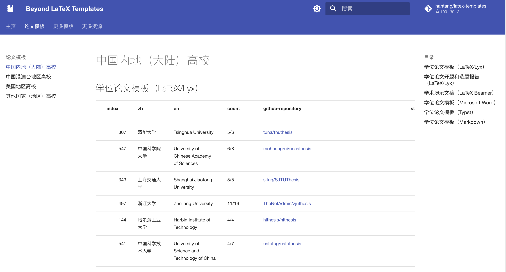

# Beyond LaTeX Templates

<!-- lastmod -->

最近更新：*2023-11-26*

<!-- end-lastmod -->

<!-- toc -->

- [Beyond LaTeX Templates](#beyond-latex-templates)
  - [说明](#说明)
  - [最受欢迎 LaTeX 中文学位论文模板](#最受欢迎-latex-中文学位论文模板)
  - [最受欢迎 LaTeX 其他学位论文模板](#最受欢迎-latex-其他学位论文模板)
  - [更多](#更多)
    - [LaTeX 论文模板](#latex-论文模板)
    - [LaTeX 简历模板](#latex-简历模板)
    - [LaTeX 通用模板](#latex-通用模板)
    - [LaTeX 绘图示例](#latex-绘图示例)
    - [Typst 模板](#typst-模板)
    - [Markdown 写作模板](#markdown-写作模板)
    - [其他写作模板](#其他写作模板)
    - [LaTeX 资源](#latex-资源)
    - [Typst 资源](#typst-资源)
    - [Markdown 资源](#markdown-资源)
    - [文献引用](#文献引用)
    - [排版相关](#排版相关)
  - [贡献](#贡献)

<!-- end-toc -->

## 说明

本项目主要收集 Github 中的 LaTeX 模板仓库，以各所大学的学位论文类型为主，兼收其他类型模板。

目前覆盖的大学约250所（包括中国内地（大陆）、港澳台地区约150所大学，30个外国（地区）近100所大学），收录GitHub仓库总数超过800。

学位论文模板的初始数据主要来自[LaTeX 工作室，国内大学高校 LaTeX 论文、报告模板统计](https://ask.latexstudio.net/ask/article/90.html)。
其他一些网站也提供了丰富的模板资源，如
[LaTeX Templates](https://www.latextemplates.com/)、
[Overleaf](https://www.overleaf.com/latex/templates)~~/ShareLaTex~~、
[CTAN](http://ctan.org/)。

相似项目：[Andy1621/thesis_latex](https://github.com/Andy1621/thesis_latex)

详细地，可以在[本仓库文档](https://hantang.github.io/latex-templates)
按国家（地区）、模板类型（论文、报告、简历、通用、演示等）、LaTeX（以及 Lyx）
或非 LaTeX 语言（Microsoft Word、Typst、Markdown 等）中查找。

学位论文写作，建议优先查询所在学校（学院）相关文件规范或咨询在校校师生。
有能力的，可以参考目前最受欢迎的模板进行适配调整。

---

<!-- toplist0 -->

## 最受欢迎 LaTeX 中文学位论文模板

- **清华大学** (Tsinghua University): [tuna/thuthesis](https://github.com/tuna/thuthesis)
  - `LaTeX Thesis Template for Tsinghua University`
  - 🔖`2011-09-12`    
- **中国科学院大学** (University of Chinese Academy of Sciences): [mohuangrui/ucasthesis](https://github.com/mohuangrui/ucasthesis)
  - `LaTeX Thesis Template for the University of Chinese Academy of Sciences`
  - 🔖`2014-05-08`    
- **上海交通大学** (Shanghai Jiaotong University): [sjtug/SJTUThesis](https://github.com/sjtug/SJTUThesis)
  - `上海交通大学 LaTeX 论文模板 | Shanghai Jiao Tong University LaTeX Thesis Template`
  - 🔖`2012-05-25`    
- **浙江大学** (Zhejiang University): [TheNetAdmin/zjuthesis](https://github.com/TheNetAdmin/zjuthesis)
  - `Zhejiang University Graduation Thesis LaTeX Template`
  - 🔖`2018-04-19`    
- **中国科学技术大学** (University of Science and Technology of China): [ustctug/ustcthesis](https://github.com/ustctug/ustcthesis)
  - `LaTeX template for USTC thesis`
  - 🔖`2015-07-07`    
- **哈尔滨工业大学** (Harbin Institute of Technology): [hithesis/hithesis](https://github.com/hithesis/hithesis)
  - `嗨！thesis！哈尔滨工业大学毕业论文LaTeX模板`
  - 🔖`2017-06-08`    
- **电子科技大学** (University of Electronic Science and Technology of China): [bdebye/thesisuestc](https://github.com/bdebye/thesisuestc)
  - `ThesisUESTC-电子科技大学毕业论文模板`
  - 🔖`2017-02-13`    
- **北京航空航天大学** (Beijing University of Aeronautics and Astronautics (Beihang University)): [BHOSC/BUAAthesis](https://github.com/BHOSC/BUAAthesis)
  - `北航毕设论文LaTeX模板`
  - 🔖`2012-06-17`    
- **复旦大学** (Fudan University): [stone-zeng/fduthesis](https://github.com/stone-zeng/fduthesis)
  - `LaTeX thesis template for Fudan University`
  - 🔖`2017-02-18`    
- **武汉大学** (Wuhan University): [whutug/whu-thesis](https://github.com/whutug/whu-thesis)
  - `:memo: 武汉大学毕业论文 LaTeX 模版 2022`
  - 🔖`2019-03-18`    
- **电子科技大学** (University of Electronic Science and Technology of China): [shifujun/UESTCthesis](https://github.com/shifujun/UESTCthesis)
  - **【已归档】** `电子科技大学毕设设计论文LaTeX模板`
  - 🔖`2013-02-19`    
- **北京大学** (Peking University): [CasperVector/pkuthss](https://github.com/CasperVector/pkuthss)
  - `LaTeX template for dissertations in Peking University`
  - 🔖`2015-04-28`    
- **中国科学院大学** (University of Chinese Academy of Sciences): [mohuangrui/ucasproposal](https://github.com/mohuangrui/ucasproposal)
  - `LaTeX Proposal Template for the University of Chinese Academy of Sciences`
  - 🔖`2016-10-02`    
- **南京大学** (Nanjing University): [Haixing-Hu/nju-thesis](https://github.com/Haixing-Hu/nju-thesis)
  - `南京大学学位论文XeLaTeX模板`
  - 🔖`2013-08-23`    
- **国防科技大学** (National Defense University of Science and Technology): [liubenyuan/nudtpaper](https://github.com/liubenyuan/nudtpaper)
  - `A LaTeX template for Master/PhD Thesis of NUDT`
  - 🔖`2013-02-23`    
- **北京理工大学** (Beijing Institute of Technology): [BITNP/BIThesis](https://github.com/BITNP/BIThesis)
  - `📖 北京理工大学非官方 LaTeX 模板集合，包含本科、研究生毕业设计模板及更多。🎉 （更多文档请访问 wiki 和 release 中的手册）`
  - 🔖`2020-01-12`    
- **北京邮电大学** (Beijing University of Posts and Telecommunications): [sheng-qiang/BUPTBachelorThesis](https://github.com/sheng-qiang/BUPTBachelorThesis)
  - `A LaTeX Template for BUPT Bachelor Thesis (updated in 2018) 北京邮电大学学士学位论文LaTeX模板`
  - 🔖`2018-04-24`    
- **北京航空航天大学** (Beijing University of Aeronautics and Astronautics (Beihang University)): [CheckBoxStudio/BUAAThesis](https://github.com/CheckBoxStudio/BUAAThesis)
  - `北航研究生学位论文模板（Word+LaTeX）.`
  - 🔖`2017-12-19`    
- **北京邮电大学** (Beijing University of Posts and Telecommunications): [rioxwang/BUPTGraduateThesis](https://github.com/rioxwang/BUPTGraduateThesis)
  - 无说明
  - 🔖`2015-01-03`    
- **广州大学** (Guangzhou University): [swq123459/GZHU-Report-Latex-Version](https://github.com/swq123459/GZHU-Report-Latex-Version)
  - `我自己制作的广州大学Latex报告模板，有毕业设计，课程设计，毕业论文，等等🎈`
  - 🔖`2018-12-28`    
- **西安电子科技大学** (Xidian University): [note286/xduts](https://github.com/note286/xduts)
  - `Xidian University TeX Suite 西安电子科技大学LaTeX套装`
  - 🔖`2022-04-03`    
- **北京理工大学** (Beijing Institute of Technology): [BIT-thesis/LaTeX-template](https://github.com/BIT-thesis/LaTeX-template)
  - `LaTeX template for BIT thesis`
  - 🔖`2017-03-08`    
- **中山大学** (Sun Yat-sen University): [SYSU-SCC/sysu-thesis](https://github.com/SYSU-SCC/sysu-thesis)
  - `中山大学 LaTeX 论文项目模板`
  - 🔖`2020-12-28`    
- **国立台湾大学（國立臺灣大學）** (National Taiwan University (NTU)): [tzhuan/ntu-thesis](https://github.com/tzhuan/ntu-thesis)
  - `NTU thesis template for XeLaTeX`
  - 🔖`2013-04-22`    
- **南京大学** (Nanjing University): [njuHan/njuthesis-nju-thesis-template](https://github.com/njuHan/njuthesis-nju-thesis-template)
  - `南京大学学位论文(本科/硕士/博士)，毕业论文LaTeX模板`
  - 🔖`2018-03-03`    
- ...

<!-- end-toplist0 -->

**[🔝 Back to Top/回到顶部](#beyond-latex-templates)**

<!-- toplist1 -->

## 最受欢迎 LaTeX 其他学位论文模板

- **University of Cambridge** (（英国）剑桥大学): [kks32/phd-thesis-template](https://github.com/kks32/phd-thesis-template)
  - `A LaTeX / XeLaTeX / LuaLaTeX PhD thesis template for Cambridge University Engineering Department (CUED)`
  - 🔖`2013-11-14`    
- **Technical University of Munich (Technische Universität München)** (（德国）慕尼黑工业大学): [fwalch/tum-thesis-latex](https://github.com/fwalch/tum-thesis-latex)
  - **【已归档】** `:notebook_with_decorative_cover: A LaTeX template for TUM Bachelor/Master theses.`
  - 🔖`2014-03-26`    
- **Norwegian University of Science and Technology (Norges teknisk-naturvitenskapelige universitet, NTNU)** (（挪威）挪威科技大学): [COPCSE-NTNU/thesis-NTNU](https://github.com/COPCSE-NTNU/thesis-NTNU)
  - `An NTNU thesis LaTeX document class for bachelor, master, and PhD theses`
  - 🔖`2019-06-27`    
- **University College London (UCL)** (（英国）伦敦大学学院): [UCL/ucl-latex-thesis-templates](https://github.com/UCL/ucl-latex-thesis-templates)
  - `UCL LaTeX thesis templates.`
  - 🔖`2014-06-16`    
- **Aalborg University (Aalborg Universitet, AAU)** (（丹麦）奥尔堡大学): [jkjaer/aauLatexTemplates](https://github.com/jkjaer/aauLatexTemplates)
  - `A collection of Aalborg University LaTeX-templates`
  - 🔖`2018-01-29`    
- **University of Cambridge** (（英国）剑桥大学): [cambridge/thesis](https://github.com/cambridge/thesis)
  - `A LaTeX document class that conforms to the Computer Laboratory's PhD thesis formatting guidelines.`
  - 🔖`2011-05-06`    
- **University of Oxford** (（英国）牛津大学): [ulyngs/oxforddown](https://github.com/ulyngs/oxforddown)
  - `Template for writing an Oxford University thesis in R Markdown; uses the OxThesis LaTeX template and was inspired by thesisdown.`
  - 🔖`2018-11-30`    
- **University of California, Los Angeles (UCLA)** (（美国）加利福尼亚大学洛杉矶分校): [uclathes/uclathes](https://github.com/uclathes/uclathes)
  - `UCLA Thesis LaTeX style`
  - 🔖`2012-04-16`    
- **University of Oxford** (（英国）牛津大学): [mcmanigle/OxThesis](https://github.com/mcmanigle/OxThesis)
  - `LaTeX template for an Oxford University thesis`
  - 🔖`2017-08-13`    
- **Warsaw University of Technology (Politechnika Warszawska)** (（波兰）华沙工业大学): [ArturB/WUT-Thesis](https://github.com/ArturB/WUT-Thesis)
  - `LaTeX template for engineer and master thesis for Warsaw University of Technology.`
  - 🔖`2019-04-26`    
- **University of Washington (UW)** (（美国）华盛顿大学): [UWIT-IAM/UWThesis](https://github.com/UWIT-IAM/UWThesis)
  - **【已归档】** `Class file for University of Washington thesis formatting with LaTeX.`
  - 🔖`2014-11-17`    
- **University of Tehran (دانشگاه تهران , UT)** (（伊朗）德黑兰大学): [sinamomken/tehran-thesis](https://github.com/sinamomken/tehran-thesis)
  - `LaTeX template for BSc/MSc/PhD theses of University of Tehran - قالب لاتک پایان‌نامه دانشگاه تهران`
  - 🔖`2017-05-09`    
- **University of California, Irvine (UCI)** (（美国）加利福尼亚大学欧文分校): [lotten/uci-thesis-latex](https://github.com/lotten/uci-thesis-latex)
  - `LaTeX template for thesis and dissertation documents at UC Irvine`
  - 🔖`2012-10-10`    
- **University of California, San Diego (UCSD)** (（美国）加利福尼亚大学圣迭戈分校): [ucsd-thesis/ucsd-thesis](https://github.com/ucsd-thesis/ucsd-thesis)
  - 无说明
  - 🔖`2016-12-31`    
- **Johns Hopkins University** (（美国）约翰斯·霍普金斯大学): [weitzner/jhu-thesis-template](https://github.com/weitzner/jhu-thesis-template)
  - `JHU Thesis Template`
  - 🔖`2014-04-29`    
- ...

<!-- end-toplist1 -->

**[🔝 Back to Top/回到顶部](#beyond-latex-templates)**

---

<!-- toplist2 -->

## 更多模板和资源

### LaTeX 论文模板

点击展开

- [AndreyAkinshin/Russian-Phd-LaTeX-Dissertation-Template](https://github.com/AndreyAkinshin/Russian-Phd-LaTeX-Dissertation-Template)
  - `LaTeX-template for russian Phd thesis`
  - 🔖`2012-10-29`    
- [Pseudomanifold/latex-mimosis](https://github.com/Pseudomanifold/latex-mimosis)
  - `A minimal & modern LaTeX template for your (bachelor's | master's | doctoral) thesis`
  - 🔖`2017-05-18`    
- [derric/cleanthesis](https://github.com/derric/cleanthesis)
  - `Clean Thesis is a clean, simple, and elegant LaTeX style (or template) for thesis documents.`
  - 🔖`2011-06-09`    
- [suchow/Dissertate](https://github.com/suchow/Dissertate)
  - `Beautiful LaTeX dissertation templates.`
  - 🔖`2011-04-06`    
- [latextemplates/scientific-thesis-template](https://github.com/latextemplates/scientific-thesis-template)
  - `LaTeX template for Master, Bachelor, Diploma, and Student Theses`
  - 🔖`2012-07-09`    
- ...

### LaTeX 简历模板

点击展开

- [posquit0/Awesome-CV](https://github.com/posquit0/Awesome-CV)
  - `:page_facing_up: Awesome CV is LaTeX template for your outstanding job application`
  - 🔖`2015-01-18`    
- [salomonelli/best-resume-ever](https://github.com/salomonelli/best-resume-ever)
  - `:necktie: :briefcase: Build fast :rocket: and easy multiple beautiful resumes and create your best CV ever! Made with Vue and LESS.`
  - 🔖`2017-01-30`    
- [billryan/resume](https://github.com/billryan/resume)
  - `An elegant LaTeX résumé template. 大陆镜像 https://gods.coding.net/p/resume/git`
  - 🔖`2015-05-30`    
- [deedy/Deedy-Resume](https://github.com/deedy/Deedy-Resume)
  - `A one page , two asymmetric column resume template in XeTeX that caters to an undergraduate Computer Science student`
  - 🔖`2014-04-30`    
- [sb2nov/resume](https://github.com/sb2nov/resume)
  - `Software developer resume in Latex`
  - 🔖`2015-10-11`    
- ...

### LaTeX 通用模板

点击展开

- [ElegantLaTeX/ElegantBook](https://github.com/ElegantLaTeX/ElegantBook)
  - `Elegant LaTeX Template for Books`
  - 🔖`2019-01-15`    
- [fmarotta/kaobook](https://github.com/fmarotta/kaobook)
  - `A LaTeX class for books, reports or theses based on https://github.com/kenohori/thesis and https://github.com/Tufte-LaTeX/tufte-latex.`
  - 🔖`2019-01-07`    
- [annProg/PanBook](https://github.com/annProg/PanBook)
  - `Pandoc LaTeX，Epub模板，用于生成书籍，幻灯片(beamer)，简历，论文等（cv, thesis, ebook,beamer)`
  - 🔖`2015-06-11`    
- [alexpovel/latex-cookbook](https://github.com/alexpovel/latex-cookbook)
  - `A comprehensive LaTeX template with examples for theses, books and more, employing the 'latest and greatest' (UTF8, glossaries, fonts, ...). The PDF artifact is built using CI/CD, with a Python testing framework.`
  - 🔖`2019-05-02`    
- [rorygregson/OSCOLA-LaTeX-Template](https://github.com/rorygregson/OSCOLA-LaTeX-Template)
  - `A LaTeX template using the OSCOLA referencing system, intended for law theses, articles, and books.`
  - 🔖`2019-06-21`    
- ...

### LaTeX 绘图示例

点击展开

- [synercys/annotated_latex_equations](https://github.com/synercys/annotated_latex_equations)
  - `Examples of how to create colorful, annotated equations in Latex using Tikz.`
  - 🔖`2022-01-10`    
- [xinychen/awesome-latex-drawing](https://github.com/xinychen/awesome-latex-drawing)
  - `Drawing Bayesian networks, graphical models, tensors, and technical frameworks and illustrations in LaTeX.`
  - 🔖`2019-01-11`    
- [MLNLP-World/Paper-Picture-Writing-Code](https://github.com/MLNLP-World/Paper-Picture-Writing-Code)
  - `MLNLP: Paper Picture Writing Code`
  - 🔖`2022-07-25`    
- [xinychen/academic-drawing](https://github.com/xinychen/academic-drawing)
  - `Providing codes (including Matlab and Python) for visualizing numerical experiment results.`
  - 🔖`2018-06-14`    

### Typst 模板

点击展开

- [typst/templates](https://github.com/typst/templates)
  - `The templates that ship with the Typst web app.`
  - 🔖`2023-03-27`    

### Markdown 写作模板

点击展开

- [tompollard/phd_thesis_markdown](https://github.com/tompollard/phd_thesis_markdown)
  - `Template for writing a PhD thesis in Markdown`
  - 🔖`2015-02-10`    
- [ismayc/thesisdown](https://github.com/ismayc/thesisdown)
  - `An updated R Markdown thesis template using the bookdown package`
  - 🔖`2016-08-16`    
- [pzhaonet/bookdownplus](https://github.com/pzhaonet/bookdownplus)
  - `The easiest way to use R package bookdown for  writing varied types of books and documents`
  - 🔖`2017-05-15`    
- [cagix/pandoc-thesis](https://github.com/cagix/pandoc-thesis)
  - `A Template for Thesis Documents written in Markdown`
  - 🔖`2019-07-22`    

### 其他写作模板

点击展开

- [dangom/org-thesis](https://github.com/dangom/org-thesis)
  - `Writing a Ph.D. thesis with Org Mode`
  - 🔖`2019-07-13`    

### LaTeX 资源

点击展开

- [martinbjeldbak/ultimate-beamer-theme-list](https://github.com/martinbjeldbak/ultimate-beamer-theme-list)
  - `A collection of Beamer themes from the community`
  - 🔖`2014-09-16`    
- [dustinvtran/latex-templates](https://github.com/dustinvtran/latex-templates)
  - `A collection of LaTeX templates used for research, courses, and miscellanea.`
  - 🔖`2014-09-27`    
- [XiangyunHuang/awesome-beamers](https://github.com/XiangyunHuang/awesome-beamers)
  - `beamer template collection`
  - 🔖`2017-06-11`    

### Typst 资源

点击展开

- [typst/typst](https://github.com/typst/typst)
  - `A new markup-based typesetting system that is powerful and easy to learn.`
  - 🔖`2019-09-24`    
- [qjcg/awesome-typst](https://github.com/qjcg/awesome-typst)
  - `Awesome Typst Links`
  - 🔖`2023-03-23`    

### Markdown 资源

点击展开

- [mundimark/awesome-markdown](https://github.com/mundimark/awesome-markdown)
  - `A collection of awesome markdown goodies (libraries, services, editors, tools, cheatsheets, etc.)`
  - 🔖`2015-05-03`    
- [mundimark/awesome-markdown-editors](https://github.com/mundimark/awesome-markdown-editors)
  - `A collection of awesome markdown editors & (pre)viewers for Linux, Apple OS X, Microsoft Windows, the World Wide Web & more`
  - 🔖`2016-03-15`    
- [BubuAnabelas/awesome-markdown](https://github.com/BubuAnabelas/awesome-markdown)
  - `:memo: Delightful Markdown stuff.`
  - 🔖`2016-07-26`    

### 文献引用

点击展开

- [redleafnew/Chinese-STD-GB-T-7714-related-csl](https://github.com/redleafnew/Chinese-STD-GB-T-7714-related-csl)
  - `GB/T 7714相关的csl以及Zotero使用技巧及教程。`
  - 🔖`2020-12-16`    
- [zepinglee/gbt7714-bibtex-style](https://github.com/zepinglee/gbt7714-bibtex-style)
  - `GB/T 7714-2015 BibTeX Style`
  - 🔖`2016-03-19`    
- [hushidong/biblatex-gb7714-2015](https://github.com/hushidong/biblatex-gb7714-2015)
  - `A biblatex implementation of the GB/T7714-2015 bibliography style  || GB/T 7714-2015 参考文献著录和标注的biblatex样式包`
  - 🔖`2016-10-12`    

### 排版相关

点击展开

- [sparanoid/chinese-copywriting-guidelines](https://github.com/sparanoid/chinese-copywriting-guidelines)
  - `Chinese copywriting guidelines for better written communication／中文文案排版指北`
  - 🔖`2014-03-17`    
- [Haixing-Hu/typesetting-standard](https://github.com/Haixing-Hu/typesetting-standard)
  - `中文排版所需遵循的标准和规范`
  - 🔖`2013-09-15`    

<!-- end-toplist2 -->

**[🔝 Back to Top/回到顶部](#beyond-latex-templates)**

---

<!-- [Stargazers over time](https://starchart.cc/hantang/latex-templates.svg) -->

## 贡献

WIP

欢迎 fork，提交 issue，补充数据，以及帮助指出或修正错误。

Copyright &copy; 2018-2024 Hantang

**[🔝 Back to Top/回到顶部](#beyond-latex-templates)**
